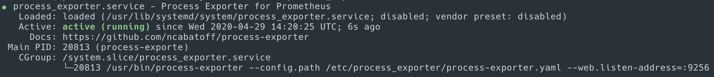

---
# frontmatter
path: "/tutorial-process-exporter-setup"
title: Prometheus Process Exporter Setup
short_title: Process Exporter Setup
description: 
  - This step is optional, but enables process metrics monitoring with the Process Exporter
  - Learn how to gather process metrics from each server running Couchbase
content_type: tutorial
filter: observability
technology: 
  - server
tags:
  - Prometheus
  - Monitoring
  - Observability
  - Configuration
sdk_language:
  - any
length: 15 Mins
---

The Process Exporter is an agent that gathers process specific metrics and exposes them in a format which can be ingested by Prometheus. This is a completely optional step and can be skipped if you do not wish to gather process metrics. The following will need to be performed on each server that you wish to monitor process metrics for.

## Download Process Exporter

[Download](https://github.com/ncabatoff/process-exporter/releases) the Process Exporter binary to each Couchbase Server that you want to monitor.

```bash
wget \
  https://github.com/ncabatoff/process-exporter/releases/download/v0.6.0/process-exporter-0.6.0.linux-amd64.tar.gz
```

## Create User

Create a Process Exporter user, required directories, and make prometheus user as the owner of those directories.

```bash
sudo groupadd -f process_exporter
sudo useradd -g process_exporter --no-create-home --shell /bin/false process_exporter
sudo mkdir /etc/process_exporter
sudo chown process_exporter:process_exporter /etc/process_exporter
```

## Unpack Process Exporter Binary

Untar and move the downloaded Process Exporter binary

```bash
tar -xvf process-exporter-0.6.0.linux-amd64.tar.gz
mv process-exporter-0.6.0.linux-amd64 process_exporter-files
```

## Install Process Exporter

Copy `process_exporter` binary from `process_exporter-files` folder to `/usr/bin` and change the ownership to prometheus user.

```bash
sudo cp process_exporter-files/process-exporter /usr/bin/
sudo chown process_exporter:process_exporter /usr/bin/process-exporter
```

## Create Process Exporter Configuration File

Create a `etc/process_exporter/process-exporter.yaml` with the following configuration.

```bash
sudo vi /etc/process_exporter/process-exporter.yaml
```

```yaml
process_names:
  - comm:
    # Data service responsible for storing user data
    - memcached
    # Couchbase cluster manager run as Erlang virtual machines -
    # babysitter, ns_server, and ns_couchdb
    - beam.smp
    # Index service
    - indexer
    # Full-Text Search Service
    - cbft
    # Analytics Service
    - cbas
    # Couchbase Query service
    - cbq-engine
    # Extracts secondary key from documents
    - projector
    # Cross Data Center Replication (XDCR) - replicates data from one cluster to another
    - goxdcr
    # Utility in Go to get disk usage stats
    - godu
    # Process that acts as a bridge between ns_server (Erlang) and the other
    # server components (cbq- engine, cbft, etc.)
    - goport
    # Service that is used to encrypt the cluster configuration stored on disk
    - gosecrets
    # Erlang port process (wrapper) used to talk to the saslauthd daemon for authentication purposes
    - saslauthd-port
    # Erlang-specific process which acts as a name server for Erlang distribution
    - epmd
    # Erlang-specific process used to collect CPU: 1 for ns_server VM and 1 for ns_couchdb VM
    - cpu_sup
    # Erlang-specific process used to collect memory usage: 1 for ns_server VM
    # and 1 for ns_couchdb VM
    - memsup
    # Built-in Erlang port process that is used to perform name service lookup
    - inet_gethost
    # Open source tool sigar that is used to collect system information
    - portsigar
    # Eventing Service
    - eventing-produc
    # Eventing Service
    - eventing-consum
    - uwsgi
    - prometheus
    - alertmanager
    - grafana
```

Change the ownership to `process_exporter` user.

```bash
sudo chown process_exporter:process_exporter /etc/process_exporter/process-exporter.yaml
```

## Setup Service

Create a process_exporter service file.

```bash
sudo vi /usr/lib/systemd/system/process_exporter.service
```

Add the following configuration

```bash
[Unit]
Description=Process Exporter for Prometheus
Documentation=https://github.com/ncabatoff/process-exporter
Wants=network-online.target
After=network-online.target

[Service]
User=process_exporter
Group=process_exporter
Type=simple
Restart=on-failure
ExecStart=/usr/bin/process-exporter \
  --config.path /etc/process_exporter/process-exporter.yaml \
  --web.listen-address=:9256

[Install]
WantedBy=multi-user.target
```

```bash
sudo chmod 664 /usr/lib/systemd/system/process_exporter.service
```

## Reload systemd and Start Process Exporter

Reload the `systemd` service to register the prometheus service and start the prometheus service.

```bash
sudo systemctl daemon-reload
sudo systemctl start process_exporter
```

Check the Process Exporter service status using the following command.

```bash
sudo systemctl status process_exporter
```



Configure process_exporter to start at boot

```bash
sudo systemctl enable process_exporter.service
```

If `firewalld` is enabled and running, add a rule for port `9256`

```bash
sudo firewall-cmd --permanent --zone=public --add-port=9256/tcp
sudo firewall-cmd --reload
```

## Verify the Exporter is Running

Verify the exporter is running by visiting the `/metrics` endpoint on the node on port `9256`

```bash
http://<process_exporter-ip>:9256/metrics
```

You should be able to see something similar to the following:

```bash
...
# HELP namedprocess_namegroup_context_switches_total Context switches
# TYPE namedprocess_namegroup_context_switches_total counter
namedprocess_namegroup_context_switches_total{ctxswitchtype="nonvoluntary",groupname="beam.smp"} 6657
namedprocess_namegroup_context_switches_total{ctxswitchtype="nonvoluntary",groupname="cbft"} 441
namedprocess_namegroup_context_switches_total{ctxswitchtype="nonvoluntary",groupname="cbq-engine"} 3
namedprocess_namegroup_context_switches_total{ctxswitchtype="nonvoluntary",groupname="eventing-consumer"} 0
namedprocess_namegroup_context_switches_total{ctxswitchtype="nonvoluntary",groupname="eventing-producer"} 1225
namedprocess_namegroup_context_switches_total{ctxswitchtype="nonvoluntary",groupname="godu"} 0
namedprocess_namegroup_context_switches_total{ctxswitchtype="nonvoluntary",groupname="goport"} 3
namedprocess_namegroup_context_switches_total{ctxswitchtype="nonvoluntary",groupname="goxdcr"} 52
namedprocess_namegroup_context_switches_total{ctxswitchtype="nonvoluntary",groupname="indexer"} 1932
namedprocess_namegroup_context_switches_total{ctxswitchtype="nonvoluntary",groupname="memcached"} 3105
namedprocess_namegroup_context_switches_total{ctxswitchtype="nonvoluntary",groupname="projector"} 11
namedprocess_namegroup_context_switches_total{ctxswitchtype="voluntary",groupname="beam.smp"} 35152
namedprocess_namegroup_context_switches_total{ctxswitchtype="voluntary",groupname="cbft"} 3229
namedprocess_namegroup_context_switches_total{ctxswitchtype="voluntary",groupname="cbq-engine"} 9164
namedprocess_namegroup_context_switches_total{ctxswitchtype="voluntary",groupname="eventing-consumer"} 680
namedprocess_namegroup_context_switches_total{ctxswitchtype="voluntary",groupname="eventing-producer"} 4690
namedprocess_namegroup_context_switches_total{ctxswitchtype="voluntary",groupname="godu"} 1723
namedprocess_namegroup_context_switches_total{ctxswitchtype="voluntary",groupname="goport"} 3865
namedprocess_namegroup_context_switches_total{ctxswitchtype="voluntary",groupname="goxdcr"} 3315
namedprocess_namegroup_context_switches_total{ctxswitchtype="voluntary",groupname="indexer"} 121989
namedprocess_namegroup_context_switches_total{ctxswitchtype="voluntary",groupname="memcached"} 7141
namedprocess_namegroup_context_switches_total{ctxswitchtype="voluntary",groupname="projector"} 9823
...
```

## Clean Up

Remove the download and temporary files

```bash
rm -rf process-exporter-0.6.0.linux-amd64.tar.gz process_exporter-files
```
