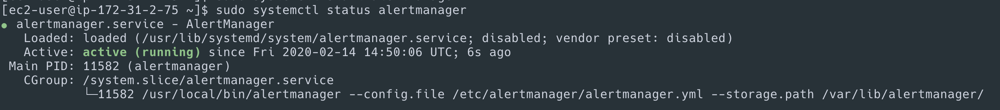
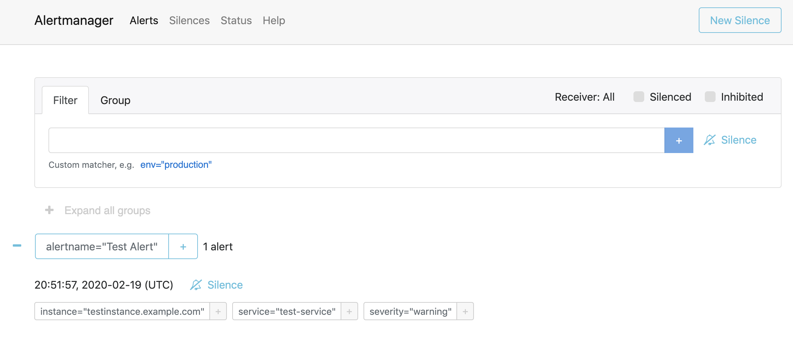

---
# frontmatter
path: "/tutorial-configure-alertmanager"
title: Configure Prometheus AlertManager
short_title: Configure AlertManager
description: 
  - Learn how to install and configure AlertManager to handle alerts sent by the Prometheus server
  - View detailed configuration examples and set up a test alert to ensure functionality
content_type: tutorial
filter: observability
technology:
  - server
tags:
  - Prometheus
  - Monitoring
  - Observability
  - Configuration
sdk_language:
  - any
length: 15 Mins
---

It is important to know that Prometheus can support multiple AlertManagers for High-Availability by specifying more than 1 `alertmanager` target. For the purpose of this tutorial, we will install a single AlertManager on the same server as Prometheus and Grafana.

## Download Prometheus AlertManager

[Download](https://github.com/prometheus/alertmanager/releases/download/v0.21.0/alertmanager-0.21.0.linux-amd64.tar.gz) the AlertManager binary to the server that you will use for alerting.

```bash
wget \
  https://github.com/prometheus/alertmanager/releases/download/v0.21.0/alertmanager-0.21.0.linux-amd64.tar.gz
```

Visit the Prometheus [downloads page](https://prometheus.io/download/) for the latest version.

## Create User

Create a Prometheus user, required directories, and make prometheus user as the owner of those directories.

```bash
sudo groupadd -f alertmanager
sudo useradd -g alertmanager --no-create-home --shell /bin/false alertmanager
sudo mkdir -p /etc/alertmanager/templates
sudo mkdir /var/lib/alertmanager
sudo chown alertmanager:alertmanager /etc/alertmanager
sudo chown alertmanager:alertmanager /var/lib/alertmanager
```

## Unpack Prometheus AlertManager Binary

Untar and move the downloaded Prometheus AlertManager binary

```bash
tar -xvf alertmanager-0.21.0.linux-amd64.tar.gz
mv alertmanager-0.21.0.linux-amd64 alertmanager-files
```

## Install Prometheus AlertManager

Copy `alertmanager` and `amtool` binary from prometheus-files folder to `/usr/bin` and change the ownership to prometheus user.

```bash
sudo cp alertmanager-files/alertmanager /usr/bin/
sudo cp alertmanager-files/amtool /usr/bin/
sudo chown alertmanager:alertmanager /usr/bin/alertmanager
sudo chown alertmanager:alertmanager /usr/bin/amtool
```

## Install Prometheus AlertManager Configuration File

Move the `alertmanager.yml` file from `alertmanager-files` to the `/etc/alertmanager` folder and change the ownership to alertmanager user.

```bash
sudo cp alertmanager-files/alertmanager.yml /etc/alertmanager/alertmanager.yml
sudo chown alertmanager:alertmanager /etc/alertmanager/alertmanager.yml
```

## Setup Prometheus AlertManager Service

Create an `alertmanager` service file.

```bash
sudo vi /usr/lib/systemd/system/alertmanager.service
```

Add the following configuration and save the file

```bash
[Unit]
Description=AlertManager
Wants=network-online.target
After=network-online.target

[Service]
User=alertmanager
Group=alertmanager
Type=simple
ExecStart=/usr/bin/alertmanager \
    --config.file /etc/alertmanager/alertmanager.yml \
    --storage.path /var/lib/alertmanager/

[Install]
WantedBy=multi-user.target
```

```bash
sudo chmod 664 /usr/lib/systemd/system/alertmanager.service
```

## Reload systemd and Register Prometheus AlertManager

Reload the `systemd` service to register and Start the Prometheus AlertManager service.

```bash
sudo systemctl daemon-reload
sudo systemctl start alertmanager
```

Check the `alertmanager` service status using the following command.

```bash
sudo systemctl status alertmanager
```



Configure Prometheus AlertManager to start at boot

```bash
sudo systemctl enable alertmanager.service
```

If `firewalld` is enabled and running, add a rule for port `9093`

```bash
sudo firewall-cmd --permanent --zone=public --add-port=9093/tcp
sudo firewall-cmd --reload
```

## Access Prometheus AlertManager UI

Now you will be able to access the AlertManager UI on `9093` port of the alertmanager server.

```bash
http://<alertmanager-ip>:9093
```

You should be able to see the following UI as shown below.


## Setup a Prometheus AlertManager Test Alert

Execute the following statement, be sure to replace `<alertmanager-ip>` with the IP address / hostname of your AlertManager instance. If you are ssh'd into the AlertManager server already you can use `localhost`.

```bash
curl -XPOST "http://<alertmanager-ip>:9093/api/v1/alerts" \
  -d \
  "[{
    \"status\": \"firing\",
    \"labels\": {
      \"alertname\": \"Test Alert\",
      \"service\": \"test-service\",
      \"severity\":\"warning\",
      \"instance\": \"testinstance.example.com\"
    },
    \"annotations\": {
      \"summary\": \"High latency is high!\"
    }
  }]"
```

Open the AlertManager UI in a web browser

```bash
http://<alertmanager-ip>:9093
```

You should be able to see your test alert in the UI as shown below.



Prometheus automatically takes care of sending alerts generated by its configured alerting rules, it is not recommended to generate alerts by calling the AlertManager APIs directly.

## Prometheus AlertManager

Edit the `alertmanager.yml` file and view the current configuration.

```bash
sudo vi /etc/alertmanager/alertmanager.yml
```

```yaml
global:
  resolve_timeout: 5m

route:
  group_by: ['alertname']
  group_wait: 10s
  group_interval: 10s
  repeat_interval: 1h
  receiver: 'web.hook'
receivers:
- name: 'web.hook'
  webhook_configs:
  - url: 'http://127.0.0.1:5001/'
inhibit_rules:
  - source_match:
      severity: 'critical'
    target_match:
      severity: 'warning'
    equal: ['alertname', 'dev', 'instance']
```

Restart AlertManager

```bash
sudo systemctl restart alertmanager
```

Currently the only receiver that is configured is a webhook on the local machine. There are an endless number of possibilities for configuring AlertManager including sending emails, webhooks, as well as 3rd party integrations such as Slack or PagerDuty. This guide does not cover these integrations, these can be implemented separately by referencing the [Prometheues documentation on Alerting Configuration](https://prometheus.io/docs/alerting/configuration/).

## Clean Up

Remove the download and temporary files

```bash
rm -rf alertmanager-0.21.0.linux-amd64.tar.gz alertmanager-files
```
