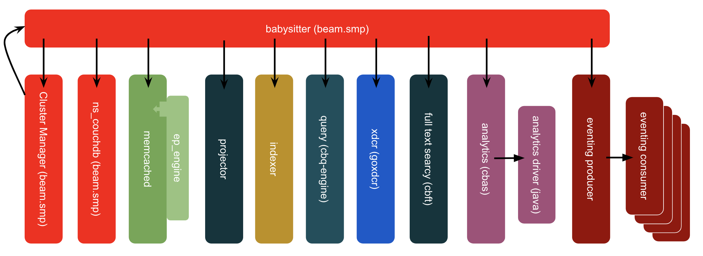

---
# frontmatter
path: "/tutorial-general-support-best-practices"
title: General Support Best Practices
short_title: Support Best Practices
description: 
  - Read about various best practices and recommendations to ensure a seamless and productive experience with support
  - Learn how to restart different Couchbase services manually, and why/when to do so
  - View tips on providing internal tier one support
content_type: tutorial
filter: other
technology: 
  - server
tags:
  - Support
  - Customer
sdk_language:
  - any
length: 15 Mins
---

**Recommendation:** Have an Incident Leader

- A leader should be chosen to manage the discussion on each incident. That leader should manage the conversation.
Often a thread of investigation can be cut off before it bears fruit because someone on the call has a different opinion of the potential problem or simply doesn’t understand the current investigation and pushes their own agenda.

**Recommendation:**  Keep an Incident Log

- This leader should be responsible (perhaps through delegation) for the keeping of an incident log.  While ultimately this log should be transcribed to an official report, the best place to keep a running log is in the chat window of a Webex (or other) call. This allows someone who joins a call to catch up on what has happened, what has been discussed, and/or what has been tried so far.  Webex chat is supported across many platforms and is available to anyone invited to the call, including vendors or people who may not be at their work desks.

**Recommendation:**  Have Architectural Documents Ready

- You can reduce MTTR significantly by reducing the number of questions that need to be asked during the incident.  Having information prepared can help expedite suggestions for remedial action and improve the accuracy and likelihood of success of any suggestions.
- For Couchbase, some information is standard, such as:
  - Product version, including server and SDKs used
  - Cluster size
  - Layout of Couchbase services
  - Peak document count, average document size, normal document growth rates
  - Overall data size and average data residency
  - Types of buckets used (Couchbase, Ephemeral, Memcached) and the ejection types (Value, Full)
- For any architecture, it is important to have
  - Information about the underlying hardware and/or virtualization platform
  - Upstream and downstream applications
- It is also critical to have an accurate history maintained of changes to the system, such as version upgrades, nodes added/removed/restarted etc. These events should be logged when they happen so that an accurate history doesn’t need to be recreated during an incident.
- Ideally, a (potentially sanitized) version of this information should be made available to any Couchbase Support Engineers working the incident.

**Recommendation:**  Progress through well defined Incident Stages

- There should be an ordered progression to the incident investigation.  
- Suggested steps would be:
  - Preservation of logs and timeline of events preceding the incident
  - Resumption of service
  - Root Cause Analysis
  - Remediation

**Recommendation:**  Upload all available logs to a Support Ticket as soon as possible

- Updating logs takes time.  Having Couchbase support request logs takes additional time. Please upload all available logs immediately after opening a ticket.
- In most cases, these logs are used for Root Cause Analysis, so, log preservation and resumption of service should already have occurred.  
- Ideally, the customer should be capable of resuming service without the help of Couchbase Support. If help is needed to achieve resumption of service, the priority of uploading all logs should be increased.

**Recommendation:**  Have Additional Servers ready to deploy in each environment

- _Cloud native_ technologies are designed to have failing nodes replaced with additional nodes.  

**Recommendation:**  Properly Size your Machines & Cluster

- Cloud database, including Couchbase, are designed to partition their load across multiple machines.  They are also designed to heal if a machine is lost and/or removed from the cluster.  For Couchbase, this is either a _Failover_, _Recovery_ or _Rebalance_. There must be enough additional resources in the cluster to perform the recovery options.

**Recommendation:**  Triage from the Top Down

- Triage gives clarity to the person trying to restore service because they know clearly what they ‘don’t have to worry about’.  
- Triage has to start with the system as a whole, not a particular component. Develop a series of scripts particular to your environment and application that could validate which systems were responding and which were not.

**Recommendation:**  Avoid Bias

- Experienced Support Engineers (like doctors) will often ignore your specific complaint until they have run through a series of tests or looked at key indicators in the logs.  While this is part of a triage process, it also avoids observation bias.  Bias can be introduced by any of the following factors:
  - _This is the area of the system where the problem is manifesting or is observed_ - this isn’t necessarily where the problem is caused
  - _This part of the architecture is the newest_ or _has caused us problems before_ - while a useful observation, this can cause your analysis to focus on the wrong component
  - _The problem can’t be in the area of the stack that I’m responsible for_ - personal pride could impede investigation into the area potentially responsible for the problem
  - _I don’t understand that part of the architecture_ - can lead to either avoidance or undue focus on one part of the architecture
- One of the prime roles of the Incident Leader it to avoid bias and ensure all options are considered until effectively ruled out.

**Recommendation:**  Test Tickets

- New applications that are preparing to go into production should go through the process of creating a Test ticket to make sure there are no impediments to updating logs.

## Providing internal tier one Support

### Escalation path

1. Internal Support (Center of Excellence)
2. If the issue is related to debugging a product fault internal support should contact Couchbase technical support with the appropriate priority level
3. If the issue is related to reviewing Architecture, index definitions, query syntax, or client SDK code, internal support should contact Solutions Engineer or professional services representative.
4. Depending on the way to resolve your issue your ticket may be referred to Engineering.

### Building an internal support team

To start with, when building an internal tier one support team it is important that those providing the support review and understand all of the following guides and best practices.

- Backup and Restore Guide (Coming Soon)
- Cluster Setup (Coming Soon)
- [Data Modeling](/learn/json-data-modeling-guide)
- Development Best Practices (Coming Soon)
- [Monitoring](/learn/couchbase-monitoring-guide)
- Security (Coming Soon)
- Testing (Coming Soon)

If the use case involves query:

- [N1QL Tuning](/learn/n1ql-query-performance-guide)

With a strong understanding of those guides, one should be able to provide support for most tier one support issues.

#### Timeouts and RTO

Sometimes, client to Couchbase interactions can timeout. If you are having issues with timeouts, using the open-tracing API may help determine the cause or where the timeout is actually happening. How to use open-tracing is language dependent. The exposure of these APIs will allow you to use other tools like jaegertracing or other commercial products to dig into where the timeouts are happening.

- [Java](https://docs.couchbase.com/java-sdk/current/threshold-logging.html#open-tracing)
- [Python](https://docs.couchbase.com/python-sdk/current/threshold-logging.html#open-tracing)
- [.Net](https://docs.couchbase.com/dotnet-sdk/current/threshold-logging.html#open-tracing)
- [PHP](https://docs.couchbase.com/php-sdk/current/threshold-logging.html#open-tracing)
- [C](https://docs.couchbase.com/c-sdk/current/threshold-logging.html#open-tracing)
- [Go](https://docs.couchbase.com/go-sdk/current/threshold-logging.html#open-tracing)
- [NodeJS](https://docs.couchbase.com/nodejs-sdk/current/threshold-logging.html#open-tracing)

Response Time Observability (RTO) is part of open-tracing and as four parts:

- Data Service (KV Engine): Logs KV operations that exceed a threshold
- Threshold Logging (SDK): Logs requests that exceed a per-service threshold
- Orphan Logging (SDK): Log responses when the request has timed out
- Improved Timeout Messages (SDK)

#### Data Service

Data Service Tracing must first be enabled to use RTO on the data service.

```bash
curl -u Administrator:password -X POST localhost:8091/pools/default/settings/memcached/global \
    --data tracing_enabled=true/false
```

Which then gives the following messages in the memcached.log

```bash
2018-07-17T15:30:05.308518Z INFO 37: HELO [{"a":"libcouchbase/2.9.2 (Darwin-17.6.0; x86_64; \
    Clang 9.1.0.9020039)","i":"00000000b35f58aa/39cc1fd4eeaf1d67"}] \
    TCP nodelay, XATTR, XERROR, Select bucket, Snappy, JSON, Tracing \
    [ 127.0.0.1:55200 - 127.0.0.1:11210 (not authenticated) ]
...
2018-07-17T15:30:07.084239Z WARNING 37: Slow operation. \
    {"cid":"00000000b35f58aa/39cc1fd4eeaf1d67/0","duration":"1771 ms", \
    "trace":"request=329316910555375:1771975 \
             get=329316911686879:35 \
             bg.wait=329316911701108:4715 \
             bg.load=329318677724103:1766022 \
             get=329318682489143:21",
    "command":"GET","peer":"127.0.0.1:55200"}
```

| Name | Definition | Comments |
| :--- | :--- | :--- |
| request | From KV-Engine receiving request (from OS) to sending response (to OS). | Overall KV-Engine view of the request. |
| bg.wait | From KV-Engine detecting background fetch needed, to starting to read from disk. | Long duration suggests contention on  Reader Threads. |
| bg.load | From KV-Engine starting to read from disk to loading the document. | Long duration suggests slow disk subsystem. |
| get | From KV-Engine parsing a GET request to processing it. | For docs which are not resident, you'll see two instances of this span. |
| get.if | From KV-Engine parsing a GET _IF request to processing it. | Similar to get, but used for certain request (e.g. XATTR handling) |
| get.stats | From KV-Engine parsing a STATS request to processing it. | Different STATS keys have different costs (e.g. disk stats are slower). |
| store | From KV-Engine parsing a STORE request to processing it. | Typically fast (as only has to write into HashTable). |
| set.with.meta | From KV-Engine parsing a SET_WITH_META request to processing it. | Similar to store but for XDCR / restore updates. |

#### SDK Logging

SDK Logging is on by default. Below is an example from an RTO Log.

```json
{
  "service": "kv",
  "count": 15,
  "top": [
    {
      "operation_name": "get",
      "last_operation_id": "0x21",
      "last_local_address": "10.211.55.3:52450",
      "last_remote_address": "10.112.180.101:11210",
      "last_local_id": "66388CF5BFCF7522/18CC8791579B567C",
      "total_duration_us": 18908,
      "encode_us": 256,
      "dispatch_us": 825,
      "decode_us": 16,
      "server_duration_us": 14
    }
  ]
}
```

| Name | Definition | Comments |
| :--- | :--- | :--- |
| operation_name | Type of operation | |
| last_operation_id | A combination of type of operation and ID | Useful for troubleshooting in combination with the local_id |
| last_local_address | The local socket used for this operation | |
| last_remote_address | Socket used on server for this request | Useful when determining which node processed this request |
| last_local_id | This ID is negotiated with the server | Can be used to correlate logging information on both sides |
| total_duration_us | The total time it took to perform the full operation | |
| encode_us | Time the client took to encode the request | Is longer the larger and more complex the json |
| dispatch_us | Time from when client to sent the request to when it got a response into the clients ring buffer | Amount of time spent traversing the network can be found by subtracting dispatch_us - server_duration_us |
| decode_us | Time the client took to decode the response | Is longer the larger and more complex the json |
| server_duration_us | Time the server took to do its work. | - |

#### Orphan Logging

This is enabled by default in the SDK. This aggregates responses where the request has timed out. ie KV get exceeds time out, error returned to application, response received some time afterwards. The log interval is 10 seconds at the WARN level, and has a  Per-service sample size of 10. Below is an example of an orphan log.

```json
{
  "service": "kv",
  "count": 2,
  "top": [
    {
      "s": "kv:get",
      "i": "0x21",
      "c": "66388CF5BFCF7522/18CC8791579B567C",
      "b": "default",
      "l": "192.168.1.101:11210",
      "r": "10.112.181.101:12110",
      "d": 120
    }
  ]
}
```

| Name | Definition |
| :--- | :--- |
| s | Service type |
| i | Operation ID |
| c | Connection ID |
| b | Bucket |
| l | LocalEndpoint and Port |
| r | Remote Endpoint and Port |
| d | Duration (us) |
| t | Timeout |

Combining these three logs, a troubleshooter should be able to trace timings all the way from the client to server and back. This should help identify any operations that timed out, or are performing slowly. Providing this information to support will greatly help in determining the cause of timeouts.

### Restarting services

On each Couchbase node there are multiple services running to maintain Couchbase and provide the services needed for operation. At times, and normally with the guidance of support, it may be necessary to restart some of those services in a recovery effort from degraded operations. A complete list of processes can be found at [https://docs.couchbase.com/server/current/install/server-processes.html](https://docs.couchbase.com/server/current/install/server-processes.html)



#### Cluster Manager

**What it does:**
Provides admin UI & RESTful administrative APIs, coordinates cluster membership, manages rebalancing, etc.

**Why to restart:**
Connections not being released, rebalance that won’t ‘stop’

**Impact of restarting:**

- Should not impact operations unless it doesn’t restart faster than the auto-failover timeout. In that case restarting may cause a failover.

**How:**

```bash
curl --data “erlang:halt().” -u <Administrator>:<password> http://<host>:8091/diag/eval
```

#### Memcached

**What it does:**
This is the data service. It manages all the vbuckets and the data within the vbuckets.

**Why to restart:**

- Do not restart without guidance from support.
- This would be done if a hard failover of a node was needed and the UI was unavailable.

**Impact of restarting:**
Causes a hard failover of the data node.

**How:**

```bash
pkill memcached
```

#### Projector

**What it does:**
This process runs on each Data node. It consumes DCP messages, Filters and formats index entries, and sends those messages to the indexer.

**Why to restart:**

- New index build seems ‘stuck’
- items_queued + items_pending increasing and not going down

**Impact of restarting:**

- Should continue from last checkpoint, no direct effect on inflight ops
- Likely already affecting At_plus or Request_plus queries

**How:**

```bash
pkill projector
```

#### Indexer

**What it does:**
The indexer runs on each Index node. It manages index records in memory & disk. This process is invoked by query engine to select query candidates.

**Why to restart:**

- Memory use of the indexer process is growing without bound
- Existing memory leak of metadata (fixed in 6.0.2)

**Impact of restarting:**

- Inflight queries may fail if they are using indexes maintained by this indexer. _YOUR CLIENTS SHOULD CODE FOR THIS EVENT_
- Assuming you have redundant index definitions no impact should occur to new queries.

**How:**

```bash
pkill indexer
```

#### Query Service

**What it does:**
The query service runs on each Query node. Each N1QL query is assigned to one node. Calls from the query service go out to Index service, Data Service and FTS Service as required

**Why to restart:**

- Memory use growing without bound

**Impact of restarting:**

- Inflight queries will fail if they are assigned to this query node. _YOUR CLIENTS SHOULD CODE FOR THIS EVENT_
- New queries will not go to this node and should be fine

**How:**

```bash
pkill cbq-engine
```

#### XDCR Service

**What it does:**
the goxdcr process runs on each Data node. It has responsibilities for data replication work done on both source & target side.

**Why to restart:**

- High CPU usage
- Connection timeouts in log
- changes_left stat increasing without going back down
- bandwidth_usage stat at 0

**Impact of restarting:**

- Will restart from last checkpoint, may see a temporary increase in CPU & bandwidth usage

**How:**

```bash
pkill goxdcr
```
