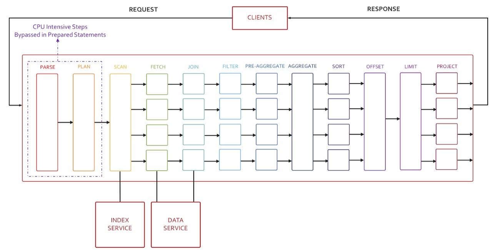

---
# frontmatter
path: '/tutorial-understanding-query-workflow-and-optimization'
title: Understanding Query Workflow and Optimization
short_title: Query Workflow
description: 
  - Learn how queries get optimized and executed in Couchbase
  - Learn about access path and index selection and how it applies to query execution
content_type: tutorial
filter: n1ql
technology:
  - query
  - server
tags:
  - SQL++ (N1QL)
  - Optimization
sdk_language:
  - any
length: 10 Mins
---

Applications and their drivers submit the N1QL query to one of the available query nodes. The Query node parses and analyzes the query, uses metadata on underlying objects to figure out the optimal execution plan, which it then executes. During execution, depending on the query, using applicable indices, the query node works with index and data nodes to retrieve and perform the select-join-project operations. Since Couchbase is a clustered database, you scale out data, index and query nodes to fit your performance and availability goals.

The figure below shows all the possible phases a query goes through during execution to return the results. Not all queries need to go through every phase. Some go through many of these phases multiple times. The Optimizer decides phases each query should execute. For example, the Sort phase will be skipped when there is no `ORDER BY` clause in the query; the scan-fetch-join phase executes multiple times to perform multiple joins. Some operations like query parsing and planning is done serially, while other operations like fetch, join, sort can be done in parallel.

The N1QL Optimizer analyzes the query and available access path options for each keyspace (bucket) in the query. For each query block, the planner needs to first select the access path for each bucket, determine the both join order and type.

## Access Path Selection

1. **KeyScan access:** When specific document IDs (keys) are available, the Keyscan access method retrieves those documents. Any filters on that keyspace are applied to those documents. The Keyscan can be used when a keyspace is queried by specifying the document keys (USE KEYS modifier) or during join processing. The Keyscan is commonly used to retrieve qualifying documents for the inner keyspace during join processing.
2. **Index Count Scan:** Queries with a single projection of a `COUNT()` aggregate and do not contain any `JOIN` statements. The chosen index needs to be covered with a single range or equality predicates that can be to push down to the indexer. The argument passed to `COUNT()` needs to be constant or leading key.
3. **Covering Secondary Scan** Each satisfied index with the most number of index keys is examined for query coverage. Shortest covering index will be used.
4. **Regular Secondary Scan access:** A qualifying secondary index scan is used to first filter the keyspace and to determine the qualifying documents IDs. It then retrieves the qualified documents from the data store, if necessary. If the selected index has all the data to answer the query, N1QL avoids fetching the document altogether — this method is called the covering index scan. This is highly performant. Your secondary indexes should help queries choose cover index scans as much as possible. Indexes with the most number of matching index keys are used. When more than one index is qualified, an IntersectScan is used.
5. **UNNEST Scan:** Only array indexes are considered. And only queries with UNNEST clauses are considered.
6. **PrimaryScan access:** This method is chosen when documents IDs are not given and no qualifying secondary indexes are available for this keyspace. This access method is quite expensive and should be avoided especially in a production environment.

## Index Selection

Before discussing how the N1QL Query Planner performs index selection, it is important to define the contract between N1QL Index Selection and the user. The contract does not change from release to release:

- The index chosen by N1QL will satisfy the query. That is N1QL will not choose an index whose definition can lead to wrong results. (Bugs outside of index definition and selection do not count)
- If there are one or more indexes that satisfy the query and are online, N1QL will choose at least one such index. That is, if an index scan can be performed, N1QL will not perform a full/primary scan.
- N1QL does not promise to choose the "best" index or combination of indexes to satisfy the query. This is an optimization problem, and no database offers such a guarantee (excluding marketing claims)

Prior to proceeding with secondary scans, the N1QL planner will resolve qualified indexes on the keyspace based on the query predicates. The following algorithm is used to select the indexes for a given query:

- **Online indexes:** Only online indexes are considered. That means when an index is being built (pending), or is only defined but not built, it is disqualified and isn't chosen.
- **Preferred indexes:** If a query has a `USE INDEX` clause, only those indexes are evaluated. If the preferred indexes are not qualified, other online indexes are considered.
- **Satisfying index filters:** For partial/filtered indexes, the N1QL Query Planner considers only those indexes whose filter (`WHERE`) is broad enough to satisfy the query. The filter does not need to match the query predicate exactly; the filter just needs to be a superset of the query predicate.
- **Satisfying index keys:** Indexes whose leading keys satisfy query predicate are selected. This is the common way to select indexes with B-TREE indexes.
- **Longest satisfying keys:** Finally, among the indexes with satisfying keys, some redundancy is eliminated by keeping the longest satisfying index keys in the index key order. For example: An index with satisfying keys (a, b, c) is retained instead of an index with satisfying keys (a, b). Note that satisfying keys refers only to those keys at the beginning of the index that is used in the query predicate. An index can have additional keys after its satisfying keys.

Once the index selection is done the following scan methods are considered in the order.

1. **IndexCountScan:** Queries with a single projection of COUNT aggregate, NO JOINs, or GROUP BY are considered. The chosen index needs to be covered with a single exact range for the given predicate, and the argument to COUNT needs to be constant or leading key.
2. **Covering secondary scan:** Each satisfied index with the most number of index keys is examined for query coverage, and the shortest covering index will be used. For an index to cover the query, we should be able to run the complete query just using the data in the index. In other words, the index needs to have both keys in the predicate as well as the keys referenced in other clauses, e.g., projection, subquery, order by, etc.
3. **Regular secondary scan:** Indexes with the most number of matching index keys are used. When more than one index is qualified, IntersectScan is used. To avoid IntersectScan, provide a hint with `USE INDEX`.
4. **UNNEST Scan:** Only array indexes with an index key matching the predicates are used for UNNEST
   scan.
5. **Regular primary scan:** If a primary scan is selected, and no primary index available, the query errors out.
