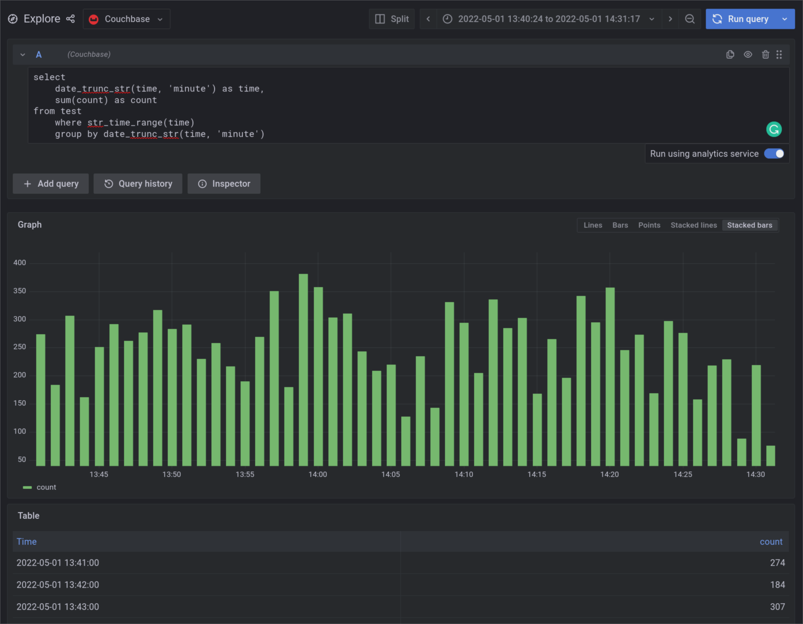
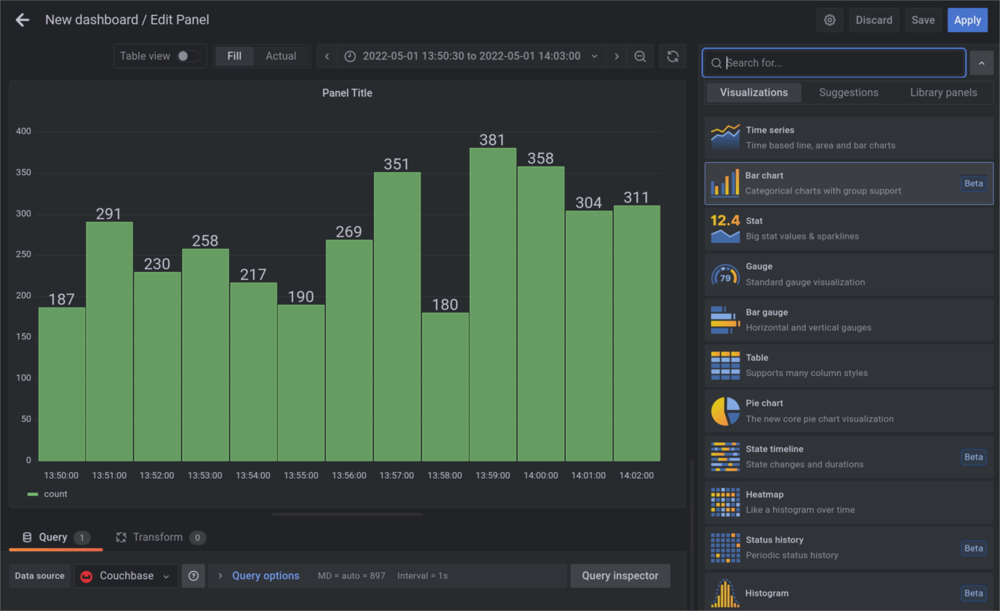

---
# frontmatter
path: "/grafana-dashboards"
title: Grafana Dashboards with Couchbase
short_title: Grafana Dashboards with Couchbase
description: 
  - Learn how to build, install, and configure Grafana Couchbase data source plugin
  - Query some data and use it in dashboards
content_type: tutorial
filter: other
technology: 
  - connectors
tags:
  - Observability
  - Metrics
sdk_language:
  - any
length: 20 Mins
---

## Overview
Grafana is a popular visualization tool commonly used to analyze time series, logs, and other data.

This tutorial will show how to create a connection between existing Grafana and Couchbase installations using the Grafana Couchbase data source plugin.

## What we'll cover
* Building the plugin.
* Installing and configuring Grafana couchbase data source plugin.
* Querying data and using it in dashboards.

## Useful Links
* [Grafana Plugins documentation](https://grafana.com/docs/grafana/latest/plugins/)
* [Couchbase documentation](https://docs.couchbase.com)
* [Plugin sources](https://github.com/couchbaselabs/grafana-plugin)

# Prerequisites
* Grafana >= 7.0
* Couchbase >= 7.0
* NodeJS >= 14
* yarn
* [Mage](https://magefile.org/)

## Downloading the Plugin
The pre-built releases as well as the source code of the plugin can be found at https://github.com/couchbaselabs/grafana-plugin. 

Go to [release page](https://github.com/couchbaselabs/grafana-plugin/releases) and download the `couchbase-datasource.zip` for the latest release. 

## Plugin Installation
On your Grafana server, find the `plugins` property in the Grafana configuration file. This property configures the location of the Grafana plugins directory. Refer to the Grafana configuration documentation for more information.

Extract the downloaded `couchbase-datasource` directory into the configured Grafana plugins directory.

Make sure that `dist` directory from the archive is located at `<plugin directory>/couchbase-datasource/dist`.

By default, Grafana does not load unsigned plugins so, we need to set [`allow_loading_unsigned_plugins`](https://grafana.com/docs/grafana/v7.5/administration/configuration/#allow_loading_unsigned_plugins) setting in grafana configuration.

To do so, locate Grafana's `custom.ini` configuration file, which usually can be found in the `conf` sub-directory of grafana working directory, an add `allow_loading_usigned_plugins=couchbase-datasource` under the `[plugins]` section to "couchbase-datasource":
```
[plugins]
allow_loading_undigned_plugins=couchbase-datasource
```

> Alternatively, you can set `GF_PLUGINS_ALLOW_LOADING_UNSIGNED_PLUGINS` Grafana environment variable to `couchbase-datasource`.

Restart the Grafana server. To verify that the new instance of Grafana has successfully loaded the plugin, search for a line in the server startup log that looks similar to this one:

```
grafana    | logger=plugin.manager t=2022-05-13T15:54:22.47+0000 lvl=info msg="Plugin registered" pluginId=couchbase-datasource
```

## Data Source Configuration
To configure the plugin, open Grafana in your web browser and go to the "Configuration -> Data sources" section. Click on the "Add data source" button and click on the "Couchbase" data source connector in the plugin list.

Provide the cluster URL, username, and password to connect to a Couchbase server and click the "Save & test" button. The plugin will connect to the cluster during the test and ping its query service. Provided configuration will be stored automatically if the test passes.


 
Please note that the plugin does not handle security and user privileges. Use Couchbase RBAC to limit which data users can access through the plugin. 

## Querying
The Couchbase data source plugin supports querying the data using the SQL++ query language. Go to the "Explore" section and select "Couchbase" as your data source:


The plugin provides `str_time_range` and `time_range` pseudo-functions that allow applying Grafana time range filters to the resulting query. 

These functions take the name of a field with time data as their only argument. 

For example, `str_time_range` is used in the following Grafana query to apply the time range by filtering on an ISO-8601 date field:
```
SELECT * from `logs` WHERE str_time_range(registration_date)
```
will be transformed by the plugin to a SQL++ query that looks like this:
```
SELECT * FROM (
	SELECT * FROM `logs` WHERE 
		STR_TO_MILLIS(registration_time) > STR_TO_MILLIS("2022-10-20 00:00:00") AND STR_TO_MILLIS(registration_time) < STR_TO_MILLIS("2022-10-21 00:00:00")
) AS data ORDER BY str_to_millis(data.registration_time) ASC
```

For fields that contain dates expressed as Unix timestamps, the `time_range` function should be used:
```
SELECT time, content from `logs` where time_range(registration_timestamp)
```

Fields that contain dates in other formats need to be transformed into either ISO-8601 or a Unix timestamp before using them in a query:
```
SELECT STR_TO_MILLIS(date, "RFC850") as time, content FROM `logs` WHERE time_range(time)
```

Grafana automatically detects what kind of data a query selects and shows it as a value graph or log messages.

The Couchbase data source plugin also supports querying data from the cluster using the [analytics service](https://docs.couchbase.com/server/current/learn/services-and-indexes/services/analytics-service.html).
To do so, activate the "Run using analytics service" toggle on the right side of the screen immediately below the query text field.


As user queries are handled directly on the cluster, all embedded and user defined SQL++ functions can be used as usual, for example:

```
SELECT SUM(count), date_trunc_str(time, "minute") FROM test WHERE str_time_range(time) GROUP BY date_trunc_str(time, "minute)
```



## Creating a dashboard 
Couchbase data source plugin supports all standard Grafana widgets and most of the widgets available in the plugin store.

To create a new dashboard, navigate to "Dashboards -> Browse" and click the "New Dashboard" button, which should open the dashboard editing interface. Select "Add a new panel" to add a panel.

Under the panel preview, select the Couchbase data source and enter your data query. Then, select the desired time interval in the top right corner above the preview. The preview should update automatically.


You can change the type of visualization used to render your data using the drop-down at the top of the right section of the screen:



## Conclusion
Grafana Couchbase data source plugin allows users to analyze time series, logging, and other data stored in a Couchbase cluster. Integration with analytics service allows exploring the data without downgrading the cluster's performance. Rich visualization tools that come with Grafana will allow users to extract more insights from their data quickly.
