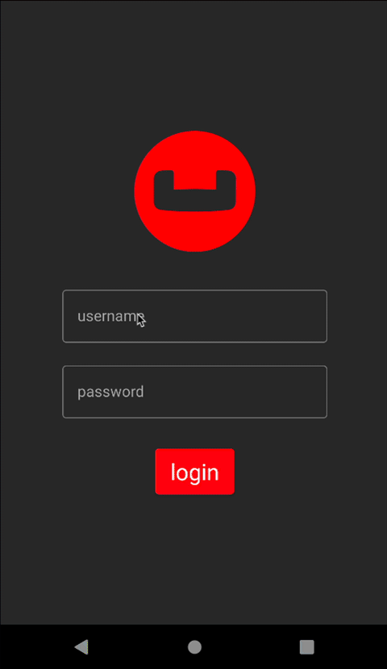

---
# frontmatter
path: "/android-kotlin-query-builder"
title:  Couchbase Lite Query Builder Engine with Kotlin and Jetpack Compose
short_title: Query Builder  
description: 
  - Learn how to query documents in Couchbase Lite
  - Explore the Query Builder Engine
content_type: tutorial
filter: mobile
technology: 
  - mobile
landing_page: mobile
landing_order: 3
exclude_tutorials: true 
tags:
  - Android
sdk_language:
  - kotlin
length: 30 Mins
---

## Introduction

Couchbase Lite brings powerful querying and Full-Text-Search(FTS) capabilties to the edge. The query builder interface is based on <a target="_blank" rel="noopener noreferrer" href="https://www.couchbase.com/sqlplusplus">SQL++</a>, Couchbase’s declarative query language that extends <a target="_blank" rel="noopener noreferrer" href="https://www.sqlite.org/index.html">SQL</a> for JSON. If you are familiar with SQL, you will feel right at home with the semantics of the new API.  The query builder API is designed using the <a target="_blank" rel="noopener noreferrer" href="https://en.wikipedia.org/wiki/Fluent_interface">Fluent API Design Pattern</a>, and it uses method cascading to read to like a Domain Specific Language (DSL). This makes the interface very intuitive and easy to understand.

In this step of the learning path you will learn the fundamentals of:

* Using the QueryBuilder API 
* Using Live Queries with queryChangeFlow and Kotlin Co-Routine Flows 
* Using JSON Serialization to "deserialize" documents from the database in to Kotlin data class 
* Using indexes to speed up a query
* Using the count function with the QueryBuilder API
* Using the LIKE operator to search for documents with a specific value in a field

## App Overview

While the demo app has a lot of functionality, this step will walk you through:

* Log in into the application
* Scrolling the list of projects 
* Review the code for displaying projects 

> **NOTE**:  This step assumes you completed the previous step <a target="_blank" rel="noopener noreferrer"  href="android-kotlin-batch-operations?learningPath=learn/android-kotlin">`Batch operations`</a> that loaded the sample data into the application.   This part of the learning path will not work if you don't complete the previous steps.

## Installation

### Fetching App Source Code

#### Clone Source Code

* If you haven't already cloned the repo from the previous steps, clone the `Learn Couchbase Lite with Kotlin and Jetpack Compose` repository from GitHub.

```bash
git clone https://github.com/couchbase-examples/android-kotlin-cbl-learning-path.git
```

### Try it out

* Open src/build.gradle using Android Studio.
* Build and run the project.
* Log in to the app with  **_"demo@example.com"_** and **_"P@ssw0rd12"_** for user Id and password fields respectively.
* Verify that you see sample projects on the screen.  If you do not see sample projects, please complete the previous step <a target="_blank" rel="noopener noreferrer"  href="android-kotlin-batch-operations?learningPath=learn/android-kotlin">**Batch operations**</a> to load sample data before continuing.



## Data Model

A reminder that Couchbase Lite is a JSON Document Store. A `Document` is a logical collection of named fields and values. The values are any valid JSON types. In addition to the standard JSON types, Couchbase Lite supports `Date` and `Blob` data types. While it is not required or enforced, it is a recommended practice to include a _"documentType"_ property that can serve as a namespace for related documents.

### The Project Document

The sample app was loaded with a collection of `Document` with a _"documentType"_ property of _"project"_ in the previous step.  Each document represents a project that a team would would work on and have to complete before the due date based on a selected location, which is another document type.   

An example of a document would be:

```json
{
	"team": "team1",
	"modifiedOn": "1656804469897",
	"documentType": "project",
	"createdBy": "demo@example.com",
	"dueDate": "1734415200000",
	"name": "Santa Clara Warehouse Audit",
	"description": "Audit of warehouse stock located in Santa Clara, CA.",
	"modifiedBy": "demo@example.com",
	"warehouse": {
		"documentType": "warehouse",
		"name": "Santa Clara Warehouse",
   	"shippingTo": [
			"AZ",
			"CA",
			"HI",
			"NV"
		],
		"warehouseId": "e1839e0b-57a0-472c-b29d-8d57e256ef32",
		"city": "Santa Clara",
		"address1": "3250 Dr Olcott Street",
		"postalCode": "95054",
		"latitude": 32.3803024,
		"state": "CA",
		"salesTax": 0.0913,
		"longitude": -121.9674197,
		"yearToDateBalance": 0.0
	},
	"projectId": "663953ba-9e4c-4090-9e07-642c1778d467",
	"createdOn": "1656804469897"
}
```

#### The Project Data Class 
When a _"project"_ is retreived from the database it is stored within an data class of type **Project**.

```kotlin
@Keep
@Serializable
data class Project (
    var projectId: String = "",
    var name: String = "",
    var description: String = "",
    var isComplete: Boolean = false,
    var documentType: String = "",
    @Serializable(with = DateSerializer::class)
    var dueDate: Date? = null,
    var warehouse: Warehouse? = null,

    //security tracking
    var team: String = "",
    var createdBy: String = "",
    var modifiedBy: String = "",
    @Serializable(with = DateSerializer::class)
    var createdOn: Date? = null,
    @Serializable(with = DateSerializer::class)
    var modifiedOn: Date? = null
)
```

#### The Warehouse Class 

When a _"warehouse"_ from a project is retreived from the database it is stored within a data class of type **Warehouse**.

```kotlin
@Keep
@Serializable
data class Warehouse(
    val warehouseId: String,
    val name: String,
    val address1: String,
    val address2: String? = "",
    val city: String,
    val state: String,
    val postalCode: String,
    val salesTax: Double,
    val yearToDateBalance: Double,
    val latitude: Double,
    val longitude: Double,
    val shippingTo: List<String>,
    val documentType: String
    )
)
```

## Exploring the Query Builder API with the Count Function

The Query API in Couchbase Lite is extensive.  On the Developer - Database Information screen we display the number of warehouse documents found in the warehouse database.  The `QueryBuilder` API along with the count function was used to calculate this number.  To see the Developer Information screen:

* Launch the Invenory Application on your emulator
* Login in using the username *demo@example.com* and password *P@ssw0rd12* 
* Click the Drawer menu icon (sometimes referred to the Hamburger icon) and tap on Developer
* Tap on the Database Information button

### Counting number of documents by type

The "DevDatabaseInfoView" screen displays the count of how many documents are in the warehouse database with the type set to 'warehouse'.  


The DevDatabaseInfoView function obtains this information from the <a target="_blank" rel="noopener noreferrer" href="https://github.com/couchbase-examples/android-kotlin-cbl-learning-path/blob/main/src/app/src/main/java/com/couchbase/learningpath/ui/developer/DevDatabaseInfoViewModel.kt#L74"> **DevDatabaseInfoViewModel**</a> class, which tracks this in a mutableStateOf variable.   The view model calls the WarehouseRepositoryDb which runs the query to calculate the count.

```kotlin
private suspend fun updateWarehouseCount() {
 viewModelScope.launch(Dispatchers.IO) {
  val locationCount = warehouseRepository.warehouseCount()
   if (locationCount > 0) {
    withContext(Dispatchers.Main) {
     numberOfWarehouses.value = locationCount
    }
   }
  }
}
```

* Open the <a target="_blank" rel="noopener noreferrer" href="https://github.com/couchbase-examples/android-kotlin-cbl-learning-path/blob/main/src/app/src/main/java/com/couchbase/learningpath/data/warehouse/WarehouseRepositoryDb.kt#L97"> **WarehouseRepositoryDb.kt**</a> file and locate the `warehouseCount` function.

```kotlin
override suspend fun warehouseCount(): Int {
```

* We build the Query using the `QueryBuilder` API that will look for Documents that match the specified criteria.

```kotlin
var resultCount = 0
val countAliasName = "count"
try {
 val db = databaseResources.warehouseDatabase
 db?.let {
  val query = QueryBuilder  // <1>
   .select(SelectResult.expression(Function.count(Expression.string("*"))).`as`(countAliasName)) // <2>
   .from(DataSource.database(it)) // <3>
   .where(Expression.property(typeAttributeName).equalTo(Expression.string(documentType))) // <4>
  val results = query.execute().allResults()  // <5>
  resultCount = results[0].getInt(countAliasName)  // <6>
  }
 } catch (e: Exception){
  Log.e(e.message, e.stackTraceToString())
 }
```
1. Call the Query Builder API to create a Query 
2. The select function will run the calculation from the count function.  Note we have to use the ` as an escape character because as is a reserved Kotlin keyword.
3. The `DataSource.database(it)` specified the Data Source which is the warehouse database
4. We include the `where` clauses that uses the `equalTo` operator to look for the _"warehouse"_ string in the _"type"_ property. 
5. We run the Query by calling the `execute().allResults()` method on the Query that was constructed in the previous step
6. We get the results by looking at the first result in the collection and getting an integer value for the key countAlaisName which we defined in the `select` clause

## Further Exploring the Query Builder API - return List of Projects Documents

The Query Builder API in Couchbase Lite is extensive. In our second example, we will be using the `QueryBuilder` API to make a simple _pattern matching_ query using the equalTo operator.  This example will use Live Query with Kotlin coroutine flows.

### Fetching Project Documents

From the "Login" screen, when a user logs in with the proper credentials they are presented with a list of projects there team is assigned to work on.

* Open the <a target="_blank" rel="noopener noreferrer" href="https://github.com/couchbase-examples/android-kotlin-cbl-learning-path/blob/main/src/app/src/main/java/com/couchbase/learningpath/ui/project/ProjectListView.kt#L54"> **ProjectListView.kt**</a> file and locate the `ProjectListView` function.

* The live query is <a target="_blank" rel="noopener noreferrer" href="https://developer.android.com/kotlin/flow">collected</a> as state from the Flow<List<Project>> repositoryFlow property that the ProjectListViewModel exposes.  Flows do not emit values until they are collected.  This is often referred to as a `cold stream`.  

> **TIP**:  Anytime documents change or are added to the database that satisify this query, the flow would stream to the ProjectListViewModel and the ProjectListView would collect it if it's the current composable on the screen.  The `live query` API via the queryChangeFlow function can dynmamically update your UI without the need for end user interaction, which will come in handy in future sections of the learning path when we review replication.  

```kotlin
val projectList by viewModel.repositoryFlow.collectAsState(initial = listOf())
```

* To see how the flow is created, open the <a target="_blank" rel="noopener noreferrer" href="https://github.com/couchbase-examples/android-kotlin-cbl-learning-path/blob/main/src/app/src/main/java/com/couchbase/learningpath/ui/project/ProjectListViewModel.kt#L29"> **ProjectListViewModel.kt**</a> file and locate the `repositoryFlow` property.

```kotlin
var repositoryFlow: Flow<List<Project>> = repository.getDocuments(currentUser.team)
```
* The view model exposes the flow which is a list of projects from the repository getDocument function.  The getDocument function takes in the current user's team in order to filter out results to only the projects associated with that team.

* To see how to build a flow, open the <a target="_blank" rel="noopener noreferrer" href="https://github.com/couchbase-examples/android-kotlin-cbl-learning-path/blob/main/src/app/src/main/java/com/couchbase/learningpath/data/project/ProjectRepositoryDb.kt#L48"> **ProjectRepositoryDb.kt**</a> file and locate the getDocuments function.

```kotlin 
override fun getDocuments(team: String): Flow<List<Project>>
```

* We first build a Query using the `QueryBuilder` API that will look for Documents that match the specified criteria.

```kotlin
 val query = QueryBuilder // <1>
  .select(SelectResult.all()) // <2>
  .from(DataSource.database(database).`as`("item")) // <3>
  .where( //4
    Expression.property("documentType")
      .equalTo(Expression.string(projectType)) // <4>
    .and(Expression.property("team")
      .equalTo(Expression.string(team)))) // <4>
```
1. Build a query using the `QueryBuilder` API
2. The `SelectResult.all()` specifies that we are interested in all properties in Documents that match the specified criteria
3. The `DataSource.database(database).\\`as\\`("item")` specified the Data Source.  Note we have to use escape character in order to use the as function
4. The `Expression` builds a `QueryExpression` used to find documents where the `type` property and the `team` properties are equal to the value passed in

* Once the query has been created we can define the flow that will be returned.

```kotlin
val flow = query        // <1>
  .queryChangeFlow()  // <1> 
  .map { qc -> mapQueryChangeToProject(qc) } // <2>
  .flowOn(Dispatchers.IO)  // <3>
query.execute()  // <4>
return flow  // <5>
```

1. The query varible from the previous step is used to call the queryChangeFlow function to return a flow
2. The <a target="_blank" rel="noopener noreferrer" href="https://developer.android.com/kotlin/flow#modify">intermediate operator map</a> is used to change the results coming back using the mapQueryChangeToProject function passing in the QueryChange.  This is used to deserialize the results from JSON to the Project data class.
3. The flowOn function is used to make sure that the flow runs on the Dispatcher.IO context to keep the code from running on the main UI thread.
4. The query executes.  Remember this step **MUST** be done before returning the flow.    
5. Return the flow

> **REMINDER**:  Kotlin Co Routine Flows emit new values into the stream of data and are not returned until they are <a target="_blank" rel="noopener noreferrer" href="https://developer.android.com/kotlin/flow">collected</a>.  

#### Indexing the Query 

* Creating indexes for non-FTS based queries is optional. However, to speed up queries, you can create indexes on the properties that you would query against. Indexing is handled eagerly.

* In the <a target="_blank" rel="noopener noreferrer" href="https://github.com/couchbase-examples/android-kotlin-cbl-learning-path/blob/main/src/app/src/main/java/com/couchbase/learningpath/data/DatabaseManager.kt#L123">**DatabaseManager.kt**</a>  file, locate the `createTeamTypeIndex` function. 
* We create an index on the `type` and `team` properties of the documents in the _inventory_ database. 

```kotlin
private fun createTeamTypeIndex(){
 try {
  inventoryDatabase?.let {  // <1>
   if (!it.indexes.contains(teamIndexName)) {
    // create index for ProjectListView to only return documents with
    // the type attribute set to project and the team attribute set to the
    // logged in users team
    it.createIndex( // <2>
     teamIndexName, // <3>
     IndexBuilder.valueIndex(   // <4>
      ValueIndexItem.property(documentTypeAttributeName), // <5>
      ValueIndexItem.property(teamAttributeName)) // <5>
     )
    }
   }
 } catch (e: Exception){
  android.util.Log.e(e.message, e.stackTraceToString())
 }
}
```
1. The let keyword is used to unbox the database since it can be null. 
2. Call the database createIndex function which takes in a name of the index and then the properites to index 
3. The name of the index in string format.  TeamIndexName is defined toward the top of the class with the value `idxTeam`
4.  The IndexBuilder's valueIndex function can be used to create the index
5.  The ValueIndexItem.property factory method can be used to create a ValueIndexItem by passing in the property of which to index.

## Query Builder API - Searching for Warehouses with the LIKE Operator 

The Query Builder API supports serveral operators including the LIKE which can be used for string matching.  We use the LIKE operator on the data editor screen for Projects to find a warehouse to add to a project.  Let's review the code.  

> **NOTE**: The like operator performs case sensitive matches.  To perform case insensitive matching, use lowercase or uppercase functions to ensure all comparators have the same case, thereby removing the case issue.

On the Project Editor screen we provide a link to the Warehouse Section screen.  To see the Project Editor screen:

* Launch the Invenory Application on your emulator
* Login in using the username *demo@example.com* and password *P@ssw0rd12* 
* Click the + icon to add a Project  
* Type in a name for the project on the Name field.  
* Tap the button `No Warehouse Selected` 


* In the City box enter Sa
* In the State box enter Ca
* Hit the Search button
* A listing of warehouses should return that match these results


Let's review the code for the Warehouse Section screen.

### Warehouse Selection 

* Open the <a target="_blank" rel="noopener noreferrer" href="https://github.com/couchbase-examples/android-kotlin-cbl-learning-path/blob/main/src/app/src/main/java/com/couchbase/learningpath/ui/project/WarehouseSelectionView.kt#L48"> **WarehouseSelectionView.kt**</a> file and locate the `WarehouseSelectionView` function.

* The WarehouseSelectionView exposes the viewModel's onSearch which the WarehouseSector function uses with the Search button.  
 
```kotlin
WarehouseSelector(
  searchCity = viewModel.searchCity.value,
  searchState = viewModel.searchState.value,
  onSearchCityChanged = viewModel.onSearchCityChanged,
  onSearchStateChanged = viewModel.onSearchCountryChanged,
  onSearch = viewModel.onSearch,
  warehouseStatusMessage = viewModel.locationStatusMessage.value,
  warehouses = viewModel.warehousesState,
  onWarehouseSelected = onWarehouseSelected
)
``` 
 
* This is defined as OnSearch in the WarehouseSelector function  

```kotlin
fun WarehouseSelector(
    searchCity: String,
    searchState: String,
    onSearchCityChanged: (String) -> Unit,
    onSearchStateChanged: (String) -> Unit,
    onSearch: () -> Unit,
    warehouseStatusMessage: String,
    warehouses: List<Warehouse>,
    onWarehouseSelected: (Warehouse) -> Unit
)
```

* The search button then calls the OnSearch method on the OnClick listener.

```kotlin
Button(modifier = Modifier
 .padding(top = 4.dp),
  colors = ButtonDefaults.buttonColors(backgroundColor = Red500),
  onClick = {
   onSearch()
  })
```
* Open the <a target="_blank" rel="noopener noreferrer" href="https://github.com/couchbase-examples/android-kotlin-cbl-learning-path/blob/main/src/app/src/main/java/com/couchbase/learningpath/ui/project/WarehouseSelectionViewModel.kt#L43"> **WarehouseSelectionViewModel.kt**</a> file and locate the `onSearch` val definition.

```kotlin
val onSearch: () -> Unit = {
 viewModelScope.launch { // <1>
  if (searchCity.value.length >= 2) { // <2>
   isLoading.value = true
   val warehouses = warehouseRepository // <3>
    .getByCityState(searchCity.value, searchState.value) // <3>
   if (warehouses.isNotEmpty()) { // <4>
    withContext(Dispatchers.Main) {
    warehousesState.clear()
    warehousesState.addAll(warehouses)
    isLoading.value = false
   } 
  } else { // <5>
   withContext(Dispatchers.Main) {
    warehousesState.clear()
    locationStatusMessage.value = "No Locations Found"
    isLoading.value = false
    }
   }
  }
 }
}
```
1. Since we will be talking to the database using suspend functions, we want to make sure we use viewModel Scope
2. Business logic to check if the searchCity value is greater than or equal to 2 characters.  If so, then we can search for warehouses.  
3. Call the warehouseRepository getByCityState function which takes in the searchCity and searchState values.  
4. If the warehouses list is not empty, then we can set the warehousesState to the warehouses list.  
5. If not, then we set the locationStatusMessage to "No Locations Found".

* Open the <a target="_blank" rel="noopener noreferrer" href="https://github.com/couchbase-examples/android-kotlin-cbl-learning-path/blob/main/src/app/src/main/java/com/couchbase/learningpath/data/warehouse/WarehouseRepositoryDb.kt#L26"> **WarehouseRepositoryDb.kt**</a> file and locate the `getByCityState` function.

```kotlin
override suspend fun getByCityState(searchCity: String, searchState: String?): List<Warehouse> {
```
* We wil use withContext(Dispatchers.IO) to make sure we are working on the IO thread since we will be talking to the database.

```kotlin
try {
 val db = databaseResources.warehouseDatabase
 db?.let { database ->
  //search by city
  var whereQueryExpression = Function
   .lower(Expression.property(cityAttributeName))
   .like(Expression.string("%" + searchCity.lowercase() + "%")) // <1>

  //search by optional state
  searchState?.let { state ->
   if (state.isNotEmpty()) { // <2>
    val stateQueryExpression = Function
     .lower(Expression.property(stateAttributeName))
     .like(Expression.string("%" + state.lowercase() + "%"))  // <2>

     whereQueryExpression =
      whereQueryExpression.and(stateQueryExpression)  // <2>
   }
  }

  //add type filter
  val typeQueryExpression = Function
   .lower(Expression.property(typeAttributeName))
   .equalTo(Expression.string(documentType))  // <3>

  whereQueryExpression = whereQueryExpression.and(typeQueryExpression) // <3>

  //create query to execute using QueryBuilder API
  val query = QueryBuilder
   .select(SelectResult.all())
   .from(DataSource.database(database).`as`(itemAliasName))
   .where(whereQueryExpression) // <4>

  //loop through results and add to list
  query.execute().allResults().forEach { item -> // <5>
   val json = item.toJSON()
   val warehouse = Json.decodeFromString<WarehouseDao>(json).item
   warehouses.add(warehouse)
  }
 }
} catch (e: Exception){
 Log.e(e.message, e.stackTraceToString())
}
```
1. Create a query expression off the city attribute and use the like function to pass in the searchCity value. 
2. If the searchState value is not null, then we will create a query expression off the state attribute and use the like function to pass in the searchState value. 
3. Create a query expression off the type attribute and use the equalTo function to pass in the documentType value.  This makes sure we only match warehouse documents.
4. We will build a query using the QueryBuilder API to select all the results from the database and pass in our whereQueryExpression with our like statement(s). 
5. We loop through all the results and add them to the warehouses list that is then returned to the ViewModel.

## Learn More

Congratulations on completing this step of our learning path!

This step of the learning path walked you through the Query Builder API in Couchbase Lite and used it to return documents from the database and we looked at calling the Query API built-in count function. Check out the following links for further documenation and continue on to the next step to learn more about how to use Query Builder with SQL++ syntax.

### References 

* <a target="_blank" rel="noopener noreferrer" href="https://docs.couchbase.com/couchbase-lite/current/android/querybuilder.html">Documentation: Querybuilder</a>
* <a target="_blank" rel="noopener noreferrer" href="https://docs.couchbase.com/couchbase-lite/current/android/querybuilder.html#lbl-like-ops">Documentation: Querybuilder - Like Operator</a>
* <a target="_blank" rel="noopener noreferrer" href="https://docs.couchbase.com/mobile/3.0.0/couchbase-lite-android/com/couchbase/lite/Function.html">API Documentation: Querybuilder - Functions</a>
* <a target="_blank" rel="noopener noreferrer" href="https://docs.couchbase.com/couchbase-lite/current/android/query-resultsets.html">Documentation: Result Sets</a>
* <a target="_blank" rel="noopener noreferrer" href="https://docs.couchbase.com/couchbase-lite/current/android/query-live.html">Documentation: Live Query - Working with Queries</a>
* <a target="_blank" rel="noopener noreferrer" href="https://docs.couchbase.com/couchbase-lite/current/android/query-troubleshooting.html">Documentation: Query Troubleshooting
</a>
