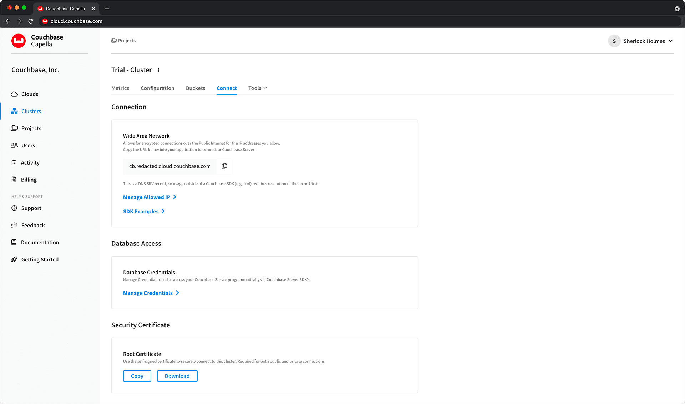

---
# frontmatter
path: "/tutorial-quickstart-scala-webservers"
# title and description do not need to be added to markdown, start with H2 (##)
title: Quickstart in Couchbase with Scala
short_title: Scala Quickstart
description:
  - Learn how to build a REST API using popular Scala web frameworks and Couchbase
  - Get experience with JSON data modeling in Couchbase, and the Scala SDK using case classes and the circe library
  - Write SQL++ queries that can filter data with parameters obtained from the REST API
content_type: quickstart
filter: sdk
technology:
  - kv
  - query
  - capella
  - server
tags:
  - REST API
sdk_language:
  - scala
length: 30 Mins
---

<!-- 
  The name of this file does not need to be `tutorial-quickstart-scala-webservers` because it is in the `tutorials/scala/markdown` directory, so we can just call it `webservers`. The idea is that we can leave off `tutorial-quickstart` as a prefix.
-->

<!-- TODO:  Figure out how to add width to image size in try it now links -->

[](https://gitpod.io/#https://github.com/couchbase-examples/scala-quickstart)

## Prerequisites

To run this prebuilt project, you will need:

- Scala 2, version 2.12 or higher installed
- Code Editor installed (IntelliJ IDEA, Eclipse, or Visual Studio Code)
- Set up Couchbase, using one of the two options below

**Option 1: Couchbase Capella**
  - [A Couchbase Capella account](https://cloud.couchbase.com/sign-up) – free trials are available with a simple sign-up
  - Capella Cluster [deployed](https://docs.couchbase.com/cloud/get-started/deploy-first-cluster.html)

**Option 2: Couchbase Server**
  - Follow [Couchbase Installation Options](/tutorial-couchbase-installation-options) for installing the latest Couchbase Database Server Instance (at least Couchbase Server 7)

## Source Code

```shell
git clone https://github.com/couchbase-examples/scala-quickstart
```

### Database and Web Server Configuration

All configuration for communication with the database and the three web servers is stored in the `/src/main/resources/application.conf` file.  This includes the connection string, username, and password for Couchbase, and the port numbers for Play/Akka http/htt4ps.  

The default username for Couchbase server is assumed to be `Administrator` and the default password is assumed to be `password`.  If these are different in your environment you will need to change them before running the application.

### Couchbase Capella Specific Configuration

This section is only needed when you've opted for using a Couchbase Capella cloud instance for following the tutorial.


To enable the tutorial code to establish a connection to Capella, you will need to make a couple of changes:
- enable the flag `capella = true` in `application.conf`
- add a bucket to Capella with the same `bucket-name` as the one defined in `application.conf`
- make sure your `username` in `application.conf` is [configured for access](https://docs.couchbase.com/cloud/get-started/configure-cluster-access.html) to this bucket
- change the `host` in `application.conf` to the **Wide Area Network** address in Capella -> Cluster -> `your_cluster_name` -> Connect. See the image below:
  

Note that for simplicity, trust certificate checking has been disabled as part of the tutorial by setting this in the `SecurityConfig`. If you want to learn more, see the [security options](https://docs.couchbase.com/scala-sdk/current/ref/client-settings.html#security-options) as part of the SDK client settings.

Possible issues:
- The Scala SDK does not support a bucket path as part of the `host` name in `application.conf`, use `bucket-name` instead
- It is not supported to create a bucket in Capella through the SDK. If you get a `CouchbaseException: Failed to create bucket`,
  please make sure you've created the bucket through the Capella user interface, and the name lines up with `bucket-name` in `application.conf`

## Running The Application

At this point the application is ready, and you can run it via your IDE or from the terminal:

```shell
sbt run
```

> Note: When using Option 2: Couchbase Server, then Couchbase Server 7 must be installed and running on localhost (http://127.0.0.1:8091) prior to running the Scala application.

The application will keep running until you provide a line of input, after which it will shut down the web servers.

You can launch your browser and go to each web server's Swagger start page:

* [Akka HTTP server](http://localhost:8081/docs)
* [http4s server](http://localhost:8082/docs)
* [Play server](http://localhost:8083/docs)

## What We'll Cover

Simple REST APIs using the Scala Couchbase SDK with the following endpoints:

- [POST a Profile](#post-a-profile) – Create a new user profile
- [GET a Profile by Key](#get-a-profile-by-key) – Get a specific profile
- [PUT Profile](#put-profile) – Update a profile
- [DELETE Profile](#delete-profile) – Delete a profile
- [GET Profiles by Searching](#get-profiles-by-searching)  – Get all profiles matching first or last Name

## Document Structure

We will be setting up REST APIs with three of the commonly used frameworks with Scala: [Play](https://www.playframework.com/), [Akka http](https://github.com/akka/akka-http) and [http4s](https://http4s.org/). Endpoint descriptions and [Swagger documentation](https://swagger.io/) is created through the [tapir framework](https://tapir.softwaremill.com/).

The REST APIs will be used manage user profile documents. Our profile document will have an auto-generated UUID for its key, first and last name of the user, an email, and hashed password. For this demo we will store all profile information in just one document in a collection named `profile`:

```json
{
  "pid": "b181551f-071a-4539-96a5-8a3fe8717faf",
  "firstName": "John",
  "lastName": "Doe",
  "email": "john.doe@couchbase.com",
  "saltedPassword": "$2a$10$tZ23pbQ1sCX4BknkDIN6NekNo1p/Xo.Vfsttm.USwWYbLAAspeWsC"
}
```

As we can see, user's passwords will be encrypted in the database. This is achieved this through a [bcrypt Scala wrapper](https://github.com/t3hnar/scala-bcrypt).

## Let's Review the Code

To begin clone the repo and open it up in the IDE of your choice to learn about how to create, read, update and delete documents in your Couchbase Server.

## POST a Profile

For CRUD operations we will use the [Key Value operations](https://docs.couchbase.com/scala-sdk/current/howtos/kv-operations.html) that are built into the Couchbase SDK to create, read, update, and delete a document. Every document will need an ID (similar to a primary key in other databases) in order to save it to the database.

If we look at the the `ProfileController` trait, found in the controllers folder and navigate to the postProfile function, then we can see the following type signature:

```scala
def postProfile(profileInput: ProfileInput): F[Either[String, Profile]]
```

The abstract definitions in `ProfileController` (and `CouchbaseConnection`) are generalized over some effect `F`, making it easier to switch between implementations such as `Future` and `IO`. This will help in defining our different REST APIs and also make it easier to test our code. 

Within the `F` type parameter, we can see that we return an `Either[String, Profile]]` representing an error string, or a successful result with the `Profile` case class.

The input for posting a `Profile` is a `ProfileInput`:

```scala
final case class ProfileInput(
    firstName: String,
    lastName: String,
    email: String,
    password: String
)
```

The implementation for `postProfile` in `CouchbaseProfileController` will salt the password and create a `UUID`, which are returned as part of the `Profile` datatype.
```scala
final case class Profile(
    pid: UUID,
    firstName: String,
    lastName: String,
    email: String,
    saltedPassword: String
)

def fromProfileInput(profileInput: ProfileInput): Try[Profile] = {
  profileInput match {
    case ProfileInput(firstName, lastName, email, password) =>
      for {
        salted <- password.bcryptSafeBounded
      } yield Profile(UUID.randomUUID(), firstName, lastName, email, salted)
  }
}
```

Our `Profile` document is ready to be persisted to the database.  We create call to the `collection` using the local variable `profileCollection: Future[Collection]` and then call the `insert` method  and passing it the UUID from the `Profile` as the key. 

Note that the [Scala SDK has support for various types of JSON](https://docs.couchbase.com/scala-sdk/current/howtos/json.html) commonly used within the Scala community. Here we use the [circe](https://circe.github.io/circe/) JSON library to convert the `Profile` with `.asJson` and insert it. 

Once the document is inserted we then return the document saved and the result all as part of the same object back to the user.

```scala
override def postProfile(profileInput: ProfileInput): Future[Either[String, Profile]] = {
  for {
    pc <- profileCollection
    profile <- Profile.fromProfileInput(profileInput) match {
      case Failure(exception) => Future.successful(Left(exception.toString))
      case Success(p) =>
        pc.insert[io.circe.Json](p.pid.toString, p.asJson) map (_ => Right(p))
    }
  } yield profile
}
```

> *from controllers/CouchbaseProfileController.scala*

## GET a Profile by Key

Navigate to the `getProfile` function in the `CouchbaseProfileController` file in the controllers folder.  We only need the profile ID `pid` from the user to retrieve a particular profile document using a basic key-value operation which is passed in the method signature as a string.  Since we created the document with a unique key we can use that key to find the document in the scope and collection it is stored in.

```scala
 override def getProfile(pid: UUID): Future[Either[String, Profile]] = {
  for {
    pc <- profileCollection
    res <- pc.get(pid.toString)
  } yield res.contentAsCirceJson[Profile]
}
```

> *from getProfile function in controllers/CouchbaseProfileController.scala and using the implicit class in models/CirceGetResult.*


## PUT Profile

Now let's navigate to the `putProfile` function of the `CouchbaseProfileController` class. The entire document gets replaced except for the document key and the `pid` field.  We create a call to the `collection` using the `upsert` method and then return the document saved and the result just as we did in the previous endpoint.

The only difference in implementation with `postProfile`) is the following line:
```scala
pc.upsert[io.circe.Json](p.pid.toString, p.asJson)
```

> *from update method of controllers/CouchbaseProfileController.scala*

## DELETE Profile

Navigate to the `deleteProfile` function in the `CouchbaseProfileController` class. We only need the `Key` or id from the user to remove a document using a basic key-value operation.

```scala
pc.remove(pid.toString)
```

> *from deleteProfile method of controllers/CouchbaseProfileController.scala*

## GET Profiles by Searching

[SQL++ (N1QL)](https://docs.couchbase.com/dotnet-sdk/current/howtos/n1ql-queries-with-sdk.html) is a powerful query language based on SQL, but designed for structured and flexible JSON documents. We will use a SQL++ query to search for profiles with Skip, Limit, and Search options.

Navigate to the `getProfiles` method in the `CouchbaseProfileController` class.  This endpoint is different from all of the others because it makes the SQL++ query rather than a key-value operation. This means more overhead because the query engine is involved. We did create an [index](https://docs.couchbase.com/server/current/learn/services-and-indexes/indexes/indexing-and-query-perf.html) specific for this query, so it should be performant.

The individual `skip` (optional), `limit` (optional), and `search` values are obtained from their respective parameters. Then, we build our SQL++ query using the parameters that were passed in.

Finally, we pass that `query` to the `cluster.query` method and return the result.

Take notice of the SQL++ syntax and how it targets the `bucket`.`scope`.`collection`.

```scala
  override def profileListing(
                               limit: Option[Int],
                               skip: Option[Int],
                               search: String
                             ): Future[Either[String, List[Profile]]] = {
  val query = s"SELECT p.* FROM " +
    s"`${quickstartConfig.couchbase.bucketName}`.`_default`.`${quickstartConfig.couchbase.collectionName}` p " +
    s"WHERE lower(p.firstName) LIKE '%${search.toLowerCase}%' " +
    s"OR lower(p.lastName) LIKE '%${search.toLowerCase}%'  " +
    s"LIMIT " + limit.getOrElse(5) + " OFFSET " + skip.getOrElse(0)

  import cats.implicits._
  for {
    cluster <- couchbaseConnection.cluster
    rows <- Future.fromTry(
      cluster.query(
        query,
        QueryOptions(scanConsistency =
          Some(QueryScanConsistency.RequestPlus())
        )
      )
    )
    profiles <- Future.fromTry(
      rows
        .rowsAs[io.circe.Json]
        .map(_.map(json => json.as[Profile].left.map(_.getMessage())))
    )
    accumulatedProfiles = profiles.toList.sequence
  } yield accumulatedProfiles
}

```

> *from getProfiles method of Controllers/ProfileController.cs*

### Running The Tests

To run the standard unit and integration tests, use the following commands:

```shell
sbt test
```

## Conclusion

Setting up a basic REST API in Spring Boot with Couchbase is fairly simple.  This project when run with Couchbase Server 7 installed creates a bucket in Couchbase, an index for our parameterized [SQL++ (N1QL) query](https://docs.couchbase.com/scala-sdk/current/howtos/n1ql-queries-with-sdk.html), and showcases basic CRUD operations needed in most applications.
