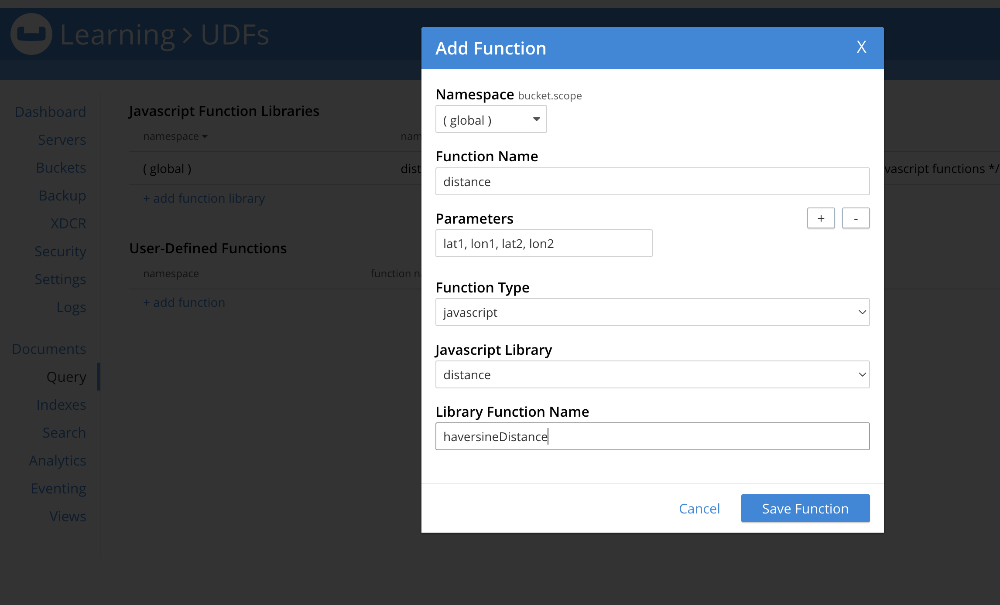

---
# frontmatter
path: '/tutorial-user-defined-functions-with-javascript'
title: Creating User Defined Functions with Javascript
short_title: User Defined Functions with Javascript
description: 
  - Build a User Defined Function with Javascript for Query Service
  - Write custom business logic inside your SQL++ queries while querying the data stored in Couchbase
content_type: tutorial
filter: sdk
technology: 
  - udf
  - analytics
  - query
tags:
  - SQL++ (N1QL)
sdk_language:
  - nodejs
length: 30 Mins
---

<!-- [abstract] -->

In this tutorial, you will learn how to create [User Defined Functions (UDF)](https://docs.couchbase.com/server/current/n1ql/n1ql-language-reference/userfun.html) with Javascript to include custom business logic inside your SQL++ queries while querying the data stored in Couchbase.

## Prerequisites

To follow this tutorial, you will need:

- Couchbase Server. Follow [Couchbase Installation Options](/tutorial-couchbase-installation-options) for installing the lastest Couchbase Database Server Instance.
- `travel-sample` bucket imported into Couchbase. The instructions to import the sample bucket can be found [here](https://docs.couchbase.com/server/current/manage/manage-settings/install-sample-buckets.html).

## Demo Use Case

For this tutorial, we will focus on creating a custom UDF to determine the places of interest around a user's current location based on the distance. This calculation is not possible directly using a SQL++ query as the distance calculation is based on the real-time geographic location of the user. This UDF can be used to power a location based search similar to what is being provided by applications like Google Maps.


The UDF performs the following functionality:

- Takes the GPS coordinates of the user.
- Calculates the distances for the locations stored in Couchbase from the user's location.

The code for this tutorial can be found in the [Github repository](https://github.com/couchbase-examples/user-defined-functions/tree/main/javascript-udf).

## Writing the UDF in Javascript

Couchbase supports writing business logic in Javascript. The complete Javascript functionality supported by Couchbase can be found in the [documentation](https://docs.couchbase.com/server/current/eventing/eventing-language-constructs.html). From Couchbase 7.1, the functions can also call N1QL queries from Javascript.

For our use case, we need to define a custom function that can be used to calculate the distance between two GPS coordinates. For this purpose, we can use the [Haversine formula](https://en.wikipedia.org/wiki/Haversine_formula) which calculates the distance between two GPS coordinates along the spherical surface of Earth.

We define two Javascript methods, `degreesToRadians` to convert the degrees to radians and `haversineDistance` to calculate the haversine distance between two GPS coordinates. The `degreesToRadians` function is only called from the `haversineDistance` function.

```javascript
function degreesToRadians(degrees) {
  return (degrees * Math.PI) / 180
}
```

```javascript
function haversineDistance(lat1, lon1, lat2, lon2) {
  var earthRadiusKm = 6371

  var dLat = degreesToRadians(lat2 - lat1)
  var dLon = degreesToRadians(lon2 - lon1)

  lat1 = degreesToRadians(lat1)
  lat2 = degreesToRadians(lat2)

  var a =
    Math.sin(dLat / 2) * Math.sin(dLat / 2) +
    Math.sin(dLon / 2) * Math.sin(dLon / 2) * Math.cos(lat1) * Math.cos(lat2)
  var c = 2 * Math.atan2(Math.sqrt(a), Math.sqrt(1 - a))
  return earthRadiusKm * c
}
```

## Importing the Javascript Methods into Couchbase

From Couchbase 7.1, the UDFs can be imported from the Couchbase web interface. To import the Javascript UDFs, we can copy the Javascript code snippets from the Github repository into the UDF pane in the Query Workbench.

Steps

- In the Query tab of your Couchbase server, click on the UDF pane.
- Click on `add function library` under `Javascript Function Libraries`. A Javascript function library is a group of one or more functions. We will reference the library when we define the UDF in SQL++.
- In the pane that opens, we can copy the Javascript functions into Couchbase.

  - The `Namespace` determines the namespace in which the UDF will be accessible. It can be used to restrict the UDF to certain buckets. For this tutorial, we can set the it as `global` for this method to be accessible to any bucket in our Couchbase cluster.
  - The `Library Name` refers to the name of the library. We can set it as `distance`.
  - Copy the code from the file `distance.js` provided in the Github repo into the space provided for javascript functions.
  - Click on `Save` to save the library.

  

## Creating UDFs from Javascript Library

In the previous step, we have created the Javascript library containing our custom functions. Now, we can define the UDF in Couchbase that references the methods in the library for the UDFs to be accessible from SQL++ queries.

Steps

- In the Query tab, under `User-Defined Functions`, click on `add function`.
- In the pane that opens, we enter the details of the UDF.
  - Namespace: It refers to the buckets in which the UDF is accessbile. Here, we can leave it as `global` for the UDF to be accessible across different buckets.
  - Function Name: This refers to the name of the UDF. It will be used in the SQL++ queries. Here, we can name it `distance`.
  - Parameters: These are the parameters that are expected by the UDF. Here, we have four parameters, the two lattitude and longitude pairs specified by lat1, lon1, lat2 and lon2.
  - Function Type: Here, we are using external Javascript function. So, it needs to be set to `javascript`.
  - Javascript Library: This refers to the Javascript library that includes the function to be called. In our case, this is `distance` from the last step.
  - Library Function Name: This is the name of the Javascript function inside the Javascript library. In our case, this is `haversineDistance`.
  - Click on `Save Function` to save the UDF definition.
    

## Testing the UDF

We can test the UDF that we defined now by using the [EXECUTE FUNCTION](https://docs-staging.couchbase.com/server/current/n1ql/n1ql-language-reference/execfunction.html) statement in SQL++.

```shell
EXECUTE FUNCTION distance(51.5, 0, 38.8, -77.1)
```

If the UDF is defined properly, there will be an output like the one shown below:

```shell
[
  5918.185064088764
]
```

This is the distance between the two GPS coordinates (51.5, 0) and (38.8, -77.1) in kilometers as computed by our UDF written in Javascript.

Note that the UDF is run against the context set in the Query workbench. As our UDF is defined globally, we need not specify any context.

## Testing UDF using SQL++ Queries with Sample Data

We are now ready to test the UDF inside a SQL++ query to generate the data for our demo application.

In our sample bucket, [travel-sample](https://docs.couchbase.com/c-sdk/current/ref/travel-app-data-model.html), we have a collection containing landmarks along with their GPS coordinates of their location. We will use this dataset to search for locations around the users' location based on proximity.

```sql
SELECT distance(l.geo.lat, l.geo.lon, 51.509865, -0.118092) AS distance_km,
       l.name,
       l.activity,
       l.city,
       l.content,
       l.geo.lat,
       l.geo.lon
FROM `travel-sample`.inventory.landmark l
ORDER BY distance_km ASC
LIMIT 10;
```

The results would show the ten closest landmarks to the user's location (51.509865, -0.118092) by distance.

```shell
[
  {
    "activity": "see",
    "city": "London",
    "content": "Somerset House is home to three art galleries:  The exceptional '''Courtauld Institute''' displays a collection of 19th and 20th century art, including well-known works by Degas, Matisse and Kandinsky; The Gilbert Collection presents a collection of decorative art; and The Hermitage Rooms, the most recent addition to Somerset House, hosts temporary exhibitions of works on loan from the Hermitage Museum in Saint Petersburg. The central courtyard is filled with fountains in the Summer, but in the Winter, an ice rink is installed, it is very popular, so visitors should book in advance, or expect to wait a long time to skate.",
    "distance_km": 0.10940067520415872,
    "lat": 51.5108,
    "lon": -0.1176,
    "name": "Somerset House"
  },
  {
    "activity": "see",
    "city": "London",
    "content": "Cleopatra's Needle originated in the ancient [[Egypt]]ian city of [[Cairo/Heliopolis|Heliopolis]], in the Temple of Atum, but the Romans moved it to [[Alexandria]] in 12 BC.  In 1819, viceroy Mehemet Ali presented Cleopatra's Needle to the British, commemorating military victories in Egypt, but it remained in Alexandria until 1877 when transportation was arranged to bring it to London.  On the voyage, the ship capsized in a storm, killing six crewmembers.  Cleopatra's Needle was thought to be lost, but Spanish trawlers found it afloat a few days later, and after some repairs, it arrived in London on 21 Jan 1878. The obelisk is flanked by two faux-sphinxes, which show the effects of bombings of London during World War II.  Today, Cleopatra's Needle shows some wear from exposure to London's damp weather.",
    "distance_km": 0.2153782246329736,
    "lat": 51.5085,
    "lon": -0.1203,
    "name": "Cleopatra's Needle"
  },
  {
    "activity": "buy",
    "city": "London",
    "content": "Daily second-hand book sale near the bank of the Thames. A nice place to just browse for books (classic and modern), maps and prints.",
    "distance_km": 0.329776385402355,
    "lat": 51.5073,
    "lon": -0.1157,
    "name": "Southbank Book Market"
  },
  {
    "activity": "see",
    "city": "London",
    "content": "[[London]] (in [[London/Covent Garden|Covent Garden]])",
    "distance_km": 0.34889537479151833,
    "lat": 51.51227,
    "lon": -0.12133,
    "name": "London Transport Museum"
  },
  {
    "activity": "see",
    "city": "London",
    "content": "London's most famous and popular skateboarding area, situated partly underneath Queen Elizabeth Hall along Queen's Walk and the Thames.  Also popular with graffiti artists, BMXers and so forth.",
    "distance_km": 0.36487940944981834,
    "lat": 51.5067,
    "lon": -0.1167,
    "name": "Undercroft"
  },
  {
    "activity": "see",
    "city": "London",
    "content": "Tucked under Waterloo Bridge, BFI Southbank, formerly known as the National Film Theatre, pitches itself as the home of film and has three screens showing classic (including silent), foreign language and less mainstream films. Recently redeveloped, it now has a new entrance on Theatre Alley, a shop dedicated to film, an interactive exhibition space and an excellent bar/restaurant at the back. Visitors can also access the Mediatheque - wind your way through the BFI's extensive film and TV archive for free.  Cool bar and restaurant. Tickets are generally available on the spur of the moment.",
    "distance_km": 0.378692262237853,
    "lat": 51.5069,
    "lon": -0.1154,
    "name": "BFI Southbank"
  },
  {
    "activity": "see",
    "city": "London",
    "content": "Music venue hosting daily performances. | image=Queen Elizabeth Hall.jpg",
    "distance_km": 0.3859430181613397,
    "lat": 51.5066,
    "lon": -0.1162,
    "name": "Queen Elizabeth Hall"
  },
  {
    "activity": "drink",
    "city": "London",
    "content": "The antidote to gay bars: a pub-like atmosphere and great music. | image=The Retro Bar.jpg",
    "distance_km": 0.39732030942983415,
    "lat": 51.5091,
    "lon": -0.1237,
    "name": "The Retro Bar"
  },
  {
    "activity": "see",
    "city": "London",
    "content": "Three large auditoriums, the Olivier, the Lyttelton and the Cottesloe. The Olivier theatre is the largest with an open stage and a fan shaped auditorium around it. This ensures that all seats provide a good view. Most of the more 'popular' productions are put on here as the space provided is much larger than most theatres. The Lyttelton theatre is more traditional with a procenium arc with good views from most seats. The Cottesloe is a small studio theatre, seating around 400. Some tickets will be available on the day, either day seats (arrive before 09:30 and queue) or standby (arrive before 6PM and queue), or you can buy online. Popular shows, especially those around Christmas in the Olivier sell out months in advance. Tickets to The National Theatre are generally better value than most other theatres. There is also the '£10 Travelex' season in the summer that provides a large number (over 100,000 seats a year) at £10. Booking in advance is required for these. There is also an exhibition space in the Lyttelton theatre foyer that frequently holds popular photographic exhibitions. Free jazz is often played in the evening in the ground floor foyer. During summer there is a free daily outdoor festival of performance, music, comedy and cabaret known as Watch This Space. Deckchairs (and artificial grass) are provided to watch on. Free exhibitions. Backstage tours £5. (http://www.nationaltheatrelondon.com/tickets/)",
    "distance_km": 0.42625112040817054,
    "lat": 51.507,
    "lon": -0.114,
    "name": "National Theatre"
  },
  {
    "activity": "drink",
    "city": "London",
    "content": "Free nightly music events.  The best place to sample underground electro, indie, dub-step and more.",
    "distance_km": 0.4323026974543284,
    "lat": 51.5063,
    "lon": -0.1156,
    "name": "Concrete"
  }
]
```

## Using SQL++ Queries inside Javascript UDF

From Couchbase 7.1, we can run SQL++ queries from within the Javascript UDFs.

Here is a short example on selecting specified number of locations and their corresponding distances from the user based on the activity type such as "eat", "do", "see", etc as selected by the user.

```javascript
function landmarkByActivity(type, rowlimit, lat, lon) {
  var query = select l.name, l.activity, l.city, l.content, l.geo from `travel-sample`.inventory.landmark l where activity = $type limit $rowlimit;
  let landmarks = [];
  for (const row of query) {
    row['distance_km'] = haversineDistance(row["geo"]["lat"], row["geo"]["lon"], lat, lon)
    landmarks.push(row);
  }
  return {'num_entries': landmarks.length, 'data': landmarks};
}
```

The example queries for the specified rows of landmark data with the specified activity, computes the distance of the landmarks from the user and returns the data along with the count of the results.

It is worth noting that we are using the Javascript method name, `haversineDistance` inside this UDF.

We can import this function in the same way as explained before into the Javascript library and create the corresponding UDF.

### Running the UDF

The query below calls the UDF to get ten locations with the activity "eat" along with their distance from the user's location (51.509865, -0.118092). Similarly other activities present in the dataset can be selected as desired.

```sql
select landmarks_by_activity("eat", 10, 51.509865, -0.118092) as locations;
```

The results will be similar to the one shown below:

```shell
[
  {
    "locations": {
      "data": [
        {
          "activity": "eat",
          "city": "Gillingham",
          "content": "A newly extended lively restaurant located in the high street, an American Hollywood style restaurant beautifully decorated with old photos and a great menu including burgers and ribs.",
          "distance_km": 47.71062812200022,
          "geo": {
            "accuracy": "RANGE_INTERPOLATED",
            "lat": 51.38937,
            "lon": 0.5427
          },
          "name": "Hollywood Bowl"
        },
        {
          "activity": "eat",
          "city": "Gillingham",
          "content": "Really popular oriental restaurant with a mixture foods including noodles, duck and other oriental staples.",
          "distance_km": 47.871016717207134,
          "geo": {
            "accuracy": "ROOFTOP",
            "lat": 51.38753,
            "lon": 0.54423
          },
          "name": "Thai Won Mien"
        },
        {
          "activity": "eat",
          "city": "Gillingham",
          "content": "Indian restaurant opposite the railway station.  Good value and quality of food. An award winning up market restaurant. Sunday Buffet for only £8.50 and you can eat as much as you like. Very popular with the locals and beyond.",
          "distance_km": 48.26099341976766,
          "geo": {
            "accuracy": "APPROXIMATE",
            "lat": 51.38633,
            "lon": 0.54952
          },
          "name": "Spice Court"
        },
        {
          "activity": "eat",
          "city": "Gillingham",
          "content": "Chinese restaurant just off the High Street.",
          "distance_km": 48.17402020586984,
          "geo": {
            "accuracy": "RANGE_INTERPOLATED",
            "lat": 51.38697,
            "lon": 0.54852
          },
          "name": "Beijing Inn"
        },
        {
          "activity": "eat",
          "city": "Gillingham",
          "content": "Best fish and chips in the area.",
          "distance_km": 48.086033369060885,
          "geo": {
            "accuracy": "RANGE_INTERPOLATED",
            "lat": 51.39243,
            "lon": 0.54977
          },
          "name": "Ossie's Fish and Chips"
        },
        {
          "activity": "eat",
          "city": "Glasgow",
          "content": "65 seat restaurant that opened in 1998 and specialising in dishes from all over the former Soviet Union such as the vegetarian dish of [[Moldavia]]n Gouvetch, a colourful and winter warming casserole of sweet peppers, potatoes, ginger, peas, aubergines, leek, chilli and garlic served with grilled lavash. Carnivorous [[Georgia (country)|Georgia]]ns will not go hungry either! Walls are hung with changing exhibitions of oil paintings, pastels, watercolours, prints, ceramics and crafts by artists from around the world.",
          "distance_km": 554.348358700705,
          "geo": {
            "accuracy": "RANGE_INTERPOLATED",
            "lat": 55.85683,
            "lon": -4.24654
          },
          "name": "Café Cossachok"
        },
        {
          "activity": "eat",
          "city": "Glossop",
          "content": "A friendly and quirky pub serving cheap and tasty vegan food and a range of real ales, ciders, etc. There is a small live music venue in an upstairs room with a varied programme and free folk-music jamming sessions in the bar on a Monday night. The own-brew beers have attracted mixed reviews.",
          "distance_km": 248.45362152304693,
          "geo": {
            "accuracy": "RANGE_INTERPOLATED",
            "lat": 53.443612,
            "lon": -1.956587
          },
          "name": "The Globe"
        },
        {
          "activity": "eat",
          "city": "Gullane",
          "content": "Award-winning fine dining restaurant which prides itself on using the best locally-sourced ingredients. Diners travel here from all over south-east Scotland.",
          "distance_km": 533.6517355105083,
          "geo": {
            "accuracy": "APPROXIMATE",
            "lat": 56.0344,
            "lon": -2.8309
          },
          "name": "La Potiniere"
        },
        {
          "activity": "eat",
          "city": "Gullane",
          "content": "After a bracing walk on the beach, what better than a hot cup of tea or coffee and a slice of proper Black Forest Gateau? Get that and much more at this German-style bakery, run by the eponymous Falko himself. If you need an &quot;alibi&quot; for tucking into the cakes, there are some delicious savouries on offer as well.",
          "distance_km": 533.7360545941461,
          "geo": {
            "accuracy": "RANGE_INTERPOLATED",
            "lat": 56.035,
            "lon": -2.8319
          },
          "name": "Falko Konditormeister"
        },
        {
          "activity": "eat",
          "city": "Harlech",
          "content": "A restaurant well situated near the Castle",
          "distance_km": 310.5847804319464,
          "geo": {
            "accuracy": "ROOFTOP",
            "lat": 52.8596,
            "lon": -4.1076
          },
          "name": "castle cottage"
        }
      ],
      "num_entries": 10
    }
  }
]
```

Note that these results are different from the earlier results as we are filtering purely based on the activity type in this UDF. In the earlier UDF without SQL++ query, we were ordering the results based on the distance from the user.

## Learn More

Congratulations on completing this tutorial!

In this tutorial, we walked through an example of how to create User Defined Functions (UDF) in Javascript, import them into Couchbase and to use them in SQL++ queries. We also saw briefly about using SQL++ queries inside the UDFs.

Check out the following links for more information on UDFs.

## Further Reading

- [UDF Documentation](https://docs-staging.couchbase.com/server/current/n1ql/n1ql-language-reference/userfun.html)
- [UDF Introduction](https://blog.couchbase.com/n1ql-user-defined-functions/)
- [Code Repository](https://github.com/couchbase-examples/user-defined-functions)
