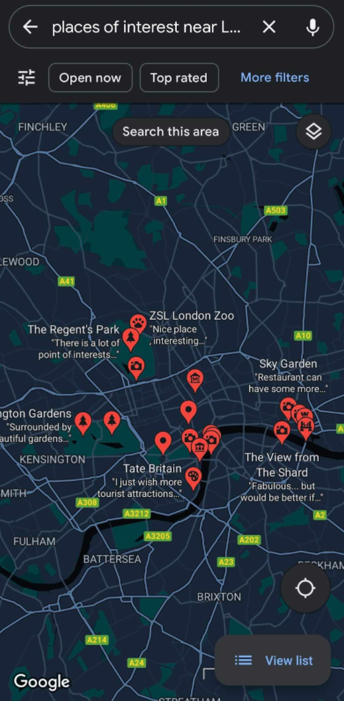
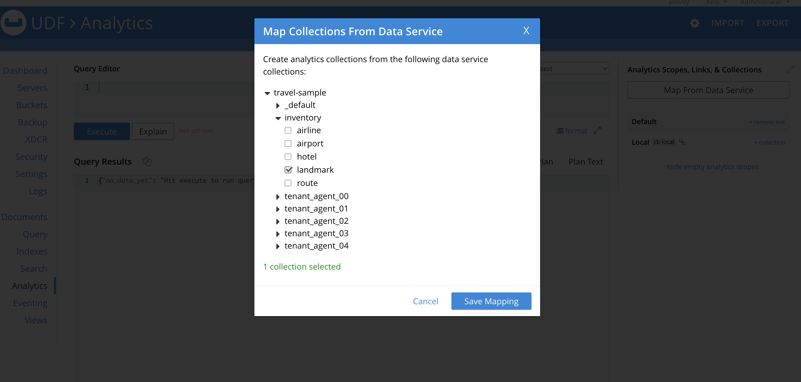

---
# frontmatter
path: '/tutorial-analytics-user-defined-functions-with-python'
title: Creating Analytics User Defined Functions with Python
short_title: User Defined Functions with Python
description:
  - Build an Analytics User Defined Function with Python
  - Write custom business logic inside your queries while querying the data using the Analytics service in Couchbase
content_type: tutorial
filter: sdk
technology:
  - udf
  - analytics
  - query
tags:
  - SQL++ (N1QL)
sdk_language:
  - python
length: 30 Mins
---

<!-- [abstract] -->

In this tutorial, you will learn how to create [User Defined Functions (UDF)](https://docs.couchbase.com/server/current/analytics/9_udf.html) with Python to include custom business logic inside your queries while querying the data using the Analytics service in Couchbase.

Note: The Python UDFs are supported currently only in Developer Preview mode. It is not possible to switch it back to normal mode. This is not recommended on a production cluster without considering this aspect. For this tutorial, we are running Couchbase in a Docker container environment.

## Prerequisites

To follow this tutorial, you will need:

- Couchbase Server. Follow [Couchbase Installation Options](/tutorial-couchbase-installation-options) for installing the lastest Couchbase Database Server Instance.
- Enable Developer Preview Mode on the Couchbase cluster. The instructions to achieve the same can be found [here](https://docs.couchbase.com/server/current/developer-preview/preview-mode.html#how-do-i-enable-the-developer-preview-mode).
- `travel-sample` bucket imported into Couchbase. The instructions to import the sample bucket can be found [here](https://docs.couchbase.com/server/current/manage/manage-settings/install-sample-buckets.html).
- [Python v3.x](https://www.python.org/downloads/) installed

## Enabling Developer Preview on Couchbase Cluster

For this tutorial, we are running the Couchbase cluster using [Docker](https://hub.docker.com/_/couchbase). Please ensure that you are exposing the port running the analytics service (8095) from Docker.

Steps

- Exec into the docker container, `db` running Couchbase
  ```shell
  $ docker exec -it db /bin/bash
  ```
- Run the command to enable the Developer Preview Mode and confirm the operation. Here, the username and password are assumed to be `Administrator` and `Password` respectively. If they are different in your case, please adapt accordingly.
  ```shell
  root@b970452b1c05:/ /opt/couchbase/bin/couchbase-cli enable-developer-preview --enable -c localhost:8091 -u Administrator -p Password
  Developer preview cannot be disabled once it is enabled. If you enter developer preview mode you will not be able to upgrade. DO NOT USE IN PRODUCTION.
  Are you sure [y/n]: y
  SUCCESS: Cluster is in developer preview mode
  ```

## Demo Use Case

For this tutorial, we will focus on creating a custom UDF to determine the places of interest around a user's current location based on the distance. This calculation is not possible directly using the Analytics queries as the distance calculation is based on the real-time geographic location of the user. This UDF can be used to power a location based search similar to what is being provided by applications like Google Maps.



The UDF performs the following functionality:

- Takes the GPS coordinates of the user.
- Calculates the distances for the locations stored in Couchbase from the user's location.

The code for this tutorial can be found in the [Github repository](https://github.com/couchbase-examples/user-defined-functions/tree/main/analytics-udf-python/distance-lib).

## Writing the UDF Functionality in Python

Couchbase Analytics supports writing business logic in Python. We can package custom Python code into a module and use them inside our Analytics UDFs.

For our use case, we need to define a custom function that can be used to calculate the distance between two GPS coordinates. For this purpose, we can use the [Geodesic Distance](https://en.wikipedia.org/wiki/Geodesics_on_an_ellipsoid) which calculates the distance between two GPS coordinates along the spherical surface of Earth.

We can use the functionality provided by a library, [geopy](https://geopy.readthedocs.io/en/stable/#module-geopy.distance) to calculate the distance between points.

We define a module, `distance_library`, that contains a class `Distance` with the method `calculate_geodesic_distance` to calculate the distance between two sets of latitude and longitude pairs.

```python
# distance_library.py
from geopy import distance


class Distance:
    def calculate_geodesic_distance(self, lat1, lon1, lat2, lon2) -> float:
        """Calculate Distance using geodesic distance"""
        return distance.distance((lat1, lon1), (lat2, lon2)).km
}
```

We can test this method locally by calling the method through an object of the Distance class.

```python
# test_distance_library.py
from distance_library import Distance

lat1, lon1 = (51.5, 0)
lat2, lon2 = (38.8, -77.1)
distance = Distance().calculate_geodesic_distance(lat1, lon1, lat2, lon2)
print(f"Distance = {distance}km")
```

```shell
Distance = 5933.529953030055km
```

## Importing the Python Module into Couchbase

In Couchbase, the Python module needs to be packaged in the format of the platform on which Couchbase is running. In our case, we are using a Linux based image.

### Packaging into Self Contained Python Library

In order to package the Python module for any platform including the dependencies, we can use an utility, [shiv](https://shiv.readthedocs.io/en/latest/) from our local development environment.

Here, we are packaging our python module into a package `distance-lib.pyz` with the python version set to 3.9 and including `geopy` as a dependency. The `manylinux2010_x86_64` indicates that we are building the package to run on a Linux based environment.

```shell
$ cd distance-lib
$ shiv -o distance-lib.pyz --site-packages . --platform manylinux2010_x86_64 --python-version 39 --only-binary=:all: geopy
```

### Importing into Couchbase Cluster

We can upload the library into the Couchbase Cluster using the REST interface of the Analytics service.

The first step is to copy the library, `distance-lib.pyz` into the Docker environment running Couchbase from the development environment. We are copying it to `/tmp` inside the Docker container.

```shell
$ docker cp ./distance-lib.pyz db:/tmp
```

Now, we can upload the library to the Analytics service using the [REST API](https://docs.couchbase.com/server/current/analytics/rest-library.html#post_library).

```shell
root@b970452b1c05:/ curl -X POST -u Administrator:Password -F "type=python" -F "data=@./tmp/distance-lib.pyz" localhost:8095/analytics/library/Default/distlib
{}
```

The `{}` indicates that there are no errors.

We uploaded the library `distance-lib.pyz` into the `distlib` library in the `Default` scope of Analytics. If any of these values are changed, they would need to be adapted in the following steps.

## Creating UDFs from Python Library

In the previous step, we created the Python library containing our custom distance function. Now, we can define the UDF in Couchbase Analytics that references the methods in the library for the UDFs to be accessible from Analytics queries.

We do that using the [Analytics Workbench](https://docs.couchbase.com/server/current/analytics/run-query.html#Using_analytics_workbench).

```shell
CREATE ANALYTICS FUNCTION distance_in_km(lat1, lon1, lat2, lon2) AS "distance_library",
  "Distance.calculate_geodesic_distance" AT distlib;
```

With this step, we have now defined the UDF `distance_in_km` in Analytics that is calling the `calculate_geodesic_distance` method defined in the class `Distance` inside the `distance_library` Python library that is imported in the `distlib` library of the Analytics service.

## Testing the UDF

We can test the UDF that we defined now by using it in an Analytical query using SQL++.

```sql
SELECT distance_in_km(51.5, 0, 38.8, -77.1) as distance
```

If the UDF is defined properly, there will be an output like the one shown below:

```shell
[
  {
    "distance": 5933.5299530300545
  }
]
```

This is the distance between the two GPS coordinates (51.5, 0) and (38.8, -77.1) in kilometers as computed by our UDF written in Python.

Note that the UDF is run against the context set in the Query workbench. As our UDF is defined in the Default scope, we need not specify any context.

## Testing the UDF using Analytics Queries with Sample Data

We are now ready to test the UDF inside an Analytics query to generate the data for our demo application.

In our sample bucket, [travel-sample](https://docs.couchbase.com/c-sdk/current/ref/travel-app-data-model.html), we have a collection containing landmarks along with the GPS coordinates of their location. We will use this dataset to search for locations around the user's location based on proximity.

### Mapping Data from Data Service in Analytics Service

In order to query the data in the Data Service from the Analytics Service, we need to [map](https://docs.couchbase.com/server/current/analytics/manage-datasets.html#mapping-collections-from-the-data-service) the collections in travel-sample data bucket in Analytics that creates a real-time shadow copy of the data in the Data Service in Analytics.

For this example, we need to map the collections with geographical data, namely the `landmark` collection from the `inventory` scope in the travel-sample bucket by clicking on the collections in the `Map Collections From Data Service` menu. If it is already mapped, we can proceed to the next step. If not, the collection needs to be selected for mapping by selecting the collection from the bucket `travel-sample` and `inventory` scope and clicking on `Save Mapping`.



Now we are ready to run the Analytic queries that use the custom UDF written in Python.

```sql
SELECT distance_in_km(l.geo.lat, l.geo.lon, 51.509865, -0.118092) AS distance_km,
       l.name,
       l.geo.lat,
       l.geo.lon,
       l.activity,
       l.city,
       l.content
FROM `travel-sample`.inventory.landmark l
ORDER BY distance_km ASC
LIMIT 10;
```

The results would show the ten closest landmarks to the user's location (51.509865, -0.118092) by distance.

```shell
[
  {
    "distance_km": 0.10949047318935648,
    "name": "Somerset House",
    "lat": 51.5108,
    "lon": -0.1176,
    "activity": "see",
    "city": "London",
    "content": "Somerset House is home to three art galleries:  The exceptional '''Courtauld Institute''' displays a collection of 19th and 20th century art, including well-known works by Degas, Matisse and Kandinsky; The Gilbert Collection presents a collection of decorative art; and The Hermitage Rooms, the most recent addition to Somerset House, hosts temporary exhibitions of works on loan from the Hermitage Museum in Saint Petersburg. The central courtyard is filled with fountains in the Summer, but in the Winter, an ice rink is installed, it is very popular, so visitors should book in advance, or expect to wait a long time to skate."
  },
  {
    "distance_km": 0.21578379129743264,
    "name": "Cleopatra's Needle",
    "lat": 51.5085,
    "lon": -0.1203,
    "activity": "see",
    "city": "London",
    "content": "Cleopatra's Needle originated in the ancient [[Egypt]]ian city of [[Cairo/Heliopolis|Heliopolis]], in the Temple of Atum, but the Romans moved it to [[Alexandria]] in 12 BC.  In 1819, viceroy Mehemet Ali presented Cleopatra's Needle to the British, commemorating military victories in Egypt, but it remained in Alexandria until 1877 when transportation was arranged to bring it to London.  On the voyage, the ship capsized in a storm, killing six crewmembers.  Cleopatra's Needle was thought to be lost, but Spanish trawlers found it afloat a few days later, and after some repairs, it arrived in London on 21 Jan 1878. The obelisk is flanked by two faux-sphinxes, which show the effects of bombings of London during World War II.  Today, Cleopatra's Needle shows some wear from exposure to London's damp weather."
  },
  {
    "distance_km": 0.33018072811955557,
    "name": "Southbank Book Market",
    "lat": 51.5073,
    "lon": -0.1157,
    "activity": "buy",
    "city": "London",
    "content": "Daily second-hand book sale near the bank of the Thames. A nice place to just browse for books (classic and modern), maps and prints."
  },
  {
    "distance_km": 0.3494696134418071,
    "name": "London Transport Museum",
    "lat": 51.51227,
    "lon": -0.12133,
    "activity": "see",
    "city": "London",
    "content": "[[London]] (in [[London/Covent Garden|Covent Garden]])"
  },
  {
    "distance_km": 0.3651528780350233,
    "name": "Undercroft",
    "lat": 51.5067,
    "lon": -0.1167,
    "activity": "see",
    "city": "London",
    "content": "London's most famous and popular skateboarding area, situated partly underneath Queen Elizabeth Hall along Queen's Walk and the Thames.  Also popular with graffiti artists, BMXers and so forth."
  },
  {
    "distance_km": 0.37914671765598384,
    "name": "BFI Southbank",
    "lat": 51.5069,
    "lon": -0.1154,
    "activity": "see",
    "city": "London",
    "content": "Tucked under Waterloo Bridge, BFI Southbank, formerly known as the National Film Theatre, pitches itself as the home of film and has three screens showing classic (including silent), foreign language and less mainstream films. Recently redeveloped, it now has a new entrance on Theatre Alley, a shop dedicated to film, an interactive exhibition space and an excellent bar/restaurant at the back. Visitors can also access the Mediatheque - wind your way through the BFI's extensive film and TV archive for free.  Cool bar and restaurant. Tickets are generally available on the spur of the moment."
  },
  {
    "distance_km": 0.3862780897615006,
    "name": "Queen Elizabeth Hall",
    "lat": 51.5066,
    "lon": -0.1162,
    "activity": "see",
    "city": "London",
    "content": "Music venue hosting daily performances. | image=Queen Elizabeth Hall.jpg"
  },
  {
    "distance_km": 0.39853606826308946,
    "name": "The Retro Bar",
    "lat": 51.5091,
    "lon": -0.1237,
    "activity": "drink",
    "city": "London",
    "content": "The antidote to gay bars: a pub-like atmosphere and great music. | image=The Retro Bar.jpg"
  },
  {
    "distance_km": 0.42698474375328754,
    "name": "National Theatre",
    "lat": 51.507,
    "lon": -0.114,
    "activity": "see",
    "city": "London",
    "content": "Three large auditoriums, the Olivier, the Lyttelton and the Cottesloe. The Olivier theatre is the largest with an open stage and a fan shaped auditorium around it. This ensures that all seats provide a good view. Most of the more 'popular' productions are put on here as the space provided is much larger than most theatres. The Lyttelton theatre is more traditional with a procenium arc with good views from most seats. The Cottesloe is a small studio theatre, seating around 400. Some tickets will be available on the day, either day seats (arrive before 09:30 and queue) or standby (arrive before 6PM and queue), or you can buy online. Popular shows, especially those around Christmas in the Olivier sell out months in advance. Tickets to The National Theatre are generally better value than most other theatres. There is also the '£10 Travelex' season in the summer that provides a large number (over 100,000 seats a year) at £10. Booking in advance is required for these. There is also an exhibition space in the Lyttelton theatre foyer that frequently holds popular photographic exhibitions. Free jazz is often played in the evening in the ground floor foyer. During summer there is a free daily outdoor festival of performance, music, comedy and cabaret known as Watch This Space. Deckchairs (and artificial grass) are provided to watch on. Free exhibitions. Backstage tours £5. (http://www.nationaltheatrelondon.com/tickets/)"
  },
  {
    "distance_km": 0.4327278022456244,
    "name": "Concrete",
    "lat": 51.5063,
    "lon": -0.1156,
    "activity": "drink",
    "city": "London",
    "content": "Free nightly music events.  The best place to sample underground electro, indie, dub-step and more."
  }
]
```

## Learn More

Congratulations on completing this tutorial!

In this tutorial, we walked through an example of how to create User Defined Functions (UDF) in Python, import them into Couchbase Analytics, and use them in Analytics queries.

Check out the following links for more information on UDFs.

## Further Reading

- [Python UDF Guide](https://docs.couchbase.com/server/current/analytics/appendix_5_python.html)
- [Python UDF Setup](https://blog.couchbase.com/ml-meets-nosql-integrating-python-user-defined-functions-with-n1ql-for-analytics/)
- [Python UDF Machine Learning Example](https://blog.couchbase.com/leveraging-your-ml-models-with-couchbase-analytics-user-defined-functions-udf/)
- [Code Repository](https://github.com/couchbase-examples/user-defined-functions)
