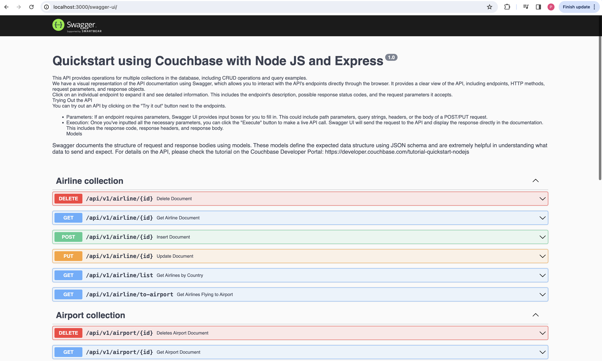

---
# frontmatter
path: "/tutorial-quickstart-nodejs"
# title and description do not need to be added to markdown, start with H2 (##)
title: Using Node.js, Couchbase, and Express
short_title: Node.js and Express
description:
  - Build a basic REST API using Express and the Couchbase Node.js SDK
  - See how you can fetch data from Couchbase using SQL++ queries
  - Explore CRUD operations in action with Couchbase
content_type: quickstart
filter: sdk
technology:
  - kv
  - query
tags:
  - Express
  - REST API
sdk_language: 
  - nodejs
length: 30 Mins
---

In this tutorial, you will learn how to connect to a Couchbase Capella cluster to create, read, update, and delete documents and how to write simple parametrized SQL++ queries.


## Prerequisites

To run this prebuilt project, you will need:

- [Couchbase Capella](https://www.couchbase.com/products/capella/) cluster with [travel-sample](https://docs.couchbase.com/nodejs-sdk/current/ref/travel-app-data-model.html) bucket loaded.
  - To run this tutorial using a self managed Couchbase cluster, please refer to the [appendix](#running-self-managed-couchbase-cluster).
- [LTS Node.js Version](https://nodejs.org/en/download)
- Loading Travel Sample Bucket
  If travel-sample is not loaded in your Capella cluster, you can load it by following the instructions for your Capella Cluster:

  - [Load travel-sample bucket in Couchbase Capella](https://docs.couchbase.com/cloud/clusters/data-service/import-data-documents.html#import-sample-data)

> Note that this tutorial is designed to work with the latest Node SDK version (4.x) for Couchbase. It will not work with the older Node js versions  for Couchbase without adapting the code.

### Couchbase Capella Configuration

When running Couchbase using [Capella](https://cloud.couchbase.com/), the following prerequisites need to be met.

- The application requires the travel-sample bucket to be [loaded](https://docs.couchbase.com/cloud/clusters/data-service/import-data-documents.html#import-sample-data) in the cluster from the Capella UI.
- Create the [database credentials](https://docs.couchbase.com/cloud/clusters/manage-database-users.html) to access the travel-sample bucket (Read and Write) used in the application.
- [Allow access](https://docs.couchbase.com/cloud/clusters/allow-ip-address.html) to the Cluster from the IP on which the application is running.
## App Setup
### Cloning Repo

```shell
git clone https://github.com/couchbase-examples/nodejs-quickstart.git
```

### Install Dependencies

Any dependencies will be installed by running the npm install command from the root directory of the project.

```shell
npm install
```
### Setup Database Configuration

To know more about connecting to your Capella cluster, please follow the [instructions](https://docs.couchbase.com/cloud/get-started/connect.html).

Specifically, you need to do the following:

- Create the [database credentials](https://docs.couchbase.com/cloud/clusters/manage-database-users.html) to access the travel-sample bucket (Read and Write) used in the application.
- [Allow access](https://docs.couchbase.com/cloud/clusters/allow-ip-address.html) to the Cluster from the IP on which the application is running.

All configuration for communication with the database is read from the environment variables. We have provided a convenience feature in this quickstart to read the environment variables from a local file, `dev.env` in the `config` folder.

Add the values for the Couchbase connection in the config/dev.env file.


```sh
CONNECTION_STRING=<connection_string>
USERNAME=<user_with_read_write_permission_to_travel-sample_bucket>
PASSWORD=<password_for_user>
```
> Note: The connection string expects the `couchbases://` or `couchbase://` part.
## Running the Application

### Directly on Local Machine

At this point, we have installed the dependencies, loaded the travel-sample data and configured the application with the credentials. The application is now ready and you can run it.

The application will run on port 3000 of your local machine (http://localhost:3000). You will find the Swagger documentation of the API which you can use to try the API endpoints.

```sh
# Execute this command in the project's root directory
npm start
```
### Docker

If you prefer to run this quick start using Docker, we have provided the Dockerfile which you can use to build the image and run the API as a container.

- Build the Docker image

```sh
cd src
docker build -t couchbase-nodejs-quickstart .
```

- Run the Docker image

```sh
docker run -it --env-file config/dev.env -p 3000:3000 couchbase-nodejs-quickstart
```

> Note: The `config/dev.env` file has the connection information to connect to your Capella cluster. With the `--env-file`, docker will inject those environment variables to the container.

Once the app is up and running, you can launch your browser and go to the [Swagger documentation](https://localhost:3000/) to test the APIs.

### Verifying the Application

Once the application starts, you can see the details of the application on the logs.


The application will run on port 3000 of your local machine (http://localhost:3000). You will find the interactive Swagger documentation of the API if you go to the URL in your browser. Swagger documentation is used in this demo to showcase the different API end points and how they can be invoked. More details on the Swagger documentation can be found in the [appendix](#swagger-documentation).



## Data Model

For this tutorial, we use three collections, `airport`, `airline` and `route` that contain sample airports, airlines and airline routes respectively. The route collection connects the airports and airlines as seen in the figure below. We use these connections in the quickstart to generate airports that are directly connected and airlines connecting to a destination airport. Note that these are just examples to highlight how you can use SQL++ queries to join the collections.


## Let Us Review the Code

To begin this tutorial, clone the repo and open it up in the IDE of your choice. Now you can learn about how to create, read, update and delete documents in Couchbase Server.

### Code Layout

```
├── src/controllers
│   ├── airlineController.js
│   ├── airportController.js
│   └── routeController.js
├── db
│   ├── connection.js
├── errors
│   ├── errors.go
├── src/routes
│   ├── airline.js
│   ├── airport.js
│   ├── route.js
├── src/shared
│   ├── makeResponse.js
│   ├── validateRequiredField.js
├── src/app.js
├── src/server.js
├── Dockerfile
└── __test__


```

We have separated out the  code into separate files by the entity (collection) in the `controllers` folder. The tests for the  project are present in the `__test__` folder.

### Airport Entity

For this tutorial, we will focus on the airport entity. The other entities are similar.

We will be setting up a REST API to manage airport documents.

- [POST Airport](#post-airport) – Create a new airport
- [GET Airport](#get-airport) – Read specified airport
- [PUT Airport](#put-airport) – Update specified airport
- [DELETE Airport](#delete-airport) – Delete airport
- [Airport List](#list-airport) – Get all airports. Optionally filter the list by country
- [Direct Connections](#direct-connections) - Get a list of airports directly connected to the specified airport

For CRUD operations, we will use the [Node JS SDK](https://docs.couchbase.com/nodejs-sdk/current/howtos/kv-operations.html) to create, read, update, and delete a document. Every document will need an ID (similar to a primary key in other databases) to save it to the database.

## Document Structure

Our airport document will have an airportname, city, country, faa code, icao code, timezone info and the geographic coordinates. For this demo, we will store all airport information in one document in the `airport` collection in the `travel-sample` bucket.

```json
{
  "airportname": "Sample Airport",
  "city": "Sample City",
  "country": "United Kingdom",
  "faa": "SAA",
  "icao": "SAAA",
  "tz": "Europe/Paris",
  "geo": {
    "lat": 48.864716,
    "lon": 2.349014,
    "alt": 92
  }
}
```
Navigate to the `connection.js` in the `db` folder. We perform some basic required checks for the environment variable not being set in the dev.env, and then proceed to connect to the couchbase cluster. We connect to the cluster using [connect](https://docs.couchbase.com/nodejs-sdk/current/hello-world/start-using-sdk.html#connect) method.
```js
  if (IS_CAPELLA === 'true') {
    // Use wan profile to avoid latency issues
    cached.conn = await couchbase.connect(DB_CONN_STR, {
      username: DB_USERNAME,
      password: DB_PASSWORD,
      configProfile: 'wanDevelopment',
    })
  } else {
    cached.conn = await couchbase.connect(DB_CONN_STR, {
      username: DB_USERNAME,
      password: DB_PASSWORD,
    })
  }

  const airlineCollection = bucket.scope('inventory').collection('airline');
  const airportCollection = bucket.scope('inventory').collection('airport');
  const routeCollection = bucket.scope('inventory').collection('route');
```


## Shared Directory

Open the `src/shared` folder and navigate to the `makeResponse.js` which contains a asynchronous function `makeResponse` for handling Express responses, executing provided actions, and managing errors. It specifically logs errors, sets appropriate HTTP status codes, and responds with a JSON object containing the error message. The status code is determined based on whether the error is a ValidationError or contains the string "not found."


```js
async function makeResponse(res, action) {
  try {
    const result = await action();
    res.json(result);
  } catch (e) {
    console.error(e);
    let status;

    if (e instanceof CouchbaseError && e.message.indexOf('not found') !== -1) {
      status = 404;
    } else {
      status = e instanceof CouchbaseError ? 400 : 500;
    }

    res.status(status);
    res.json({ message: e.message });
  }
}
```
Now open the `validateRequiredField.js` and the function `validateRequiredFields` checks if certain fields specified in requiredFields are missing from the request body. If any fields are missing, it sends a 400 status response with an error message detailing the missing fields; otherwise, it returns true, indicating that all required fields are present.

### POST Airport

To insert a new airport document, locate the createAirline method within the `airportController` file found in the `controllers` package. This expects a POST request with the airport data provided in the request body.
We extract this airport ID from the airport data, and create a airport document using [`.insert()`](https://docs.couchbase.com/sdk-api/couchbase-node-client/classes/Collection.html#insert) method. If the document is not found it is caught by the makeResponse method.

```js
    await makeResponse(res, async () => {
        await airportCollection.insert(req.params.id, req.body)
        res.status(201);
        return req.body;
    });
```


## GET Airport

To fetch a airport document, locate the getAirport method within the `airportController.js` file found in the `controllers` package. This expects a GET request with the airport document ID (id) specified in the URL path.
We extract this airport document ID from the URL and retrieve a Airport document using [`.get()`](https://docs.couchbase.com/sdk-api/couchbase-node-client/classes/Collection.html#get) method.

```js
    await makeResponse(res, async () => {
        let getResult = await airportCollection.get(req.params.id)
        return getResult["content"];
    });
```

We only need the airport ID from the user to retrieve a particular airport document using a basic key-value operation. We catch the error if the key-value operation fails and return an error message.

## PUT Airport

To update a airport document, locate the updateAirline method within the `airportController.js` file found in the `controllers` package.
This expects a PUT request with the airport ID (id) specified in the URL path and the airport data to be updated provided in the request body.

```js
    await makeResponse(res, async () => {
        await airportCollection.upsert(req.params.id, req.body)
        return req.body;
    });
```


The `updateAirport` method calls the [`.upsert()`](https://docs.couchbase.com/sdk-api/couchbase-node-client/classes/Collection.html#upsert) method.

## DELETE Airport

To delete a airport document, locate the DeleteDocumentForAirport method within the `airportController.js` file found in the `controllers` package.
This expects a DELETE request with the airport document ID (id) specified in the URL path.
 We just need to supply the `id` of the document we want to remove.

```js
    await makeResponse(res, async () => {
        await airportCollection.remove(req.params.id)
        res.status(204);
        return req.body;
    });
```

Delete Airport by Airport ID by using [`.remove()`](https://docs.couchbase.com/sdk-api/couchbase-node-client/classes/Collection.html#remove) method and returns a 404 if the document is not found.

## List Airport

This endpoint retrieves the list of airports in the database. The API has options to specify the page size for the results and country from which to fetch the airport documents.

[SQL++](https://docs.couchbase.com/nodejs-sdk/current/howtos/n1ql-queries-with-sdk.html) is a powerful query language based on SQL, but designed for structured and flexible JSON documents. We will use a SQL++ query to search for airports with Limit, Offset, and Country option.

Navigate to the `listAirport` method in the `airportController.js` file. This endpoint is different from the others we have seen before because it makes the SQL++ query rather than a key-value operation. This usually means more overhead because the query engine is involved. For this query, we are using the predefined indices in the `travel-sample` bucket. We can create an additional [index](https://docs.couchbase.com/server/current/learn/services-and-indexes/indexes/indexing-and-query-perf.html) specific for this query to make it perform better.

First, we need to get the values from the query string for country, limit, and Offset that we will use in our query. These are pulled from the `request.query` method.

This end point has two queries depending on the value for the country parameter. If a country name is specified, we retrieve the airport documents for that specific country. If it is not specified, we retrieve the list of airports across all countries. The queries are slightly different for these two scenarios.

We build our SQL++ query using the [named parameters](https://docs.couchbase.com/nodejs-sdk/current/howtos/n1ql-queries-with-sdk.html#queries-placeholders) specified by `$` symbol for both these scenarios. The difference between the two queries is the presence of the `country` parameter in the query. Normally for the queries with pagination, it is advised to order the results to maintain the order of results across multiple queries.

Next, we pass that `query` and the `parameters` to the  [scope.query()](https://docs.couchbase.com/sdk-api/couchbase-node-client/classes/Scope.html#query) method and return the results.

```js
  const country = req.query.country || "";
  const limit = parseInt(req.query.limit, 10) || 10;
  const offset = parseInt(req.query.offset, 10) || 0;
  let filter = {};
  if (country) {
    filter.country = country;
  }

  const options = { limit: limit, offset: offset };
  await makeResponse(res, async () => {
    const airports = await AirportModel.find(filter, options);
    return airports.rows;
  });
```

### Direct Connections

This endpoint fetches the airports that can be reached directly from the specified source airport code. This also uses a SQL++ query to fetch the results simlar to the List Airport endpoint.

Let us look at the query used here:

```sql
	SELECT DISTINCT route.destinationairport
	FROM airport AS airport
	JOIN route AS route ON route.sourceairport = airport.faa
	WHERE airport.faa = $AIRPORT AND route.stops = 0
	ORDER BY route.destinationairport
	LIMIT $LIMIT
	OFFSET $OFFSET
```

We are fetching the direct connections by joining the airport collection with the route collection and filtering based on the source airport specified by the user and by routes with no stops.

### Project Setup Notes

We have set up a `.babelrc` file at the root of our project so that we can use ES6 and imports in our project:

```json
{
  "presets": [
    "@babel/preset-env"
  ]
}
```

We have created a start script in our `package.json` that executes babel-node and the starting point of our application `src/server.js`:

```json
"scripts": {
  "start": "env-cmd ./config/dev.env nodemon --exec babel-node src/server",
},
```

There are other scripts that we have added for our maintenance and testing of the project on GitHub using GitHub actions.

```json
  "scripts": {
    "start": "env-cmd -f ./config/dev.env nodemon --exec babel-node src/server",
    "test": "env-cmd -f ./config/test.env jest --verbose --forceExit --detectOpenHandles",
    "testGA": "jest --verbose --runInBand",
    "clean": "rm -rf dist",
    "build": "npm run clean && babel ./src --out-dir dist --copy-files"
  },
```

## Running Tests

We have defined integration tests using [jest](https://jestjs.io/) for all the API end points. The integration tests use the same database configuration as the application. After the tests, the documents are cleaned up.

The tests are configured in the `__test__` folder.

To run the tests, run the below command after copying the content of the `dev.env` file to the `test.env` to ensure it uses the same database configuration:

```bash
# Execute this command in the project's root directory
npm run test
```

## Appendix

### Extending API by Adding New Entity

If you would like to add another entity to the APIs, these are the steps to follow:

- **Create the New Entity in Couchbase Bucket:**
  - Utilize the [Couchbase Server interface](https://docs.couchbase.com/cloud/n1ql/n1ql-language-reference/createcollection.html) to establish the new collection within the Couchbase bucket. Alternatively the collection can be created using the [createCollection](https://docs.couchbase.com/sdk-api/couchbase-node-client/classes/CollectionManager.html#createCollection) via the SDK.

- **Define the New Route:**
  - Navigate to the `src/routes` folder and create the new route.

- **Controller Configuration:**
  - Develop a new file in the `controllers` folder, mirroring the existing structures (e.g., `airportController.js`). Craft the corresponding method within this file to manage the new entity.


- **Add Tests:**
  - Add the tests for the new routes in a new file in the `__test__` folder similar to other collection tests.

Following these steps ensures a systematic and organized approach to expanding the API functionality with a new entity.
### Running Self Managed Couchbase Cluster

If you are running this quickstart with a self managed Couchbase cluster, you need to [load](https://docs.couchbase.com/server/current/manage/manage-settings/install-sample-buckets.html) the travel-sample data bucket in your cluster and generate the credentials for the bucket.

- Follow [Couchbase Installation Options](/tutorial-couchbase-installation-options) for installing the latest Couchbase Database Server Instance.

You need to update the connection string and the credentials in the `dev.env` file in the `config` folder.

> Note: Couchbase Server must be installed and running prior to running the app.

### Swagger Documentation

Swagger documentation provides a clear view of the API including endpoints, HTTP methods, request parameters, and response objects.

Click on an individual endpoint to expand it and see detailed information. This includes the endpoint's description, possible response status codes, and the request parameters it accepts.

#### Trying Out the API

You can try out an API by clicking on the "Try it out" button next to the endpoints.

- Parameters: If an endpoint requires parameters, Swagger UI provides input boxes for you to fill in. This could include path parameters, query strings, headers, or the body of a POST/PUT request.

- Execution: Once you've inputted all the necessary parameters, you can click the "Execute" button to make a live API call. Swagger UI will send the request to the API and display the response directly in the documentation. This includes the response code, response headers, and response body.

#### Models

Swagger documents the structure of request and response bodies using models. These models define the expected data structure using JSON schema and are extremely helpful in understanding what data to send and expect.