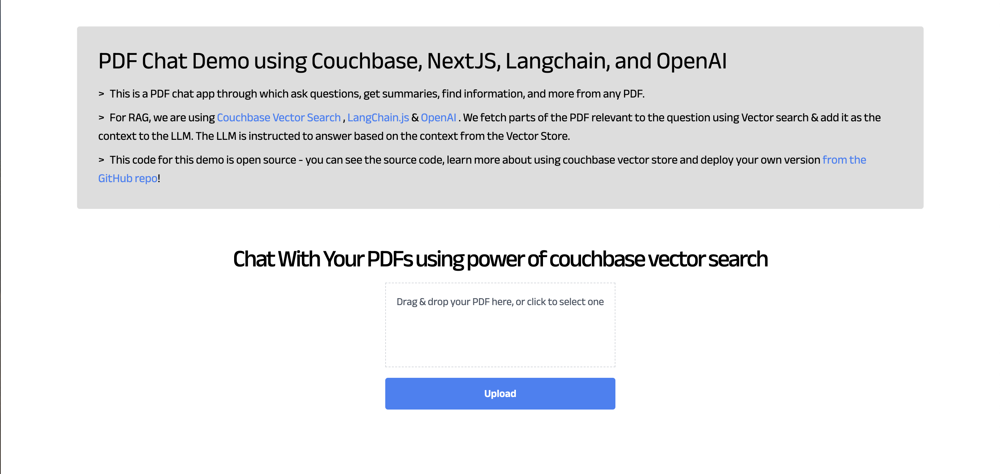
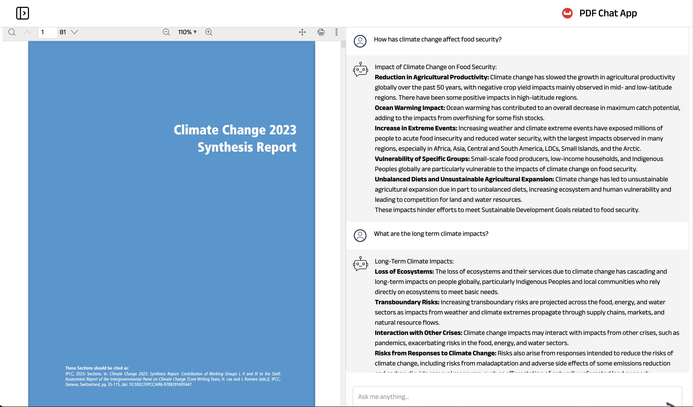
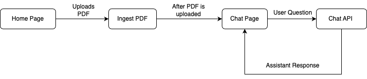

---
# frontmatter
path: "/tutorial-nodejs-langchain-pdf-chat"
# title and description do not need to be added to markdown, start with H2 (##)
title: Build PDF Chat App With Couchbase Nodejs SDK and LangChain
short_title: Build PDF Chat App
description:
  - Construct a PDF Chat App with LangChain, Couchbase Node.js SDK, Couchbase Vector Search, and Next.js.
  - Learn to upload PDFs into Couchbase Vector Store with LangChain.
  - Discover how to use RAG’s for context-based Q&A’s from PDFs with LLMs.
content_type: tutorial
filter: sdk
technology:
  - fts
  - kv
tags:
  - Next.js
  - LangChain
  - OpenAI
sdk_language:
  - nodejs
length: 45 Mins
---

## Introduction

Welcome to this comprehensive guide on constructing an AI-enhanced Chat Application. We will create a dynamic chat interface capable of delving into PDF documents to extract and provide summaries, key facts, and answers to your queries. By the end of this tutorial, you’ll have a powerful tool at your disposal, transforming the way you interact with and utilize the information contained within PDFs.

This tutorial will demonstrate how to -

- Construct a [Couchbase Search Index](https://www.couchbase.com/products/vector-search/) for doing Vector Search
- Chunk PDFs into Vectors with [LangChain.js](https://js.langchain.com/) and use [Couchbase Vector Store](https://js.langchain.com/docs/integrations/vectorstores/couchbase) to store the vectors into couchbase
- Query large language models via the [RAG framework](https://aws.amazon.com/what-is/retrieval-augmented-generation/) for contextual insights. We will use [OpenAI](https://openai.com) for generating Embeddings and LLM
- Craft an elegant UI with Next.js. All these components come together to create a seamless, AI-powered chat experience.

## Prerequisites

- [LTS Node.js Version](https://nodejs.org/en/download)
- Couchbase Cluster (Self Managed or Capella) version 7.6+  with [Search Service](https://docs.couchbase.com/server/current/fts/fts-introduction.html)

> Note that this tutorial is designed to work with the latest Node SDK version (4.3.0+) for Couchbase. It will not work with the older Node.js versions.

> Vector Search in Couchbase is only supported at Couchbase Version 7.6+. 

## Quick Start Guide:

### Cloning Repo

```shell
git clone https://github.com/couchbase-examples/vector-search-nodejs.git
```

### Install Dependencies

Any dependencies will be installed by running the npm install command from the root directory of the project.

```shell
npm install
```

### Setup Database Configuration

#### Capella Setup

To know more about connecting to your Capella cluster, please follow the [instructions](https://docs.couchbase.com/cloud/get-started/connect.html).

Specifically, you need to do the following:

- Create the [database credentials](https://docs.couchbase.com/cloud/clusters/manage-database-users.html) to access cluster via SDK
- [Allow access](https://docs.couchbase.com/cloud/clusters/allow-ip-address.html) to the Cluster from the IP on which the application is running.

#### Self Managed Setup

- Follow [Couchbase Installation Options](/tutorial-couchbase-installation-options) for installing the latest Couchbase Database Server Instance. Make sure to add the [Search Service](https://docs.couchbase.com/server/current/fts/fts-introduction.html)

### Create Bucket

- For the purpose of this tutorial, we will be using specific bucket, scope and collection. However, you may use any name of your choice but make sure to update names in all the steps.
- Create a bucket named `pdf-chat`. We will use the `_default` scope and `_default` collection of this bucket.

### Create the Search Index on Full Text Service

We need to create the Search Index on the Full Text Service in Couchbase. For this demo, you can import the following index using the instructions.

- [Couchbase Capella](https://docs.couchbase.com/cloud/search/import-search-index.html)

  - Copy the index definition to a new file index.json
  - Import the file in Capella using the instructions in the documentation.
  - Click on Create Index to create the index.

- [Couchbase Server](https://docs.couchbase.com/server/current/search/import-search-index.html)

  - Click on Search -> Add Index -> Import
  - Copy the following Index definition in the Import screen
  - Click on Create Index to create the index.

You may also create a vector index using Search UI on both [Couchbase Capella](https://docs.couchbase.com/cloud/vector-search/create-vector-search-index-ui.html) and [Couchbase Self Managed Server](https://docs.couchbase.com/server/current/vector-search/create-vector-search-index-ui.html)

#### Index Definition

Here, we are creating the index `pdf_search` on the documents. The Vector field is set to `embedding` with 1536 dimensions and the text field set to `text`. We are also indexing and storing all the fields under `metadata` in the document as a dynamic mapping to account for varying document structures. The similarity metric is set to `dot_product`. If there is a change in these parameters, please adapt the index accordingly.

```json
{
  "name": "pdf_search",
  "type": "fulltext-index",
  "params": {
    "doc_config": {
      "docid_prefix_delim": "",
      "docid_regexp": "",
      "mode": "scope.collection.type_field",
      "type_field": "type"
    },
    "mapping": {
      "default_analyzer": "standard",
      "default_datetime_parser": "dateTimeOptional",
      "default_field": "_all",
      "default_mapping": {
        "dynamic": true,
        "enabled": false
      },
      "default_type": "_default",
      "docvalues_dynamic": false,
      "index_dynamic": true,
      "store_dynamic": false,
      "type_field": "_type",
      "types": {
        "_default._default": {
          "dynamic": true,
          "enabled": true,
          "properties": {
            "embedding": {
              "enabled": true,
              "dynamic": false,
              "fields": [
                {
                  "dims": 1536,
                  "index": true,
                  "name": "embedding",
                  "similarity": "dot_product",
                  "type": "vector",
                  "vector_index_optimized_for": "recall"
                }
              ]
            },
            "metadata": {
              "dynamic": true,
              "enabled": true
            },
            "text": {
              "enabled": true,
              "dynamic": false,
              "fields": [
                {
                  "index": true,
                  "name": "text",
                  "store": true,
                  "type": "text"
                }
              ]
            }
          }
        }
      }
    },
    "store": {
      "indexType": "scorch",
      "segmentVersion": 16
    }
  },
  "sourceType": "gocbcore",
  "sourceName": "pdf-docs",
  "sourceParams": {},
  "planParams": {
    "maxPartitionsPerPIndex": 64,
    "indexPartitions": 16,
    "numReplicas": 0
  }
}
```

### Setup Environment Config

Copy the `.env.template` file from the repo and rename it to `.env` (`.env.local` in case of local development) and replace the placeholders with the actual values for your environment.
All configuration for communication with the database is read from the environment variables.

```sh
OPENAI_API_KEY=<open_ai_api_key>
DB_CONN_STR=<connection_string_for_couchbase_cluster>
DB_USERNAME=<username_for_couchbase_cluster>
DB_PASSWORD=<password_for_couchbase_cluster>
DB_BUCKET=<name_of_bucket_to_store_documents>
DB_SCOPE=<name_of_scope_to_store_documents>
DB_COLLECTION=<name_of_collection_to_store_documents>
INDEX_NAME=<name_of_fts_index_with_vector_support>
```

> [OpenAI](https://openai.com) API Key is required for usage in generating embedding and querying LLM

> The [connection string](https://docs.couchbase.com/nodejs-sdk/current/howtos/managing-connections.html#connection-strings) expects the `couchbases://` or `couchbase://` part.

> For this tutorial, `DB_BUCKET=pdf-chat`, `DB_SCOPE=_default`, `DB_COLLECTION=_default` and `INDEX_NAME=pdf_search`

### Running the Application

After starting couchbase server, adding vector index and installing dependencies. Our Application is ready to run.

In the projects root directory, run the following command

```sh
npm run dev
```

The application will run on your local machine at http://localhost:3000.

### Using PDF Chat App

At the home page, there will be option to upload the PDF. Drag and Drop the PDF file in the upload box or Click to browse. Click on Upload and the process of conversion starts. This step may take some time depending on the size of uploaded PDF.


After uploading, a new screen appears which shows the uploaded PDF at the left and chat interface on the right side. Use Chat to ask questions regarding the PDF and get answers.


## Concepts

The PDF Chat application leverages two powerful concepts: [Retrieval-Augmented Generation (RAG)](https://aws.amazon.com/what-is/retrieval-augmented-generation/) and [Vector Search](https://www.couchbase.com/products/vector-search/). Together, these techniques enable efficient and context-aware interactions with PDF documents.

### Retrieval-Augmented Generation (RAG)

RAG is like having two helpers:

- **Retriever**: This helper looks through all the PDF documents to find the most relevant information based on your question or prompt.
- **Generator**: This helper is like a large language model (e.g., GPT-4, Gemini) that can understand natural language and generate human-like responses.

Here's how RAG works:

- You ask a question or provide a prompt to the app.
- The Retriever helper goes through the PDF documents and finds the most relevant passages or sections related to your question using Vector Search.
- The Generator helper takes those relevant passages and your original question, and uses them to generate a clear and contextual answer.

This enhances the context from PDF and LLM is able to give relevant results from the PDF rather than giving generalized results.

### Vector Search with Couchbase

Couchbase is a NoSQL database that provides a powerful Vector Search capability. It allows you to store and search through high-dimensional vector representations (embeddings) of textual data, such as PDF content.

The PDF Chat app uses LangChain to convert the text from the PDF documents into embeddings. These embeddings are then stored in a Couchbase bucket, along with the corresponding text.

When a user asks a question or provides a prompt:

- The app converts the user's query into an embedding using LangChain's embedding models (e.g., OpenAI's embeddings).
- [Couchbase's Vector Search](https://docs.couchbase.com/nodejs-sdk/current/howtos/full-text-searching-with-sdk.html#vector-search) capability is utilized, which supports search indexes. A dedicated search index is created for the PDF embeddings and their corresponding text content, configured with the necessary indexing parameters (bucket, scope, collection, index name).
- The app queries this search index using the user's query embedding. Couchbase's Vector Search calculates the [similarity](https://www.couchbase.com/blog/vector-similarity-search/) (e.g., dot product) between the query embedding and the indexed PDF embeddings, enabling fast retrieval of the nearest neighbor embeddings.
- The nearest neighbor embeddings represent the most semantically similar passages or sections from the PDF documents compared to the user's query.
- The app retrieves the text content associated with these nearest neighbor embeddings, providing the necessary context for generating a relevant response.
- Couchbase's Vector Search supports advanced indexing techniques, such as [scoped indexes](https://docs.couchbase.com/nodejs-sdk/current/howtos/full-text-searching-with-sdk.html#scoped-vs-global-indexes), [dynamic indexing](https://docs.couchbase.com/server/current/fts/fts-creating-index-from-REST-dynamic.html) and [hybrid search](https://docs.couchbase.com/nodejs-sdk/current/howtos/full-text-searching-with-sdk.html#combining-fts-and-vector-queries), allowing for efficient management, better scaling of the vector store and multiple types of search supported.
- The search index facilitates fast and accurate retrieval, enabling the app to provide context-aware and relevant responses to the user's queries, even when the phrasing or terminology differs from the PDF content.
- Couchbase's Vector Search integrates seamlessly with LangChain's [CouchbaseVectorStore](https://js.langchain.com/docs/integrations/vectorstores/couchbase#create-vector-store) class, abstracting away the complexities of vector similarity calculations.

### LangChain.js

LangChain is a powerful library that simplifies the process of building applications with [large language models](https://en.wikipedia.org/wiki/Large_language_model) (LLMs) and vector stores like Couchbase.

In the PDF Chat app, LangChain is used for several tasks:

- **Loading and processing PDF documents**: LangChain's [_PDFLoader_](https://js.langchain.com/docs/integrations/document_loaders/file_loaders/pdf) is used to load the PDF files and convert them into text documents.
- **Text splitting**: LangChain's [_RecursiveCharacterTextSplitter_](https://js.langchain.com/docs/modules/data_connection/document_transformers/recursive_text_splitter) is used to split the text from the PDF documents into smaller chunks or passages, which are more suitable for embedding and retrieval.
- **Embedding generation**: LangChain integrates with [various embedding models](https://js.langchain.com/docs/integrations/text_embedding), such as OpenAI's embeddings, to convert the text chunks into embeddings.
- **Vector store integration**: LangChain provides a [_CouchbaseVectorStore_](https://js.langchain.com/docs/integrations/vectorstores/couchbase#create-vector-store) class that seamlessly integrates with Couchbase's Vector Search, allowing the app to store and search through the embeddings and their corresponding text.
- **Chains**: LangChain provides various [chains](https://js.langchain.com/docs/modules/chains/) for different requirements. For using RAG concept, we require _Retrieval Chain_ for Retrieval and _Question Answering Chain_ for Generation part. We also add _Prompts_ that guide the language model's behavior and output. These all are combined to form a single chain which gives output from user questions.
- **Streaming Output**: LangChain integrates with the [_StreamingTextResponse_](https://js.langchain.com/docs/expression_language/streaming) class, allowing the app to stream the generated answer to the client in real-time.

By combining Vector Search with Couchbase, RAG, and LangChain; the PDF Chat app can efficiently ingest PDF documents, convert their content into searchable embeddings, retrieve relevant information based on user queries and conversation context, and generate context-aware and informative responses using large language models. This approach provides users with a powerful and intuitive way to explore and interact with large PDF files.

## Let us Understand the Flow

To begin this tutorial, clone the repo and open it up in the IDE of your choice. Now you can learn how to create the PDF Chat App.

### Code Layout

```
app
├── api
│   ├── chat
│   │   └── route.ts
│   └── ingestPdf
│       └── route.ts
├── chatPage
│   ├── layout.tsx
│   └── page.tsx
├── layout.tsx
├── page.tsx
components
├── Header.tsx
├── InfoCard.tsx
├── Loader.tsx
├── LoadingDots.tsx
├── PDFUploader.tsx
└── Sidebar.tsx
styles
├── global.css
└── loading-dots.module.css
lib
└── couchbase-connection.tsx
```

#### APIs and Lib

The APIs are written in `/app/api` folder. We have 2 APIs, one for ingesting the newly uploaded PDF into the couchbase vector store and the other for chat to get user message and return message response from AI assistant.

We also have a couchbase connection function written at `/lib/couchbase-connection.tsx` which provides connection to couchbase support.

#### UI

The user interface is written as 2 pages. The Home Page (`/page.tsx`) and the Chat Page (`/chatPage/page.tsx`). The additional components required by the UI are written in `/components` and are used to offer functionalities like loader, Sidebar, PDF Uploader etc.

The styles are defined at `/styles` folder with `global.css` as the global CSS file and `/loading-dots.module.css` module for showing loading dots in chat.

### App Flow

The fundamental workflow of the application is as follows: The user initiates the process from the Home Page by uploading a PDF. This action triggers the ingestPDF API route, which subsequently uploads the PDF into the Couchbase vector store. Following this, the Chat Page is presented to the user.

On the Chat Page, the user can pose questions. These inquiries are processed by the Chat API, which consults the LLM for responses, aided by the context provided by RAG. The assistant then delivers the answer, and the user has the option to ask additional questions.



## Connecting to Couchbase

The first step will be connecting to couchbase. Couchbase Vector Search is required for PDF Upload as well as during chat (For Retrieval). We will use the Couchbase Node.js SDK to connect to the Couchbase cluster. The connection is established in the `couchbase-connection.ts` file in the `lib` folder.

The connection string and credentials are read from the environment variables. We perform some basic required checks for the environment variable not being set in the `.env`, and then proceed to connect to the couchbase cluster. We connect to the cluster using [connect](https://docs.couchbase.com/nodejs-sdk/current/hello-world/start-using-sdk.html#connect) method.

```typescript
import { connect, Cluster } from "couchbase";
export async function createCouchbaseCluster(): Promise<Cluster> {
  const connectionString = process.env.DB_CONN_STR;
  const databaseUsername = process.env.DB_USERNAME;
  const databasePassword = process.env.DB_PASSWORD;

  if (!databaseUsername) {
    throw new Error(
      "Please define the DB_USERNAME environment variable inside .env"
    );
  }

  if (!databasePassword) {
    throw new Error(
      "Please define the DB_PASSWORD environment variable inside .env"
    );
  }

  if (!connectionString) {
    throw new Error(
      "Please define the DB_CONN_STR environment variable inside .env"
    );
  }

  const cluster = await connect(connectionString, {
    username: databaseUsername,
    password: databasePassword,
    configProfile: "wanDevelopment",
  });

  return cluster;
}
```

## PDF Ingest API

This API at `/app/api/ingestPdf/route.ts` allows you to upload a PDF file, split its text into chunks, generate embeddings for those chunks, and ingest the chunks and their embeddings into a Couchbase vector store. Let's go step by step on what it does.

### Read Uploaded PDF File

The code extracts the uploaded file from the request's form data and converts the file to an Array Buffer and then to a Node.js Buffer.

```typescript
// Get file from form data
const data = await request.formData();
const file: File | null = data.get("file") as unknown as File;

// Read file to a Node.js Buffer
const bytes = await file.arrayBuffer();
const buffer = Buffer.from(bytes);
```

### Load PDF File

It then creates a [PDFLoader](<(https://js.langchain.com/docs/integrations/document_loaders/file_loaders/pdf)>) instance from the LangChain library and initializes it with the binary data of the uploaded PDF file. We then load the PDF Files to LangChain [Document](https://js.langchain.com/docs/modules/chains/document/) type.

```typescript
import { PDFLoader } from "langchain/document_loaders/fs/pdf";

const loader = new PDFLoader(new Blob([buffer]));
const rawDocs = await loader.load();
```

### Split Documents

This LangChain document array will contain huge individual files which defeats the purpose while retrieval as we want to send more relevant context to LLM. So we will split it into smaller chunks or passages using LangChain's [_RecursiveCharacterTextSplitter_](https://js.langchain.com/docs/modules/data_connection/document_transformers/recursive_text_splitter):

- chunkSize: 1000: This parameter specifies that each chunk should contain approximately 1000 characters.
- chunkOverlap: 200: This parameter ensures that there is an overlap of 200 characters between consecutive chunks. This overlap helps maintain context and prevent important information from being split across chunk boundaries.

At the end _splitDocuments_ method splits the large document into smaller LangChain documents based on above defined parameters.

```typescript
const textSplitter = new RecursiveCharacterTextSplitter({
  chunkSize: 1000,
  chunkOverlap: 200,
});
const docs = await textSplitter.splitDocuments(rawDocs);
```

### Initialize OpenAI and Couchbase Vector Store

We will now initialize [OpenAI embeddings](https://js.langchain.com/docs/integrations/text_embedding/openai) which will be used by CouchbaseVectorStore for converting the split docs defined above to vectors (embeddings).

We will also initialize couchbase vector store with couchbase bucket info. Firstly we will connect to couchbase cluster using[`createCouchbaseCluster`](#connecting-to-couchbase).

We will define the bucket, scope, collection and index names from [Environment Variables](#Setup-Environment-Config). We will also define search related parameter:

- `textKey` which is the key of where original text will be stored in couchbase document.
- `embeddingKey` which is the key of where embedded text (vectors) will be stored in couchbase document.
- `scopedIndex` defines whether to use scoped index or cluster index. We recommend using scoped index, and we will use it for this tutorial as well.

```typescript
const embeddings = new OpenAIEmbeddings({
  openAIApiKey: process.env.OPENAI_API_KEY,
});

const bucketName = process.env.DB_BUCKET || "";
const scopeName = process.env.DB_SCOPE || "";
const collectionName = process.env.DB_COLLECTION || "";
const indexName = process.env.INDEX_NAME || "";
const textKey = "text";
const embeddingKey = "embedding";
const scopedIndex = true;

const cluster = await createCouchbaseCluster();
const couchbaseConfig: CouchbaseVectorStoreArgs = {
  cluster,
  bucketName,
  scopeName,
  collectionName,
  indexName,
  textKey,
  embeddingKey,
  scopedIndex,
};
```

### Create Vector Store From Documents

With everything ready for initializing Vector store, we create it using [_CouchbaseVectorStore.fromDocuments_](https://js.langchain.com/docs/integrations/vectorstores/couchbase#create-vector-store) function in LangChain. This function requires the documents which user wants to upload, details of couchbase vector store and an embeddings client which will create text to vector (embeddings).

```typescript
await CouchbaseVectorStore.fromDocuments(docs, embeddings, couchbaseConfig);
```

### Save PDF File

It also saves the PDF file to the public/assets/ directory for using in viewing the PDF file later in chat page.

```typescript
await writeFile(path.join(process.cwd(), "public/assets/" + file.name), buffer);
```

### Response

After all the above steps, The PDF uploading part is complete, and now we can use this PDF data during our chats. We return the [_NextResponse_](https://nextjs.org/docs/app/api-reference/functions/next-response) back to UI so that we can switch to the Chat Page.

```typescript
return NextResponse.json({
  text: "Successfully embedded pdf",
  fileName: file.name,
});
```

## Chat API

This API at `/app/api/chat/route.ts` is used when user asks a question from the assistant. The assistant (LLM) is called here with RAG context, the response from the assistant is sent back to the user.

### Get User Message

The user will type a message and the message will be sent to the chat API. The current message and other history messages are segregated.

All the message history is formatted using _formatVercelMessages_ Function. This function takes a _VercelChatMessage_ object and converts it into a [HumanMessage](https://api.js.langchain.com/classes/langchain_core_messages.HumanMessage.html) or [AIMessage](https://api.js.langchain.com/classes/langchain_core_messages.AIMessage.html) object, which are classes from the LangChain library used to represent [conversation messages](https://js.langchain.com/docs/expression_language/how_to/with_history).

At the end we get all the previous messages in chat formatted form and current question (message) from user

```typescript
const formatVercelMessages = (message: VercelChatMessage) => {
  if (message.role === "user") {
    return new HumanMessage(message.content);
  } else if (message.role === "assistant") {
    return new AIMessage(message.content);
  } else {
    console.warn(
      `Unknown message type passed: "${message.role}". Falling back to generic message type.`
    );
    return new ChatMessage({ content: message.content, role: message.role });
  }
};

const body = await request.json();
const messages = body.messages ?? [];
if (!messages.length) {
  throw new Error("No messages provided.");
}
const formattedPreviousMessages = messages
  .slice(0, -1)
  .map(formatVercelMessages);

const currentMessageContent = messages[messages.length - 1].content;
```

### Configure OpenAI

We require OpenAI's embedding model and [LLM model](https://js.langchain.com/docs/integrations/llms/openai).

OpenAI Embeddings are vector representations of text generated by OpenAI's language models. In this API, the [_OpenAIEmbeddings_](https://js.langchain.com/docs/integrations/text_embedding/openai) class from the LangChain library is used to generate embeddings for the documents stored in the Couchbase Vector Store.

The [_ChatOpenAI_](https://js.langchain.com/docs/integrations/chat/openai) class from the LangChain library is used as the language model for generating responses. It is an interface to OpenAI's chat models, which are capable of understanding and generating human-like conversations.

```typescript
const model = new ChatOpenAI({});
const embeddings = new OpenAIEmbeddings({
  openAIApiKey: process.env.OPENAI_API_KEY,
});
```

### Initialize Couchbase Vector Store

Just like in [PDF Ingest API](#Initialize-OpenAI-and-Couchbase-Vector-Store), we will initialize the couchbase vector store here. Use the same details here as well of couchbase collection and index. Now we will initialize the store using [_CouchbaseVectorStore.initialize()_](https://js.langchain.com/docs/integrations/vectorstores/couchbase#create-vector-store) method.

We also create the [retriever](https://js.langchain.com/docs/modules/data_connection/retrievers/vectorstore) of the couchbase vector store. This retriever will be used to retrieve the previously documents which are similar to current query. We also define a callback to get document details as well.

```typescript
const bucketName = process.env.DB_BUCKET || "";
const scopeName = process.env.DB_SCOPE || "";
const collectionName = process.env.DB_COLLECTION || "";
const indexName = process.env.INDEX_NAME || "";
const textKey = "text";
const embeddingKey = "embedding";
const scopedIndex = true;

const cluster = await createCouchbaseCluster();
const couchbaseConfig: CouchbaseVectorStoreArgs = {
  cluster,
  bucketName,
  scopeName,
  collectionName,
  indexName,
  textKey,
  embeddingKey,
  scopedIndex,
};
const couchbaseVectorStore = await CouchbaseVectorStore.initialize(
  embeddings,
  couchbaseConfig
);

const retriever = couchbaseVectorStore.asRetriever({
  callbacks: [
    {
      handleRetrieverEnd(documents) {
        resolveWithDocuments(documents);
      },
    },
  ],
});
```

### LangChain Expression Language (LCEL)

We will now utilize the power of LangChain Chains using the [LangChain Expression Language](https://js.langchain.com/docs/expression_language/) (LCEL). LCEL makes it easy to build complex chains from basic components, and supports out of the box functionality such as streaming, parallelism, and logging.

LCEL is a domain-specific language that provides several key advantages when working with LangChain:

- Composability: It allows you to easily combine different LangChain components like retrievers, language models, and output parsers into complex workflows.
- Readability: The syntax is concise and expressive, making it easy to understand the flow of operations within a chain or sequence.
- Reusability: You can define reusable sub-chains or components that can be incorporated into larger chains, promoting code reuse and modularity.

In summary, LCEL streamlines the process of building sophisticated natural language processing applications by providing a composable, readable, reusable, extensible, type-safe, and abstracted way to define and orchestrate LangChain components into complex workflows.

We will be using LCEL chains in next few sections and will see how LCEL optimizes our whole workflow.

### History Aware Prompt

The _historyAwarePrompt_ is used to generate a query for the vector store based on the conversation history and the current user message.

The _historyAwarePrompt_ is a [_ChatPromptTemplate_](https://js.langchain.com/docs/modules/model_io/concepts#chatprompttemplate) from the LangChain library.
It is defined to include the conversation history, the current user message, and a prompt asking for a concise vector store search query.

```typescript
const historyAwarePrompt = ChatPromptTemplate.fromMessages([
  new MessagesPlaceholder("chat_history"),
  ["user", "{input}"],
  [
    "user",
    "Given the above conversation, generate a concise vector store search query to look up in order to get information relevant to the conversation.",
  ],
]);
```

### History Aware Chain

The _historyAwareRetrieverChain_ is created using the [_createHistoryAwareRetriever_](https://api.js.langchain.com/functions/langchain_chains_history_aware_retriever.createHistoryAwareRetriever.html) function from the LangChain library. It takes the _historyAwarePrompt_, the language model (ChatOpenAI instance), and the vector store retriever as input.

The _historyAwareRetrieverChain_ is responsible for generating a query based on the conversation history and retrieving relevant documents from the vector store.

```typescript
const historyAwareRetrieverChain = await createHistoryAwareRetriever({
  llm: model,
  retriever,
  rephrasePrompt: historyAwarePrompt,
});
```

### Document Chain

The documentChain is created using the [_createStuffDocumentsChain_](https://api.js.langchain.com/functions/langchain_chains_combine_documents.createStuffDocumentsChain.html) function from the LangChain library. It takes the language model (ChatOpenAI instance) and a prompt (answerPrompt) as input.

The answerPrompt is a _ChatPromptTemplate_ that includes instructions for the language model to generate an answer based on the provided context (retrieved documents) and the user's question.

```typescript
const ANSWER_SYSTEM_TEMPLATE = `You are a helpful AI assistant. Use the following pieces of context to answer the question at the end.
  If you don't know the answer, just say you don't know. DO NOT try to make up an answer.
  If the question is not related to the context, politely respond that you are tuned to only answer questions that are related to the context.
  
  <context>
  {context}
  </context>
  
  Please return your answer in markdown with clear headings and lists.`;

const answerPrompt = ChatPromptTemplate.fromMessages([
  ["system", ANSWER_SYSTEM_TEMPLATE],
  new MessagesPlaceholder("chat_history"),
  ["user", "{input}"],
]);

const documentChain = await createStuffDocumentsChain({
  llm: model,
  prompt: answerPrompt,
});
```

### Conversation Retrieval Chain

The _conversationalRetrievalChain_ combines the _historyAwareRetrieverChain_ and the _documentChain_.

- The _conversationalRetrievalChain_ is created using the [_createRetrievalChain_](https://api.js.langchain.com/functions/langchain_chains_retrieval.createRetrievalChain.html) function from the LangChain library.
- It takes the _historyAwareRetrieverChain_ and the _documentChain_ as input.
- This chain combines the retrieval and question-answering steps into a single workflow.

```typescript
const conversationalRetrievalChain = await createRetrievalChain({
  retriever: historyAwareRetrieverChain,
  combineDocsChain: documentChain,
});
```

### Output Chain

- The _outputChain_ is a sequence of [_runnable_](https://js.langchain.com/docs/expression_language/interface) steps.
- It includes the _conversationalRetrievalChain_, a _RunnablePick_ step to extract the "answer" key from the output, and an _HttpResponseOutputParser_ to stream the response as plain text.

```typescript
const outputChain = RunnableSequence.from([
  conversationalRetrievalChain,
  new RunnablePick({ keys: "answer" }),
  new HttpResponseOutputParser({ contentType: "text/plain" }),
]);
```

### Chat Response

The response is [streamed](https://js.langchain.com/docs/modules/model_io/chat/streaming) back to the client, along with metadata about the message index and the retrieved document sources.

- The _outputChain_ is executed with the _formattedPreviousMessages_ and the current user message as input.
- The response is streamed back to the client as a [_StreamingTextResponse_](https://sdk.vercel.ai/docs/api-reference/streaming-text-response).
- The response headers include the message index and a base64-encoded string representing the retrieved document sources (truncated to the first 50 characters of the page content and metadata). This source will be used in showing from which page of PDF, the answer is based up on.

```typescript
const stream = await outputChain.stream({
  chat_history: formattedPreviousMessages,
  input: currentMessageContent,
});

const documents = await documentPromise;
const serializedSources = Buffer.from(
  JSON.stringify(
    documents.map((doc) => {
      return {
        pageContent: doc.pageContent.slice(0, 50) + "...",
        metadata: doc.metadata,
      };
    })
  )
).toString("base64");

return new StreamingTextResponse(stream, {
  headers: {
    "x-message-index": (formattedPreviousMessages.length + 1).toString(),
    "x-sources": serializedSources,
  },
});
```
