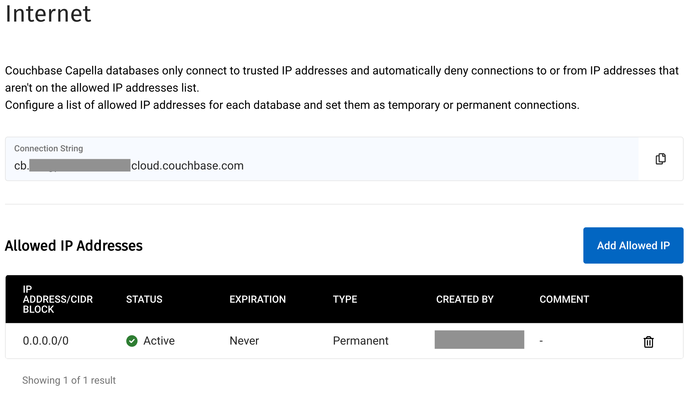
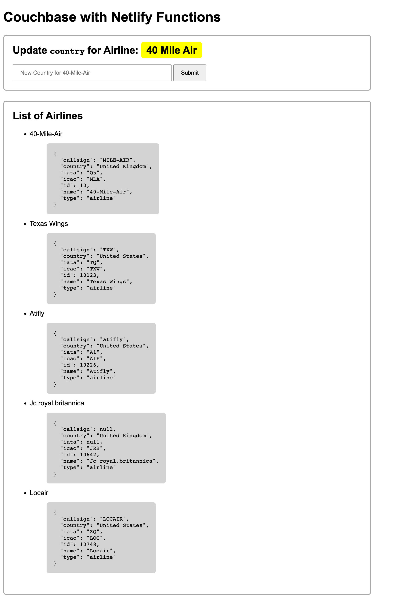

---
# frontmatter
path: '/tutorial-quickstart-netlify'
# title and description do not need to be added to markdown, start with H2 (##)
title: Quickstart using Couchbase Capella and Netlify Serverless Functions
short_title: Couchbase Capella and Netlify Serverless Functions
description:
  - Learn how to build and deploy a web application using Couchbase Capella and Netlify Serverless Functions
  - Set up a sample database on Couchbase Capella
  - Use Netlify Functions to build APIs to connect to your Couchbase database and perform queries
content_type: tutorial
filter: sdk
technology:
  - capella
  - query
tags:
  - REST API
sdk_language:
  - nodejs
length: 30 Mins
---

## Overview

The movement of <a target="_blank" rel="noopener noreferrer" href="https://www.netlify.com/jamstack/">static websites with serverless functions</a> is gaining momentum due to their simplicity, performance, and painless deployments. With static websites, there is no need for a dedicated server to process dynamic content as all the pages are pre-built and served directly to the browser. This means that serverless functions can be used to handle dynamic content, such as authentication and business logic, without needing to care about infrastructure.

Netlify is a platform that is at the forefront of this movement and has made it extremely easy and friendly for developers to deploy their applications. With features such as automatic continuous deployment, built-in CDN, and serverless functions, Netlify makes it easy for developers to build and deploy static websites quickly and efficiently.

Couchbase Capella follows the popular movement towards <a target="_blank" rel="noopener noreferrer" href="https://www.couchbase.com/blog/what-is-a-database-as-a-service-dbaas-why-is-it-important/">Database-as-a-Service</a> and works very well with this paradigm of moving to cloud services. Couchbase Capella is fully managed and removes the pain of hosting your own dedicated servers. Capella offers developers performance, security, and high availability across many regions and cloud providers, with all the benefits of a NoSQL database. This enables developers to focus on building applications, increasing productivity and reducing costs.

This tutorial will show how to quickly create a web application that utilizes Netlify Functions to connect to Couchbase Capella. We will be writing a web application that displays and mutates sample airline data in a Couchbase Capella database.

## Why use Netlify with Couchbase Capella

Using Netlify with Couchbase Capella can offer powerful benefits, including:

- Easy Deployment: Netlify offers a simple and straightforward deployment process for web applications, allowing you to easily deploy your application and manage it from a single dashboard. You can also integrate with Couchbase Capella to deploy your application alongside the database service.

- Scalability: Couchbase Capella is designed for cloud-native applications, and it offers scalability and flexibility to grow with your application needs. Netlify also supports auto-scaling, allowing your application to handle high traffic without any downtime.

- Performance: Couchbase Capella offers low-latency and high-throughput data access, which can significantly improve the performance of your web application. Netlify also provides features such as CDN integration and asset optimization, which can further improve the speed and performance of your application.

- Security: Couchbase Capella offers robust security features, including data encryption, role-based access control, and compliance with various data protection regulations. Netlify also offers security features such as SSL encryption to ensure your application is secure.

Overall, using Netlify with Couchbase Capella can help teams and individual developers easily deploy and manage a high-performance, scalable, and secure web application of any size.

## Prerequisites

- A <a target="_blank" rel="noopener noreferrer" href="https://docs.couchbase.com/cloud/get-started/create-account.html">Couchbase Capella</a> account (Get started for free with a trial database account)
- A <a target="_blank" rel="noopener noreferrer" href="https://www.netlify.com/">Netlify</a> account (Get started for free by signing in with your GitHub account)
- A GitHub account
- <a target="_blank" rel="noopener noreferrer" href="https://docs.netlify.com/cli/get-started/">Netlify CLI</a>
- Node.js 16+ setup and work with the CLI of your choice.
- curl or your preferred API testing tool

## Sample application

The final sample application can be found at on <a target="_blank" rel="noopener noreferrer" href="https://github.com/couchbase-examples/netlify-tutorial">GitHub</a> which can be used for reference.

## Set up your Couchbase Capella database

In this section, we will walk through how to set up Couchbase Capella with sample data called <a target="_blank" rel="noopener noreferrer" href="https://docs.couchbase.com/ruby-sdk/current/ref/travel-app-data-model.html">`travel-sample`</a>. If you do not have a Couchbase Capella account, follow the directions in this <a target="_blank" rel="noopener noreferrer" href="https://www.couchbase.com/blog/get-started-couchbase-capella/">blog article</a>. Please ensure you can sign into your Couchbase Capella account before continuing.

We need to set up a Couchbase Capella database with the sample data and configure the internet and user settings to allow Netlify Functions to access the database.

<a target="_blank" rel="noopener noreferrer" href="https://www.couchbase.com/blog/get-started-couchbase-capella/">Create your Couchbase Capella database</a> and set up the sample data.

1. On the Couchbase Capella console, create a new database and navigate to it.
2. Click Import Data under the Start tab
3. Import the Travel Sample dataset


Next, we need to set up internet settings to allow connections from all IP addresses. This is required for Netlify Functions to access the database for the purpose of this tutorial.

1. Navigate to the `Settings` tab on the database page.
2. Navigate to `Networking > Internet` on the sidebar

> NOTE: We will use the connection string displayed on this screen later in our code that will allow us to configure how to connect to Couchbase Capella via the Couchbase NodeJS SDK. Please copy this information and put it somewhere where you can access it later in the tutorial to save yourself from returning to this screen.

3. Click `Add allowed IP`
4. Allowlist `0.0.0.0/0` and save



Next, we will need to create a user account that can be used to access the database from our Serverless Function.

1. Confirm that you are on the `Settings` tab.
2. Navigate to `Security > Database Access` on the sidebar
3. Enter a memorable name and password as we'll need that later.
4. Select `travel-sample` for Bucket
5. Select `All Scopes` for Scopes
6. Select `Read/Write` for Access


You should now have a Couchbase Capella database, the `travel-sample` data loaded, network access configured, and a user account to access the data setup.

## Building the web application

### Create a new Netlify project

Create a new directory for your project and navigate into it. Set up a GitHub repository.

If you haven't already installed the Netlify CLI:

```
npm i -g netlify-cli
```

Create a new Netlify project using the command:

```
netlify sites:create
```

1. Select the default team or your organization's team for Team
2. Leave the site name blank or type any name for Site name

### Install dependencies

We'll need to install the <a target="_blank" rel="noopener noreferrer" href="https://www.npmjs.com/package/couchbase">Couchbase SDK</a> and <a target="_blank" rel="noopener noreferrer" href="https://www.npmjs.com/package/dotenv">dotenv</a> in order for our Netlify Functions to connect to our database.

```
npm install couchbase dotenv
```

### Create a netlify.toml file

For the Couchbase SDK to work with Netlify, we'll need to add a custom build command. Create a file called `netlify.toml` in the root directory and add the following:

```
[build]
  command = "strip --strip-debug ./node_modules/couchbase/build/Release/couchbase_impl.node"
  publish = "."
```

For more information on file-based configuration, please check out the <a target="_blank" rel="noopener noreferrer" href="https://docs.netlify.com/configure-builds/file-based-configuration/">Netlify Docs</a>

### Create a .env file

Hard coding your username and password into files and then checking that code into a repository like GitHub is highly discouraged. For the sake of this tutorial, we will need to create an environment file (`.env`) that includes the information on how to connect to our Couchbase Capella account and data. Later we will exclude this from being checked in. In real-world situations, you should inject these values via a CI/CD pipeline using Netlify and environment variables.

In the root directory of your project, create a `.env` file with the following:

```
COUCHBASE_USERNAME=<DATABASE_ACCESS_USERNAME>
COUCHBASE_PASSWORD=<DATABASE_ACCESS_PASSWORD>
COUCHBASE_ENDPOINT=<DATABASE_ENDPOINT>
COUCHBASE_BUCKET=travel-sample
```

Fill in the details with the database access username and password you set up earlier. Set the connection string we took note of earlier as the endpoint. This is required for testing our code locally.

> **NOTE:** Optionally, you can set environment variables via the CLI.  The CLI can also set the environment varibles for the app when it's deployed.  More information can be found in the [Netlify documentation](https://cli.netlify.com/commands/env/).

### Create a .gitignore file

In the root directory of your project, create a `.gitignore` file so we don't push our environment variables and build files to the GitHub repository.

```
# Local Netlify folder
.netlify
.env

node_modules/
```

### Create serverless functions

We'll need to create some serverless functions to allow your web application to interact with the Couchbase database. This should be easy, thanks to the powerful CLI tool that netlify provides. We'll create two functions for this tutorial that use the <a target="_blank" rel="noopener noreferrer" href="https://docs.couchbase.com/ruby-sdk/current/ref/travel-app-data-model.html#airline-documents">Airline documents</a>. The `get_airlines` function will run a query to retrieve some airline data, while the `put_airline` function will modify some airline data in our database.

First create the `get_airlines` function.

```
netlify functions:create get_airlines
```

1. Select Serverless function
2. Use the default path (hit enter)
3. Select Javascript
4. Select hello world example

This will create a new `get_airlines.js` file with a `handler()` function.

Repeat the process to create a `put_airline` function.

### Write the get_airlines.js handler

Navigate to the `get_airlines.js` file you've just created.

With just a few lines of code, we can write an API to use the <a target="_blank" rel="noopener noreferrer" href="https://docs.couchbase.com/nodejs-sdk/4.1/hello-world/start-using-sdk.html#connection">Couchbase NodeJS SDK</a> to connect to our newly created database and query data.

At the top of the file we can use the Couchbase SDK and our environment variables to initialize the Couchbase client. Note that this should be placed outside the handler, otherwise we will be creating a new connection to the database with every request.

```js
const couchbase = require('couchbase')
require('dotenv').config()

const ENDPOINT = process.env.COUCHBASE_ENDPOINT
const USERNAME = process.env.COUCHBASE_USERNAME
const PASSWORD = process.env.COUCHBASE_PASSWORD

const couchbaseClientPromise = couchbase.connect('couchbases://' + ENDPOINT, {
  username: USERNAME,
  password: PASSWORD,
  timeouts: {
    kvTimeout: 10000, // milliseconds
  },
})
```

Now we need to edit the handler to use the Couchbase client to query the database for airline data and return the results.

This snippet will query the database and return 5 airline entries.

```js
const cluster = await couchbaseClientPromise
const results = await cluster.query(
  'SELECT * from `travel-sample`.inventory.airline LIMIT 5'
)
```

After some more modifications to the handler function to accept only GET requests and handle the response, your final handler should something look like this:

```js
const handler = async (event) => {
  // only allow GET requests
  if (event.httpMethod !== 'GET') {
    return {
      statusCode: 405,
    }
  }

  try {
    const cluster = await couchbaseClientPromise
    const results = await cluster.query(
      'SELECT * from `travel-sample`.inventory.airline LIMIT 5'
    )

    return {
      statusCode: 200,
      body: JSON.stringify(results),
    }
  } catch (error) {
    return { statusCode: 500, body: error.toString() }
  }
}
```

To test our handler, we can run the netlify development environment with this CLI command:

```
netlify dev
```


Your Netlify development server should be up and running.

> We will use the url shown in the terminal throughout this tutorial in order to test our code. The port shown here may be different than on your machine. We will be using `http://localhost:8888` for the purposes of this tutorial, but you will need to replace the url in the commands with the one shown in your terminal.

The function we just wrote will be hosted at `http://localhost:8888/.netlify/functions/get_airlines`. The port may be different on your machine. It should return some airline data. Try making a request (Replace the port with the port of your development server if needed):

```sh
curl 'http://localhost:8888/.netlify/functions/get_airlines'
```

or for Powershell users:

```sh
Invoke-RestMethod -Uri 'http://localhost:8888/.netlify/functions/get_airlines' | ConvertTo-Json -Dept 10
```

### Write the put_airline.js handler

We also need to create a `put_airline` function to make changes to our database.

This function will create a simple API to change the country of the 40-Mile-Air airline.

Copy the following into your `put_airline.js` file:

```js
const couchbase = require('couchbase')
require('dotenv').config()

const ENDPOINT = process.env.COUCHBASE_ENDPOINT
const USERNAME = process.env.COUCHBASE_USERNAME
const PASSWORD = process.env.COUCHBASE_PASSWORD
const BUCKET = process.env.COUCHBASE_BUCKET

const couchbaseClientPromise = couchbase.connect('couchbases://' + ENDPOINT, {
  username: USERNAME,
  password: PASSWORD,
  timeouts: {
    kvTimeout: 10000, // milliseconds
  },
})

const handler = async (event) => {
  // only allow PUT requests
  if (event.httpMethod !== 'PUT') {
    return {
      statusCode: 405,
    }
  }

  try {
    const cluster = await couchbaseClientPromise
    const bucket = cluster.bucket(BUCKET)
    const scope = bucket.scope('inventory')
    const collection = scope.collection('airline')
    const modifiedAirline = {
      callsign: 'MILE-AIR',
      country: JSON.parse(event.body).country,
      iata: 'Q5',
      icao: 'MLA',
      id: 10,
      name: '40-Mile-Air',
      type: 'airline',
    }

    const idToUpsert = modifiedAirline.type + '_' + modifiedAirline.id

    const result = await collection.upsert(idToUpsert, modifiedAirline)

    return {
      statusCode: 200,
      body: JSON.stringify(result),
    }
  } catch (error) {
    return { statusCode: 500, body: error.toString() }
  }
}

module.exports = { handler }
```

We can test our newly created function now. Make sure you're running the `netlify dev` server. Your new function should be hosted at `http://localhost:8888/.netlify/functions/put_airline`. The port may be different on your machine, so check the terminal for your url. Try making a PUT request to the API locally to change the country of the 40-Mile-Air airline to "United Kingdom" (Replace the port with the port of your development server if needed).

```sh
curl -H "Content-type: application/json" -d '{"country":"United Kingdom"}' 'http://localhost:8888/.netlify/functions/put_airline'
```

or for Powershell users:

```sh
$headers=@{}
$headers.Add("Content-type", "application/json")
$body = '{"country":"United Kingdom"}'
Invoke-RestMethod -Uri 'http://localhost:8888/.netlify/functions/put_airline' -Method PUT -Headers $headers -ContentType 'application/json' -Body $body
```

The new data should be reflected in the Couchbase Capella console or you can check the `get_airlines` API as well to see that the data has changed.

```sh
curl 'http://localhost:8888/.netlify/functions/get_airlines'
```

or for Powershell users:

```sh
Invoke-RestMethod -Uri 'http://localhost:8888/.netlify/functions/get_airlines' | ConvertTo-Json -Dept 10
```

With this, both our Netlify Functions are done.

### Write the front-end for our web application

Now that the serverless functions are done, we can write some HTML and Javascript to consume the APIs.

The important snippets in this section to note are:

```js
await fetch("/.netlify/functions/put_airline", {
  method: "PUT",
  headers: {
    "Content-Type": "application/json",
  },
  body: JSON.stringify({ country: country }),
});
...
let results = await fetch("/.netlify/functions/get_airlines");
```

We can make requests to the serverless functions we created with just these few lines.

Create an `index.html` file in the root directory with the following:

> The final version of this UI code can be found in our <a target="_blank" rel="noopener noreferrer" href="https://github.com/couchbase-examples/netlify-tutorial/blob/main/index.html">sample application repo</a> if you want to copy and paste it in.

```html
<!DOCTYPE html>
<html lang="en">
  <head>
    <meta charset="UTF-8" />
    <title>Couchbase with Netlify</title>
  </head>
  <body>
    <h1>Couchbase with Netlify Functions</h1>
    <div class="section">
      <h2>
        Update <code>country</code> for Airline:
        <span class="highlight">40 Mile Air</span>
      </h2>
      <form onsubmit="handleCountrySubmit(event)">
        <input
          type="text"
          id="newCountry"
          placeholder="New Country for 40-Mile-Air"
          size="50"
        />
        <button type="submit">Submit</button>
      </form>
    </div>
    <div class="section">
      <h2>List of Airlines</h2>
      <ul id="airlines"></ul>
    </div>
  </body>
</html>

<script>
  async function handleCountrySubmit(e) {
    e.preventDefault()

    let country = e.target[0].value
    await fetch('/.netlify/functions/put_airline', {
      method: 'PUT',
      headers: {
        'Content-Type': 'application/json',
      },
      body: JSON.stringify({ country: country }),
    })

    location.reload()
  }

  ;(async () => {
    try {
      let results = await fetch('/.netlify/functions/get_airlines')
      let parsedResults = await results.json()
      parsedResults.rows.forEach((result) => {
        const listItem = document.createElement('li')
        listItem.innerText = result.airline.name
        const subList = document.createElement('ul')
        const subListItem = document.createElement('li')
        const codeBlock = document.createElement('pre')
        codeBlock.innerText = JSON.stringify(result.airline, null, 2)
        subListItem.appendChild(codeBlock)
        subList.appendChild(subListItem)
        listItem.appendChild(subList)
        document.getElementById('airlines').appendChild(listItem)
      })
    } catch (error) {
      const listError = document.createElement('li')
      const errorMsg = document.createElement('strong')
      errorMsg.innerText = error.message
      listError.innerText = `Error Fetching Airlines: `
      listError.appendChild(errorMsg)
      document.getElementById('airlines').appendChild(listError)
    }
  })()
</script>

<style>
  body {
    font-family: Arial, serif;
  }
  #airlines > li > ul {
    list-style: none !important;
  }
  pre {
    background: lightgray;
    display: inline-block;
    padding: 16px;
    border-radius: 6px;
  }
  .highlight {
    background: yellow;
    padding: 6px 12px;
    border-radius: 6px;
  }
  .section {
    border: 2px solid darkgray;
    border-radius: 6px;
    margin: 24px 0;
    padding: 0 0 20px 20px;
    width: 90%;
  }
  form > input,
  button {
    padding: 10px 16px;
  }
  button {
    cursor: pointer;
  }
</style>
```

Our project is now ready to deploy to Netlify. You can check your work by running `netlify dev` to run your project locally and navigating to the url shown in the terminal. Your web application should show some airline data and you should be able to modify the country of the 40-Mile-Air airline using the form.



## Deploy to Netlify

### Github

If you haven't already done so, <a target="_blank" rel="noopener noreferrer" href="https://docs.github.com/en/migrations/importing-source-code/using-the-command-line-to-import-source-code/adding-locally-hosted-code-to-github">create a new GitHub repository and push your code</a>.

### Netlify

Using the Netlify console, click `Import an Existing Project`, connect to your GitHub account, and select the repository that you've created. Check the Netlify docs for detailed steps to <a target="_blank" rel="noopener noreferrer" href="https://docs.netlify.com/welcome/add-new-site/#import-from-an-existing-repository">import a project</a>.


Keep the defaults for the following site settings page and click `Deploy`.


After the project is created, go to `Site Settings > Environment variables`. Now use the Add a variable pull down menu and select Import from a .env file. Finally cut and paste in the contents of the .env file you created earlier and click the Import variables button.


Alternatively, we can also use the Netlify CLI to <a target="_blank" rel="noopener noreferrer" href="https://docs.netlify.com/configure-builds/environment-variables/#declare-variables">import our environment variables</a> and <a target="_blank" rel="noopener noreferrer" href="https://docs.netlify.com/site-deploys/create-deploys/">deploy our project</a> using `netlify env:set VAR_NAME value` as well as `netlify deploy`

Any changes you make to the environment variables will require your site to be redeployed. After the site is finished deploying, navigate to the site. You should see some airline data; try using the text field to change the country of the 40-Mile-Air airline.


If you are having issues, confirm that you have imported the correct environment variables into Netlify and the project is working locally. You can also check the reference sample application.

## Conclusion

You have just created a full-stack application using Couchbase Capella and Netlify. We used Netlify Functions to create a REST API that reads and stores data in a Couchbase Capella database. Combined, they are powerful tools that allow developers to quickly build production-ready, scalable, complex applications without needing to worry about infrastructure.
