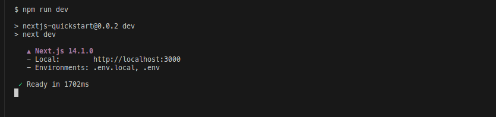
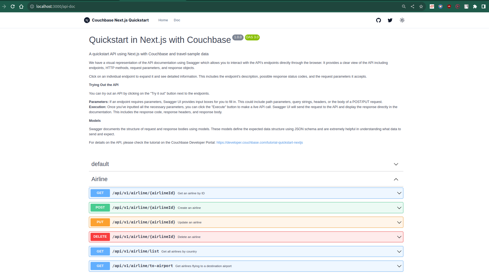

---
# frontmatter
path: "/tutorial-quickstart-nextjs-capella"
title: Using Next.js with Couchbase NodeJS SDK
short_title: Next.js with Node SDK
description:
  - Build a basic REST API using using Next.js and Couchbase Nodejs SDK
  - See how you can fetch data from Couchbase without exposing API routes
  - Explore CRUD operations in action with Couchbase
content_type: quickstart
filter: sdk
technology:
  - kv
  - query
  - index
tags:
  - Next.js
sdk_language:
  - nodejs
length: 45 Mins
---

<!-- [abstract] -->

In this tutorial, you will learn how to connect to a Couchbase Capella cluster to create, read, update, and delete documents and how to write simple parametrized SQL++ queries.

## Prerequisites

To run this prebuilt project, you will need:

- [Couchbase Capella](https://www.couchbase.com/products/capella/) cluster with [travel-sample](https://docs.couchbase.com/nodejs-sdk/current/ref/travel-app-data-model.html) bucket loaded.
  - To run this tutorial using a self managed Couchbase cluster, please refer to the [appendix](#running-self-managed-couchbase-cluster).
- [Next.js](https://nextjs.org/) 14 or higher installed
- Loading Travel Sample Bucket
  If travel-sample is not loaded in your Capella cluster, you can load it by following the instructions for your Capella Cluster:

  - [Load travel-sample bucket in Couchbase Capella](https://docs.couchbase.com/cloud/clusters/data-service/import-data-documents.html#import-sample-data)

> Note that this tutorial is designed to work with the latest [Node.js SDK (4.x)](https://docs.couchbase.com/nodejs-sdk/current/hello-world/overview.html) for Couchbase. It will not work with older versions of Next.js without adapting the code.

- Ensure that the Nodejs version is [compatible](https://docs.couchbase.com/nodejs-sdk/current/project-docs/compatibility.html) with the Couchbase SDK.
- Loading Travel Sample Bucket
  If travel-sample is not loaded in your Capella cluster, you can load it by following the instructions for your Capella Cluster:

  - [Load travel-sample bucket in Couchbase Capella](https://docs.couchbase.com/cloud/clusters/data-service/import-data-documents.html#import-sample-data)

> Note that this tutorial is designed to work with Next.js 14. Please make sure you have Next.js 14 installed before proceeding.

## App Setup

### Cloning Repo

```shell
git clone https://github.com/couchbase-examples/nextjs-capella-quickstart.git
```

### Install Dependencies

Any dependencies should be installed through the node package manager (npm). Navigate to the root directory and run the following command:

```shell
npm install
```

### Setup Database Configuration

To know more about connecting to your Capella cluster, please follow the [instructions](https://docs.couchbase.com/cloud/get-started/connect.html).

Specifically, you need to do the following:

- Create the [database credentials](https://docs.couchbase.com/cloud/clusters/manage-database-users.html) to access the travel-sample bucket (Read and Write) used in the application.
- [Allow access](https://docs.couchbase.com/cloud/clusters/allow-ip-address.html) to the Cluster from the IP on which the application is running.

All configuration for communication with the database is fetched from the environment variables. We have provided a convenience feature in this quickstart to read the environment variables from a local file, `.env` in the source folder.

Create a copy of `.env.example` file & rename it to `.env.local` & add the values for the Couchbase cluster.

```sh
DB_CONN_STR=<connection_string>
DB_USERNAME=<user_with_read_write_permission_to_travel-sample_bucket>
DB_PASSWORD=<password_for_user>
```

> Note: The connection string expects the `couchbases://` or `couchbase://` part.

## Running the Application

### Directly on Local Machine

At this point, we have installed the dependencies, loaded the travel-sample data and configured the application with the credentials. The application is now ready and you can run it.

```sh
npm run dev
```

The application will start on port 3000 of your local machine (http://localhost:3000).
The interactive Swagger documentation of the API can be found at http://localhost:3000/api-doc.

#### Using Docker

If you prefer to run this quick start using Docker, we have provided the Dockerfile which you can use to build the image and run the API as a container.

- Build the Docker image

```sh
docker build -t nextjs-capella-quickstart . -f Dockerfile.dev
```

- Run the Docker image

```sh
docker run -p 3000:3000 nextjs-capella-quickstart -e DB_CONN_STR=<connection_string> -e DB_USERNAME=<user_with_read_write_permission_to_travel-sample_bucket> -e DB_PASSWORD=<password_for_user>
```

> Note: The `dev.env` file has the environment variables for the application. The `-e` flag is used to pass the environment variables to the container.

### Verifying the Application

Once the application starts, you can see the details of the application on the logs.



The application will run on port 3000 of your local machine (http://localhost:3000). You will find the interactive Swagger documentation of the API if you go to the URL(http://localhost:3000/api-doc) in your browser. Swagger documentation is used in this demo to showcase the different API end points and how they can be invoked. More details on the Swagger documentation can be found in the [appendix](#swagger-documentation).



## Data Model

For this tutorial, we use three collections, `airport`, `airline` and `route` that contain sample airports, airlines and airline routes respectively. The route collection connects the airports and airlines as seen in the figure below. We use these connections in the quickstart to generate airports that are directly connected and airlines connecting to a destination airport. Note that these are just examples to highlight how you can use SQL++ queries to join the collections.


## Let Us Review the Code

To begin this tutorial, clone the repo and open it up in the IDE of your choice. Now you can learn about how to create, read, update and delete documents in Couchbase Server.

### Code Layout

```
Dockerfile.dev
app
├── api
│   ├── hello
│   │   └── route.ts
│   └── v1
│       ├── airline
│       │   ├── [airlineId]
│       │   │   ├── route.test.ts
│       │   │   └── route.ts
│       │   ├── list
│       │   │   ├── route.test.ts
│       │   │   └── route.ts
│       │   └── to-airport
│       │       ├── route.test.ts
│       │       └── route.ts
│       ├── airport
│       │   ├── [airportId]
│       │   │   ├── route.test.ts
│       │   │   └── route.ts
│       │   └── direct-connections
│       │       ├── route.test.ts
│       │       └── route.ts
│       └── route
│           └── [routeId]
│               ├── route.test.ts
│               └── route.ts
├── api-doc
│   ├── page.tsx
│   └── react-swagger.tsx
├── layout.tsx
├── models
│   ├── Airline.ts
│   ├── Airport.ts
│   └── Route.ts
└── page.tsx
```

### Connecting to Couchbase

We use the Couchbase Node.js SDK to connect to the Couchbase cluster. The connection is established in the `couchbase-connection.ts` file in the `lib` folder. The connection string and credentials are read from the environment variables.

Here is the code to connect to the Couchbase cluster:

```ts
interface DbConnection {
  cluster: couchbase.Cluster;
  bucket: couchbase.Bucket;
  scope: couchbase.Scope;
  airlineCollection: couchbase.Collection;
  airportCollection: couchbase.Collection;
  routeCollection: couchbase.Collection;
}

let cachedDbConnection: DbConnection | null = null;

declare const global: {
  couchbase?: {
    conn: couchbase.Cluster | null;
  };
};

/**
 * Global is used here to maintain a cached connection across hot reloads
 * in development. This prevents connections growing exponentially
 * during API Route usage.
 */
let cached: { conn: couchbase.Cluster | null } = global.couchbase ?? {
  conn: null,
};

async function createCouchbaseCluster(): Promise<couchbase.Cluster> {
  if (cached.conn) {
    return cached.conn;
  }
  const cluster = await couchbase.connect(DB_CONN_STR, {
    username: DB_USERNAME,
    password: DB_PASSWORD,
    configProfile: "wanDevelopment",
  });

  cached.conn = cluster;
  return cluster;
}

async function connectToDatabase(): Promise<DbConnection> {
  const cluster = await createCouchbaseCluster();
  const bucket = cluster.bucket(DB_BUCKET_NAME);
  const scope = bucket.scope("inventory");
  const airlineCollection = scope.collection("airline");
  const airportCollection = scope.collection("airport");
  const routeCollection = scope.collection("route");

  const dbConnection: DbConnection = {
    cluster,
    bucket,
    scope,
    airlineCollection,
    airportCollection,
    routeCollection,
  };
  cachedDbConnection = dbConnection;
  return dbConnection;
}

export function getDatabase(): Promise<DbConnection> {
  if (!cachedDbConnection) {
    // If connection doesn't exist, create and cache it
    return connectToDatabase();
  }
  // If connection exists, return it
  return Promise.resolve(cachedDbConnection);
}
```

In the `connectToDatabase` function, we connect to the Couchbase cluster using the connection string and credentials. We then connect to the `travel-sample` bucket and create references to the collections we will be using in the application.

In the `getDatabase` function, we check if the connection exists and return it. If it doesn't exist, we create and cache it.

We use the global object to maintain a cached connection across hot reloads in development. This prevents connections from growing exponentially during API route usage.

### Airline Entity

For this tutorial, we will focus on the airline entity. The other entities are similar.

We will be setting up a REST API to manage airline documents.

- [GET Airline](#get-airline) – Read specified airline
- [POST Airline](#post-airline) – Create a new airline
- [PUT Airline](#put-airline) – Update specified airline
- [DELETE Airline](#delete-airline) – Delete airline
- [Airline List](#list-airline) – Get all airlines. Optionally filter the list by country

For CRUD operations, we will use the [Key-Value operations](https://docs.couchbase.com/nodejs-sdk/current/howtos/kv-operations.html) that are built into the Couchbase SDK to create, read, update, and delete a document. Every document will need an ID (similar to a primary key in other databases) to save it to the database. This ID is passed in the URL. For other end points, we will use [SQL++](https://docs.couchbase.com/nodejs-sdk/current/howtos/n1ql-queries-with-sdk.html) to query for documents.

### Airline Document Structure

Our profile document will have an airportname, city, country, faa code, icao code, timezone info and the geographic coordinates. For this demo, we will store all airport information in one document in the `airline` collection in the `travel-sample` bucket.

```json
{
  "name": "40-Mile Air",
  "iata": "Q5",
  "icao": "MLA",
  "callsign": "MILE-AIR",
  "country": "United States"
}
```

### GET Airline

In the `GET` method, we use the `get` method of the `airlineCollection` to fetch the document with the specified ID. If the document is not found, we return a 404 status code. If an error occurs, we return a 500 status code.

If the document is found, we return the document as a JSON response with a 200 status code.

```ts
export async function GET(
  req: NextRequest,
  { params }: { params: { airlineId: string } }
) {
  try {
    const { airlineId } = params;
    const { airlineCollection } = await getDatabase();

    const airline = await airlineCollection.get(airlineId);
    return NextResponse.json(airline.content as TAirline, { status: 200 });
  } catch (error) {
    if (error instanceof DocumentNotFoundError) {
      return NextResponse.json(
        { message: "Airline not found", error: "Airline not found" },
        { status: 404 }
      );
    } else {
      return NextResponse.json(
        {
          message: "An error occurred while fetching airline",
        },
        { status: 500 }
      );
    }
  }
}
```

### POST Airline

In the `POST` method, we use the `insert` method of the `airlineCollection` to create a new document with the specified ID. If the document already exists, we return a 409 status code. If the request body is invalid, we return a 400 status code. If an error occurs, we return a 500 status code.

If the document is created successfully, we return the document as a JSON response with a 201 status code.

```ts
export async function POST(
  req: NextRequest,
  { params }: { params: { airlineId: string } }
) {
  try {
    const { airlineId } = params;
    const airlineData: TAirline = await req.json();
    const parsedAirlineData = AirlineSchema.parse(airlineData);
    const { airlineCollection } = await getDatabase();

    const createdAirline = await airlineCollection.insert(
      airlineId,
      parsedAirlineData
    );
    return NextResponse.json(
      {
        airlineId: airlineId,
        airlineData: parsedAirlineData,
        createdAirline: createdAirline,
      },
      {
        status: 201,
      }
    );
  } catch (error) {
    if (error instanceof DocumentExistsError) {
      return NextResponse.json(
        {
          message: "Airline already exists",
          error: "Airline already exists",
        },
        { status: 409 }
      );
    } else if (error instanceof ZodError) {
      return NextResponse.json(
        {
          message: "Invalid request body",
          error: error.errors,
        },
        { status: 400 }
      );
    } else {
      return NextResponse.json(
        {
          message: "An error occurred while creating airline",
        },
        { status: 500 }
      );
    }
  }
}
```

### PUT Airline

In the `PUT` method, we use the `upsert` method of the `airlineCollection` to update the document with the specified ID. If the document does not exist, it is created. If the request body is invalid, we return a 400 status code. If an error occurs, we return a 500 status code.

If the document is updated successfully, we return the document as a JSON response with a 200 status code.

```ts
export async function PUT(
  req: NextRequest,
  { params }: { params: { airlineId: string } }
) {
  try {
    const { airlineId } = params;
    const airlineData: TAirline = await req.json();
    const parsedAirlineData = AirlineSchema.parse(airlineData);
    const { airlineCollection } = await getDatabase();

    const updatedAirline = await airlineCollection.upsert(
      airlineId,
      parsedAirlineData
    );
    return NextResponse.json(
      {
        airlineId: airlineId,
        airlineData: parsedAirlineData,
        updatedAirline: updatedAirline,
      },
      { status: 200 }
    );
  } catch (error) {
    if (error instanceof ZodError) {
      return NextResponse.json(
        { message: "Invalid request body", error: error.errors },
        { status: 400 }
      );
    } else {
      return NextResponse.json(
        {
          message: "An error occurred while updating airline",
          error: "An error occurred while updating airline",
        },
        { status: 500 }
      );
    }
  }
}
```

### DELETE Airline

In the `DELETE` method, we use the `remove` method of the `airlineCollection` to delete the document with the specified ID. If the document is not found, we return a 404 status code. If an error occurs, we return a 500 status code.

If the document is deleted successfully, we return a JSON response with a 202 status code.

```ts
export async function DELETE(
  req: NextRequest,
  { params }: { params: { airlineId: string } }
) {
  try {
    const { airlineId } = params;
    const { airlineCollection } = await getDatabase();

    await airlineCollection.remove(airlineId);
    return NextResponse.json(
      { message: "Successfully deleted airline" },
      { status: 202 }
    );
  } catch (error) {
    if (error instanceof DocumentNotFoundError) {
      return NextResponse.json(
        {
          message: "Airline not found",
          error: "Airline not found",
        },
        { status: 404 }
      );
    } else {
      return NextResponse.json(
        {
          message: "An error occurred while deleting airline",
        },
        { status: 500 }
      );
    }
  }
}
```

### List Airline

This endpoint retrieves the list of airlines in the database. The API has options to specify the page size for the results and country from which to fetch the airport documents.

Navigate to the `GET` method in the `app/api/v1/airline/list/route.ts` file. This endpoint is different from the others we have seen before because it makes the SQL++ query rather than a key-value operation. This usually means more overhead because the query engine is involved. For this query, we are using the predefined indices in the `travel-sample` bucket. We can create an additional [index](https://docs.couchbase.com/server/current/learn/services-and-indexes/indexes/indexing-and-query-perf.html) specific for this query to make it perform better.

First, we need to get the values from the query string for country, limit, and Offset that we will use in our query. These are pulled in by the [query parameters](https://nextjs.org/docs/app/api-reference/functions/use-search-params) in Next.js API routes.

This endpoint has two queries depending on the value for the country parameter. If a country name is specified, we retrieve the airport documents for that specific country. If it is not specified, we retrieve the list of airlines across all countries. The queries are slightly different for these two scenarios.

We build our SQL++ query using the [parameters](https://docs.couchbase.com/nodejs-sdk/current/howtos/n1ql-queries-with-sdk.html#queries-placeholders)
specified by `$` symbol for both these scenarios. The difference between the two queries is the presence of the `country` parameter in the query. Normally for the queries with pagination, it is advised to order the results to maintain the order of results across multiple queries.

Next, we pass that `query` to the CouchbaseClient class `query` method. We save the results in a list, `airlines`.

```ts
export async function GET(req: NextRequest) {
  try {
    const { scope } = await getDatabase();
    const country = req.nextUrl.searchParams.get("country") ?? "";
    const limit = req.nextUrl.searchParams.get("limit") ?? 10;
    const offset = req.nextUrl.searchParams.get("offset") ?? 0;

    let query: string;
    type QueryOptions = {
      parameters: {
        COUNTRY?: string;
        LIMIT: number;
        OFFSET: number;
      };
    };

    let options: QueryOptions;

    if (country === "") {
      query = `
        SELECT air.callsign,
               air.country,
               air.iata,
               air.icao,
               air.id,
               air.name,
               air.type
        FROM airline AS air
        LIMIT $LIMIT OFFSET $OFFSET
      `;
      options = {
        parameters: {
          LIMIT: Number(limit),
          OFFSET: Number(offset),
        },
      };
    } else {
      query = `
        SELECT air.callsign,
               air.country,
               air.iata,
               air.icao,
               air.id,
               air.name,
               air.type
        FROM airline AS air
        WHERE air.country = $COUNTRY
        LIMIT $LIMIT OFFSET $OFFSET
      `;
      options = {
        parameters: {
          COUNTRY: country,
          LIMIT: Number(limit),
          OFFSET: Number(offset),
        },
      };
    }

    const result: QueryResult = await scope.query(query, options);
    const airlines: TAirline[] = result.rows;

    return NextResponse.json(airlines, { status: 200 });
  } catch (error) {
    return NextResponse.json(
      {
        message: "An error occurred while fetching airlines",
      },
      { status: 500 }
    );
  }
}
```

### Direct Connections

This endpoint fetches the airports that can be reached directly from the specified source airport code. This also uses a SQL++ query to fetch the results simlar to the List Airport endpoint.

Let us look at the query used here:

```sql
SELECT DISTINCT route.destinationairport
FROM airport AS airport
JOIN route AS route ON route.sourceairport = airport.faa
WHERE airport.faa = $destinationAirportCode AND route.stops = 0
LIMIT $LIMIT OFFSET $OFFSET
```

We are fetching the direct connections by joining the airport collection with the route collection and filtering based on the source airport specified by the user and by routes with no stops.

### Running Tests

We have defined integration tests using [Vite](https://vitejs.dev/) for all the API endpoints. The integration tests use the same database configuration as the application. For the tests, we perform the operation using the API and confirm the results by checking the documents in the database. For example, to check the creation of the document by the API, we would call the API to create the document and then read the same document directly from the database using the appropriate client and compare them. After the tests, the documents are cleaned up.

The tests including the fixtures and helpers for the tests are configured in the `tests` folder.

To run the tests, use the following command:

```sh
npm install -g vitest
vitest app/api/v1/airline/[airlineId]/route.test.ts
```

## Appendix

### Extending API by Adding New Entity

If you would like to add another entity to the APIs, these are the steps to follow:

- Create the new entity (collection) in the Couchbase bucket. You can create the collection using the [SDK](https://docs.couchbase.com/nodejs-sdk/current/howtos/provisioning-cluster-resources.html#collection-management) or via the [Couchbase Server interface](https://docs.couchbase.com/cloud/n1ql/n1ql-language-reference/createcollection.html).
- Create the new entity model in the `models` folder similar to the existing models like `Airline.ts`.
- Create the new API routes in the `api/v1` folder similar to the existing routes like `airline`.

### Running Self Managed Couchbase Cluster

If you are running this quickstart with a self managed Couchbase cluster, you need to [load](https://docs.couchbase.com/server/current/manage/manage-settings/install-sample-buckets.html) the travel-sample data bucket in your cluster and generate the credentials for the bucket.

- Follow [Couchbase Installation Options](/tutorial-couchbase-installation-options) for installing the latest Couchbase Database Server Instance.

You need to update the connection string and the credentials in the `dev.env` file in the source folder.

> Note: Couchbase Server must be installed and running prior to running the Nextjs app.

### Swagger Documentation

Swagger documentation provides a clear view of the API including endpoints, HTTP methods, request parameters, and response objects.

Click on an individual endpoint to expand it and see detailed information. This includes the endpoint's description, possible response status codes, and the request parameters it accepts.

#### Trying Out the API

You can try out an API by clicking on the "Try it out" button next to the endpoints.

- Parameters: If an endpoint requires parameters, Swagger UI provides input boxes for you to fill in. This could include path parameters, query strings, headers, or the body of a POST/PUT request.

- Execution: Once you've inputted all the necessary parameters, you can click the "Execute" button to make a live API call. Swagger UI will send the request to the API and display the response directly in the documentation. This includes the response code, response headers, and response body.

#### Models

Swagger documents the structure of request and response bodies using models. These models define the expected data structure using JSON schema and are extremely helpful in understanding what data to send and expect.
