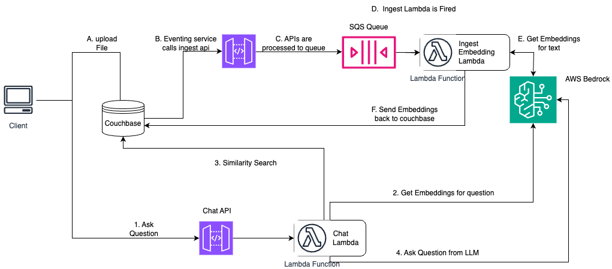

---
# frontmatter
path: "/tutorial-bedrock-serverless-pdf-chat"
# title and description do not need to be added to markdown, start with H2 (##)
title: Serverless PDF Chat App with Couchbase and AWS Bedrock
short_title: Build PDF Chat App
description:
  - Construct a PDF Chat App with AWS Serverless Architecture and Couchbase Capella
  - Learn to use Couchbase Vector Store, LangChain, Couchbase Eventing
  - Utilize multiple AWS features to get E2E Serverless Stack
  - Discover how to use RAGs for context-based Q&As from PDFs with LLM Service from AWS Bedrock.
content_type: tutorial
filter: sdk
technology:
  - fts
  - kv
  - eventing
tags:
  - Streamlit
  - LangChain
  - LLama3
  - AWS
sdk_language:
  - python
length: 60 Mins
---

## Introduction

Welcome to this comprehensive guide on constructing an AI-enhanced Chat Application. We will create a dynamic chat interface capable of going deep into PDF documents to extract and provide summaries, key facts, and answers to your queries. By the end of this tutorial, you’ll have a powerful tool at your disposal, transforming the way you interact with and utilize the information contained within PDFs.

This tutorial will demonstrate how to -

- Construct a [Couchbase Search Index](https://www.couchbase.com/products/vector-search/) for doing Vector Search.
- Use AWS Serverless Architecture with services like API Gateway, SQS, Lambdas, Bedrock.
- Chunk PDFs into Vectors with [LangChain](https://langchain.com/) and use [Couchbase Vector Store](https://python.langchain.com/docs/integrations/vectorstores/couchbase/) to store the vectors into Couchbase.
- Query large language models via the [RAG framework](https://aws.amazon.com/what-is/retrieval-augmented-generation/) for contextual insights. We will use [AWS Bedrock](https://aws.amazon.com/bedrock/) for generating Embeddings and LLM.
- Craft an elegant UI with Streamlit. All these components come together to create a seamless, AI-powered chat experience.

## Prerequisites

- [Python](https://www.python.org/downloads/) 3.10 or higher installed.
- Ensure that the Python version is [compatible](https://docs.couchbase.com/python-sdk/current/project-docs/compatibility.html#python-version-compat) with the Couchbase SDK.
- Couchbase Cluster (Self Managed or Capella) version 7.6.2+ with [Search Service](https://docs.couchbase.com/server/current/fts/fts-introduction.html) and [Eventing Service](https://docs.couchbase.com/server/current/eventing/eventing-overview.html)

> Note that this tutorial is designed to work with the latest Python SDK version (4.3.0+) for Couchbase. It will not work with the older Python SDK versions.

> Vector Search in Couchbase is only supported at Couchbase Version 7.6+. 

## Quick Start Guide:

### Cloning Repo

```shell
git clone https://github.com/couchbase-examples/rag-aws-bedrock-serverless.git
```

### Install Dependencies

Any dependencies should be installed through `pip`, the default package manager for Python. You may use [virtual environment](https://docs.python.org/3/tutorial/venv.html) as well.

```shell
python -m pip install -r requirements.txt
```

### Setup Database Configuration

#### Capella Setup

To know more about connecting to your Capella cluster, please follow the [instructions](https://docs.couchbase.com/cloud/get-started/connect.html).

Specifically, you need to do the following:

- Create the [database credentials](https://docs.couchbase.com/cloud/clusters/manage-database-users.html) to access cluster via SDK
- [Allow access](https://docs.couchbase.com/cloud/clusters/allow-ip-address.html) to the Cluster from the IP on which the application is running.

#### Self Managed Setup

- Follow [Couchbase Installation Options](/tutorial-couchbase-installation-options) for installing the latest Couchbase Database Server Instance. Make sure to add the [Search Service](https://docs.couchbase.com/server/current/fts/fts-introduction.html).

### Create Bucket

- For the purpose of this tutorial, we will be using specific bucket, scope and collection. However, you may use any name of your choice but make sure to update names in all the steps.
- Create a bucket named `pdf-chat`. We will use the `shared` scope and `docs` collection of this bucket which needs to be created. [Read more](https://docs.couchbase.com/cloud/clusters/data-service/about-buckets-scopes-collections.html) 

### Create the Search Index on Full Text Service

We need to create the Search Index on the Full Text Service in Couchbase. For this demo, you can import the following index using the instructions.

- [Couchbase Capella](https://docs.couchbase.com/cloud/search/import-search-index.html)

  - Copy the index definition to a new file index.json.
  - Import the file in Capella using the instructions in the documentation.
  - Click on Create Index to create the index.

- [Couchbase Server](https://docs.couchbase.com/server/current/search/import-search-index.html)

  - Click on Search → Add Index → Import.
  - Copy the following Index definition in the Import screen.
  - Click on Create Index to create the index.

You may also create a vector index using Search UI on both [Couchbase Capella](https://docs.couchbase.com/cloud/vector-search/create-vector-search-index-ui.html) and [Couchbase Self Managed Server](https://docs.couchbase.com/server/current/vector-search/create-vector-search-index-ui.html).

#### Index Definition

Here, we are creating the index `pdf_search` on the documents. The Vector field is set to `embedding` with 1024 dimensions and the text field set to `text`. We are also indexing and storing all the fields under `metadata` in the document as a dynamic mapping to account for varying document structures. The similarity metric is set to `dot_product`. If there is a change in these parameters, please adapt the index accordingly.

```json
{
  "name": "pdf_search",
  "type": "fulltext-index",
  "params": {
    "doc_config": {
      "docid_prefix_delim": "",
      "docid_regexp": "",
      "mode": "scope.collection.type_field",
      "type_field": "type"
    },
    "mapping": {
      "default_analyzer": "standard",
      "default_datetime_parser": "dateTimeOptional",
      "default_field": "_all",
      "default_mapping": {
        "dynamic": true,
        "enabled": false
      },
      "default_type": "_default",
      "docvalues_dynamic": false,
      "index_dynamic": true,
      "store_dynamic": false,
      "type_field": "_type",
      "types": {
        "shared.docs": {
          "dynamic": true,
          "enabled": true,
          "properties": {
            "embedding": {
              "enabled": true,
              "dynamic": false,
              "fields": [
                {
                  "dims": 1024,
                  "index": true,
                  "name": "embedding",
                  "similarity": "dot_product",
                  "type": "vector",
                  "vector_index_optimized_for": "recall"
                }
              ]
            },
            "metadata": {
              "dynamic": true,
              "enabled": true
            },
            "text": {
              "enabled": true,
              "dynamic": false,
              "fields": [
                {
                  "index": true,
                  "name": "text",
                  "store": true,
                  "type": "text"
                }
              ]
            }
          }
        }
      }
    },
    "store": {
      "indexType": "scorch",
      "segmentVersion": 16
    }
  },
  "sourceType": "gocbcore",
  "sourceName": "pdf-chat",
  "sourceParams": {},
  "planParams": {
    "maxPartitionsPerPIndex": 64,
    "indexPartitions": 16,
    "numReplicas": 0
  }
}
```

### Setup Environment Config

Update the `.env` file to include all these required variables. All configuration for communication with the database is read from the environment variables. We will revisit the environment file again to add more fields.

```bash
CB_CONN_STR=connection_string_for_couchbase_cluster
CB_USERNAME=username_for_couchbase_cluster
CB_PASSWORD=password_for_couchbase_cluster
CB_BUCKET=name_of_bucket_to_store_documents
CB_SCOPE=name_of_scope_to_store_documents
CB_COLLECTION=name_of_collection_to_store_documents
INDEX_NAME=name_of_fts_index_with_vector_support
```

> The [connection string](https://docs.couchbase.com/python-sdk/current/howtos/managing-connections.html#connection-strings) expects the `couchbases://` or `couchbase://` part.

> For this tutorial, `CB_BUCKET = pdf-chat`, `CB_SCOPE = shared`, `CB_COLLECTION = docs` and `INDEX_NAME = pdf_search`.

### Configuring AWS

We need to set up our AWS Environment and run all the necessary services.

#### Deploy Lambdas to ECR

We will need to use Lambdas deployed as docker container in the [AWS Elastic Container Registry Service](https://aws.amazon.com/ecr/). We have two lambdas in the application at directory `src/lambads`. For Each of the lambdas a new ECR Repository needs to be created.

Firstly build the docker image for the two of them using `docker build` in the respective folder

```bash
docker build -t <lambda name> .
```

Lambda name will be chat and ingest for the respective folders. 
Then use [this guide from AWS](https://docs.aws.amazon.com/AmazonECR/latest/userguide/docker-push-ecr-image.html) to understand how to push an image to ECR.

Once it's pushed, we are ready for the next steps.

#### Enable Bedrock

You may need to allow access to models used in this example via [Amazon Bedrock](https://console.aws.amazon.com/bedrock). Click on get started to open Bedrock console. in the sidebar, there will be option of `Bedrock configurations`. Click on model access inside it. For this tutorial we are using models `Titan Multimodal Embeddings G1` and `Llama 3 70B Instruct`. You can change the lambda named chat if you need any other models. Click on modify model access and select models required. Accept terms and conditions and now the AI Model will be ready to use.

#### Setup AWS CLI

The AWS CLI is a unified tool that provides a consistent interface for interacting with all parts of AWS. Please follow this [User Guide](https://docs.aws.amazon.com/cli/latest/userguide/getting-started-quickstart.html) by AWS to set up AWS on your local machine. 

Please follow the next steps, once AWS is successfully configured.

#### Run AWS Cloud Development Kit

Run the Following Command on the root folder of the project

```bash
cdk deploy
```

You may enter a couple of `y` to approve the deployment. This step will ensure 2 AWS stacks (One for ingesting documents and other for chatting) are deployed on your AWS account. This will generate 2 API gateway endpoints. We will require these two API Gateway endpoints in the next step.

#### Update the Environment File

We will need to update the environment file to include one more variable at the end of `.env` file we created at [Setup Environment Config](#setup-environment-config). The variable name is `CHAT_URL`

```bash
CHAT_URL=API_Gateway_Endpoint_of_ChatBedrockStack
```

This variable must have the API gateway endpoint of the ChatBedrockStack which came as part of cdk deploy. The exact endpoint also includes `/chat` so append it to the back of URL.

### Setup Couchbase Eventing

Once AWS is deployed, we will need to set up couchbase eventing function. This function will add embeddings to Couchbase Database whenever a document is added. Read more about the [Couchbase Eventing Service](https://docs.couchbase.com/server/current/eventing/eventing-overview.html).

We will use import function feature of couchbase eventing. Go to eventing tab in the Web Console of Cluster. You will get an option to import function. Click on it and use upload from computer if any option is asked. There is file named `eventingIngest.json` present in the root folder of the project. Use this file in import. All the settings will be pre-applied. Click next.

> We are using _default scope and _default collection for storing eventing temp files, you may use some other collection of your choice. 

Now, in the create bindings step, Change the `API_URL` variable to URL of the API gateway endpoint of `IngestBedrockStack`. The URL should be appended with `/send` to indicate exact endpoint of the function. 

Once it's updated, click next, and you can see your JS eventing function. You may add any logging or any features you may require here. The default function sends data to API gateway which inside AWS calls SQS and Lambda which will update the file with necessary embeddings.

After saving, Deploy the created function. Now our setup process is completed with Couchbase Server and AWS Running.


### Running the Application

After starting Couchbase server, adding vector index and installing dependencies. Our Application is ready to run.

In the projects root directory, run the following command

```sh
streamlit run src/ui/streamlit_ui.py
```

The application will run on your local machine at http://localhost:8501.

### Using PDF Chat App

The page contains two areas. The top portion is an area to add PDFs. The mid and bottom area is a chat screen.

Now you may upload the PDF you want to chat about. Depending on the size of the PDF, the upload process may take some time.

Once upload is done, you can ask question related to it using bedrock. This demonstrates how the Retrieval Augmented Generation (RAG) model enhances the answers provided by the language model using the PDF content.

## Concepts

The PDF Chat application leverages two powerful concepts: [Retrieval-Augmented Generation (RAG)](https://aws.amazon.com/what-is/retrieval-augmented-generation/) and [Vector Search](https://www.couchbase.com/products/vector-search/). Together, these techniques enable efficient and context-aware interactions with PDF documents.

### Retrieval-Augmented Generation (RAG)

RAG is like having two helpers:

- **Retriever**: This helper looks through all the PDF documents to find the most relevant information based on your question or prompt.
- **Generator**: This helper is like a large language model (e.g., GPT-4, Gemini) that can understand natural language and generate human-like responses.

Here's how RAG works:

- You ask a question or provide a prompt to the app.
- The Retriever helper goes through the PDF documents and finds the most relevant passages or sections related to your question using Vector Search.
- The Generator helper takes those relevant passages and your original question, and uses them to generate a clear and contextual answer.

This enhances the context from PDF and LLM is able to give relevant results from the PDF rather than giving generalized results.

### Vector Search with Couchbase

Couchbase is a NoSQL database that provides a powerful Vector Search capability. It allows you to store and search through high-dimensional vector representations (embeddings) of textual data, such as PDF content.

The PDF Chat app uses LangChain to convert the text from the PDF documents into embeddings. These embeddings are then stored in a Couchbase bucket, along with the corresponding text.

When a user asks a question or provides a prompt:

- The app converts the user's query into an embedding using LangChain's embedding models (e.g., OpenAI's embeddings).
- [Couchbase's Vector Search](https://docs.couchbase.com/python-sdk/current/howtos/full-text-searching-with-sdk.html#vector-search) capability is utilized, which supports search indexes. A dedicated search index is created for the PDF embeddings and their corresponding text content, configured with the necessary indexing parameters (bucket, scope, collection, index name).
- The app queries this search index using the user's query embedding. Couchbase's Vector Search calculates the [similarity](https://www.couchbase.com/blog/vector-similarity-search/) (e.g., dot product) between the query embedding and the indexed PDF embeddings, enabling fast retrieval of the nearest neighbor embeddings.
- The nearest neighbor embeddings represent the most semantically similar passages or sections from the PDF documents compared to the user's query.
- The app retrieves the text content associated with these nearest neighbor embeddings, providing the necessary context for generating a relevant response.
- Couchbase's Vector Search supports advanced indexing techniques, such as [scoped indexes](https://docs.couchbase.com/python-sdk/current/howtos/full-text-searching-with-sdk.html#scoped-vs-global-indexes), [dynamic indexing](https://docs.couchbase.com/server/current/fts/fts-creating-index-from-REST-dynamic.html) and [hybrid search](https://docs.couchbase.com/python-sdk/current/howtos/full-text-searching-with-sdk.html#combining-fts-and-vector-queries), allowing for efficient management, better scaling of the vector store and multiple types of search supported.
- The search index facilitates fast and accurate retrieval, enabling the app to provide context-aware and relevant responses to the user's queries, even when the phrasing or terminology differs from the PDF content.
- Couchbase's Vector Search integrates seamlessly with LangChain's [CouchbaseVectorStore](https://python.langchain.com/docs/integrations/vectorstores/couchbase/) class, abstracting away the complexities of vector similarity calculations.

### LangChain

LangChain is a powerful library that simplifies the process of building applications with [large language models](https://en.wikipedia.org/wiki/Large_language_model) (LLMs) and vector stores like Couchbase.

In the PDF Chat app, LangChain is used for several tasks:

- **Loading and processing PDF documents**: LangChain's [_PDFLoader_](https://python.langchain.com/docs/modules/data_connection/document_loaders/pdf/) is used to load the PDF files and convert them into text documents.
- **Text splitting**: LangChain's [_RecursiveCharacterTextSplitter_](https://python.langchain.com/docs/modules/data_connection/document_transformers/recursive_text_splitter/) is used to split the text from the PDF documents into smaller chunks or passages, which are more suitable for embedding and retrieval.
- **Embedding generation**: LangChain integrates with [various embedding models](https://python.langchain.com/docs/modules/data_connection/text_embedding/), such as OpenAI's embeddings, to convert the text chunks into embeddings.
- **Vector store integration**: LangChain provides a [_CouchbaseVectorStore_](https://python.langchain.com/docs/integrations/vectorstores/couchbase/) class that seamlessly integrates with Couchbase's Vector Search, allowing the app to store and search through the embeddings and their corresponding text.
- **Chains**: LangChain provides various [chains](https://python.langchain.com/docs/modules/chains/) for different requirements. For using RAG concept, we require _Retrieval Chain_ for Retrieval and _Question Answering Chain_ for Generation part. We also add _Prompts_ that guide the language model's behavior and output. These all are combined to form a single chain which gives output from user questions.
- **Streaming Output**: LangChain supports [streaming](https://python.langchain.com/docs/expression_language/streaming/), allowing the app to stream the generated answer to the client in real-time.

By combining Vector Search with Couchbase, RAG, and LangChain; the PDF Chat app can efficiently ingest PDF documents, convert their content into searchable embeddings, retrieve relevant information based on user queries and conversation context, and generate context-aware and informative responses using large language models. This approach provides users with a powerful and intuitive way to explore and interact with large PDF files.

### LangChain Expression Language (LCEL)

We will now utilize the power of LangChain Chains using the [LangChain Expression Language](https://python.langchain.com/docs/expression_language/) (LCEL). LCEL makes it easy to build complex chains from basic components, and supports out of the box functionality such as streaming, parallelism, and logging.

LCEL is a domain-specific language that provides several key advantages when working with LangChain:

- Composability: It allows you to easily combine different LangChain components like retrievers, language models, and output parsers into complex workflows.
- Readability: The syntax is concise and expressive, making it easy to understand the flow of operations within a chain or sequence.
- Reusability: You can define reusable sub-chains or components that can be incorporated into larger chains, promoting code reuse and modularity.

In summary, LCEL streamlines the process of building sophisticated natural language processing applications by providing a composable, readable, reusable, extensible, type-safe, and abstracted way to define and orchestrate LangChain components into complex workflows.

## Backend Architecture



At its core, this system is designed to optimize resource usage by recognizing that PDF embedding is an intermittent task, not a constant one. By intelligently managing these occasional demands alongside on-demand chat interactions, we've created a solution that maintains high performance while minimizing operational costs. Let's understand the flow.

### Ingesting PDF Flow

This flow is marked with Uppercase English letters. We will go throw each step and what it does.

#### A. Upload File

PDF File is chunked and uploaded to Couchbase Database. This is the starting step of the backend flow where the main data is added to the database. This data will be used to generate embeddings and do vector similarity search in chat part. Make sure that text is added to `text` field in the document.

#### B. Eventing Service in Action

The Couchbase Eventing Service makes sure that each and every added chunked file is processed. The processing happens by calling the API Gateway if embedding is not present. 

#### C. Send to Queue

All the documents are forwarded to Simple Queue Service in AWS so that if a large file is chunked, it is not rate limited by the lambda. This way all files get eventually processed and load gets handled perfectly.

#### D. Ingest Lambda is Fired

Queue sends the files to the lambda. It's the duty of the lambda to make sure that embedding for the chunk is created and sent back to couchbase.

#### E. Get Embeddings for Text

Lambda calls AWS Bedrock service to get embedding of a particular text. Bedrock returns the result to Lambda. Here LangChain is used to generate embedding.

#### F. Send Embeddings To Couchbase

Lambda uses Couchbase Python SDK to update the corresponding Couchbase Document. Embedding is added to the Document. Here LangChain's `CouchbaseVectorStore` is used to abstract multiple methods.

### Chat with PDF Flow

This flow is marked with Numbers. We will go through to each step to understand how Chat part of the application works.

#### 1. Ask Question

User asks the question. The question is sent to the Chat API gateway endpoint. This proxies the data to Chat Lambda which handles all the other interactions.

#### 2. Get Embeddings for Question

Here again LangChain is used. Bedrock Service is used to fetch embeddings for the question. 

#### 3. Similarity Search

Using Couchbase Vector Store, Similarity search is performed using the embeddings of the question. Similarity search gives the documents which are near to the question asked and may be helpful in answering the underlying question.

#### 4. Ask Question from LLM

The Question is asked to the LLM provided by AWS Bedrock (Llama3 here). The context which was received from similarity search is also appended to the question of which helps in returning context rich answer.

## Important Components

These are some important components used. We will understand how each of them works. 

### Couchbase Eventing

Couchbase Eventing is used here to check for all documents. If any new document is added, Call up the Ingest Lambda so that it can work on ingesting the PDF.

```js
function OnUpdate(doc, meta) {
    if (doc.hasOwnProperty('embedding')) {
        log("Embedding exists in the document, skipping API call.");
        return;
    }

    // Prepare the data to send to API Gateway
    let payload = {
        ...doc,
        id: meta.id,
    };

    try {
        // Make the HTTP POST request to API Gateway
        let response = curl("POST", apiUrl,
            {
                body: JSON.stringify(payload),
                headers: {
                    "Content-Type": "application/json",
                }
            }
        );

        // Log the response
        log("API Gateway response: ");
        log(response)
    } catch (e) {
        // Log any errors
        log("Error calling API Gateway: ");
        log(e)
    }
}
```

The Eventing function checks if embedding already exists. If not, it sends the curl request to the Ingest API Gateway. 

### Ingest Lambda

This lambda gets a single document at a time. Uses bedrock to get corresponding embedding vectors and then send the embeddings back to Couchbase.

Let's understand a bit more on the lambda function code.

#### Connect To Couchbase

The first step will be connecting to Couchbase. Couchbase Vector Store is required for PDF Upload as well as during chat (For Retrieval). We will use the Couchbase Python SDK to connect to the Couchbase cluster. The connection is established in the `connect_to_couchbase` function.

The connection string and credentials are read from the environment variables. We perform some basic required checks for the environment variable not being set in the `.env`, and then proceed to connect to the Couchbase cluster. We connect to the cluster using [connect](https://docs.couchbase.com/python-sdk/current/hello-world/start-using-sdk.html#connect) method.

```python
def connect_to_couchbase(connection_string, db_username, db_password):
    """Connect to Couchbase"""
    from couchbase.cluster import Cluster
    from couchbase.auth import PasswordAuthenticator
    from couchbase.options import ClusterOptions
    from datetime import timedelta

    auth = PasswordAuthenticator(db_username, db_password)
    options = ClusterOptions(auth)
    connect_string = connection_string
    cluster = Cluster(connect_string, options)

    # Wait until the cluster is ready for use.
    cluster.wait_until_ready(timedelta(seconds=5))

    return cluster
```

#### Get bedrock embeddings

This part of code uses AWS SDK to get bedrock. Then initializes the embedding object. For this example we are using `amazon.titan-embed-image-v1` embedding model.

```python
from langchain_aws.embeddings import BedrockEmbeddings

bedrock = boto3.client('bedrock-runtime')
cluster = connect_to_couchbase(connection_string, username, password)
embedding = BedrockEmbeddings(client=bedrock, model_id="amazon.titan-embed-image-v1")
```

#### Use LangChain to get embeddings and store text

LangChain has a Couchbase Vector Store support. We use this vector store to abstract out all the internals of getting the embeddings and sending it back to couchbase.

We will use `add_texts` method of CouchbaseVectorStore object to add text with appropriate embedding.

```python
from langchain_couchbase.vectorstores import CouchbaseVectorStore

cb_vector_store = get_vector_store(cluster, bucket_name, scope_name, collection_name, embedding, index_name)

sending_text = json.loads(all_messages[0]['body'])['text']
ids = json.loads(all_messages[0]['body'])['id']

cb_vector_store.add_texts([sending_text], ids=[ids])
```

### Chat Lambda

This lambda focusses on answering a single question asked by the user. When a question is asked, this lambda uses bedrock to get appropriate embeddings for the question. Then, these embeddings are used by couchbase vector store to perform similarity search and get similar documents (Relevant Pages from the PDF) to help in answering. At the end, the question with the whole context is asked from the Bedrock's LLM and the answer is sent back to show to the UI.

#### Connect to Couchbase and get bedrock embeddings

Similar to the last section, here again we will set up Couchbase Cluster using Python SDK and then get bedrock embeddings.

```python
cluster = connect_to_couchbase(connection_string, username, password)
bedrock = boto3.client('bedrock-runtime')
embedding = BedrockEmbeddings(client=bedrock, model_id="amazon.titan-embed-image-v1")
```

#### Create Vector Store Retriever

Similar to last section, We will create an object for couchbase vector store as part of langchain. However, now as we need to use Couchbase Vector Search feature, the vector store needs to act as a retriever. Therefore, Couchbase Vector Store Retriever as part LangChain Chain Expression Language (LCEL) will be used ahead.

```python
from langchain_couchbase.vectorstores import CouchbaseVectorStore

vector_store = get_vector_store(cluster, bucket_name, scope_name, collection_name, embedding, index_name)
retriever = vector_store.as_retriever()
```

#### LangChain Chain Essentials

After the vector store, we will now set up the question. Whenever we ask questions to LLM, it's a good practice to give some prompt to the LLM to answer more precisely. 

We will also set up the LLM itself from AWS Bedrock as part of LangChain. We are using Meta's Llama3 70b Model here, but you may change based on your preference from bedrock.

```python
template = """You are a helpful bot. If you cannot answer based on the context provided, respond with a generic answer. Answer the question as truthfully as possible using the context below:
  {context}

  Question: {question}"""

prompt = ChatPromptTemplate.from_template(template)

aws_model_id = "meta.llama3-70b-instruct-v1:0"
llm = ChatBedrock(client=bedrock, model_id=aws_model_id)
```

#### Create and run Chain

We will now create a single chain from all the components like retriever from Couchbase Vector Store, prompt, LLM from Bedrock and parser to parse the output as string.

We will run(invoke) the chain and send the output back to UI through API Gateway.

```python
chain = (
        {"context": retriever, "question": RunnablePassthrough()}
        | prompt
        | llm
        | StrOutputParser()
)

output = chain.invoke(input=question)
print(output)
return {
    'statusCode': 200,
    'body': json.dumps(output)
}
```

### Streamlit UI

We are here using UI powered by streamlit which basically tries to use API gateway endpoints to provide PDF ingestion and Chat interface.

#### PDF Uploading

Let's start with PDF ingestion part. We use streamlit file uploader to get PDF uploaded from system. We send the PDF to temp file and use LangChain's PyPDFLoader to process the PDF so that it becomes consistent with LangChain format. 

```python
from langchain.document_loaders import PyPDFLoader

uploaded_file = st.file_uploader("Choose a PDF file", type="pdf")

if uploaded_file is not None:
    # Create a temporary file to save the PDF
    with tempfile.NamedTemporaryFile(delete=False, suffix=".pdf") as tmp_file:
        tmp_file.write(uploaded_file.getvalue())
        tmp_file_path = tmp_file.name

    # Use LangChain to load and process the PDF
    loader = PyPDFLoader(tmp_file_path)
    documents = loader.load()
```

#### Split Documents

This LangChain document array will contain huge individual files which defeats the purpose while retrieval as we want to send more relevant context to LLM. So we will split it into smaller chunks or passages using LangChain's [_RecursiveCharacterTextSplitter_](https://python.langchain.com/docs/modules/data_connection/document_transformers/recursive_text_splitter/):

- chunk_size: 1000: This parameter specifies that each chunk should contain approximately 1000 characters.
- chunk_overlap: 200: This parameter ensures that there is an overlap of 200 characters between consecutive chunks. This overlap helps maintain context and prevent important information from being split across chunk boundaries.

At the end split_documents method splits the large document into smaller LangChain documents based on above defined parameters.

```python
from langchain.text_splitter import RecursiveCharacterTextSplitter

text_splitter = RecursiveCharacterTextSplitter(chunk_size=1000, chunk_overlap=200)
chunks = text_splitter.split_documents(documents)
```

#### Send Documents to Couchbase

We then send all the documents in batches to couchbase using `upsert_multi` method of couchbase. Here we will need to connect to couchbase earlier. This uses same way as we did in [Connect to Couchbase](#connect-to-couchbase) Section.

We use batches, here we are using batch of 100, but this may be adjusted based on requirements.

```python
batch_size = 100
batch = dict()
# Process each chunk
for chunk in chunks:
    # Call the ingest Lambda function for each chunk
    key = f"{uuid.uuid4()}"

    batch[key] = {
        "text": chunk.page_content
    }
    if len(batch) == batch_size:
        cluster.bucket(DB_BUCKET).scope(DB_SCOPE).collection(DB_COLLECTION).upsert_multi(batch)
        batch = dict()

else:
    if batch:
        cluster.bucket(DB_BUCKET).scope(DB_SCOPE).collection(DB_COLLECTION).upsert_multi(batch)
    st.success("PDF processed and stored successfully!")
```

> Note: Alternatively, `CouchbaseVectorStore` can be used for document ingestion with embeddings, eliminating the need for serverless architecture. The eventing method described in this tutorial is preferable for existing documents or when a dedicated server isn't used.

#### Ask Question

Let's move to Chat interface. We create a chat interface using Streamlit components. Whenever user asks a question, The question is sent to the Chat API Gateway. Read more about what the API does [here](#chat-lambda)

```python
st.subheader("Chat with your PDF")
user_question = st.text_input("Ask a question about your PDF:")

if user_question:
    # Call the chat Lambda function
    chat_response = requests.post(
        url=CHAT_URL,
        json={"question": user_question}
    ).json()
    
    st.write("Answer:", chat_response)
```

