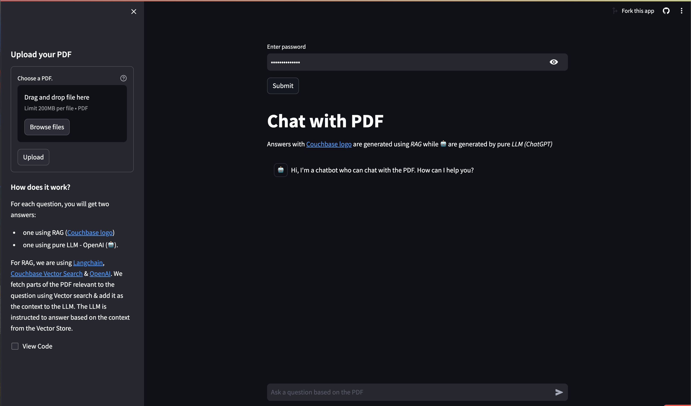
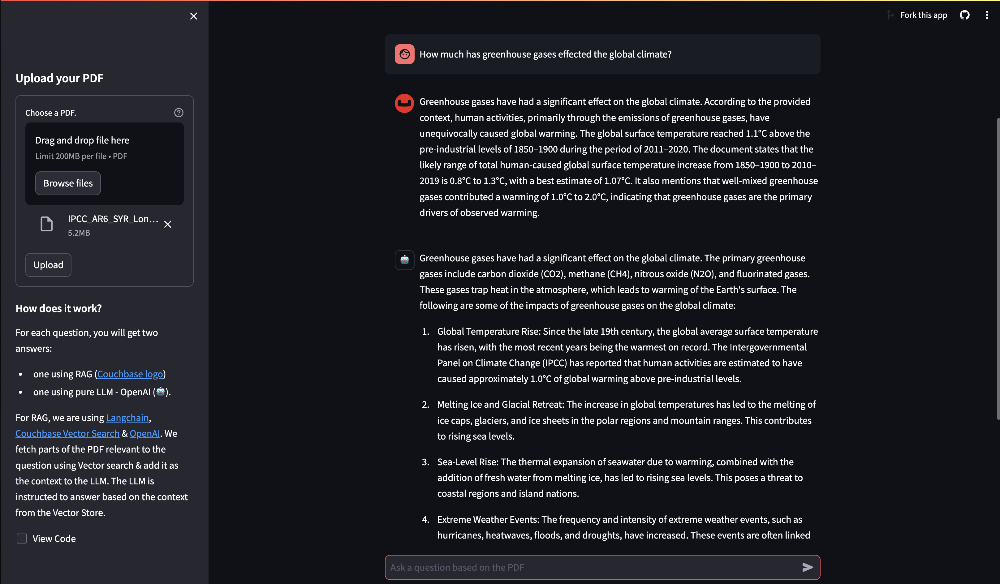

---
# frontmatter
path: "/tutorial-python-langchain-pdf-chat"
# title and description do not need to be added to markdown, start with H2 (##)
title: Build PDF Chat App With Couchbase Python SDK and LangChain
short_title: Build PDF Chat App
description:
  - Construct a PDF Chat App with LangChain, Couchbase Python SDK, Couchbase Vector Search, and Streamlit.
  - Learn to upload PDFs into Couchbase Vector Store with LangChain.
  - Discover how to use RAG’s for context-based Q&A’s from PDFs with LLMs.
content_type: tutorial
filter: sdk
technology:
  - fts
  - kv
tags:
  - Streamlit
  - LangChain
  - OpenAI
sdk_language:
  - python
length: 45 Mins
---

## Introduction

Welcome to this comprehensive guide on constructing an AI-enhanced Chat Application. We will create a dynamic chat interface capable of delving into PDF documents to extract and provide summaries, key facts, and answers to your queries. By the end of this tutorial, you’ll have a powerful tool at your disposal, transforming the way you interact with and utilize the information contained within PDFs.

This tutorial will demonstrate how to -

- Construct a [Couchbase Search Index](https://www.couchbase.com/products/vector-search/) for doing Vector Search.
- Chunk PDFs into Vectors with [LangChain](https://langchain.com/) and use [Couchbase Vector Store](https://python.langchain.com/docs/integrations/vectorstores/couchbase/) to store the vectors into Couchbase.
- Query large language models via the [RAG framework](https://aws.amazon.com/what-is/retrieval-augmented-generation/) for contextual insights. We will use [OpenAI](https://openai.com) for generating Embeddings and LLM.
- Craft an elegant UI with Streamlit. All these components come together to create a seamless, AI-powered chat experience.

## Prerequisites

- [Python](https://www.python.org/downloads/) 3.10 or higher installed.
- Ensure that the Python version is [compatible](https://docs.couchbase.com/python-sdk/current/project-docs/compatibility.html#python-version-compat) with the Couchbase SDK.
- Couchbase Cluster (Self Managed or Capella) with [Search Service](https://docs.couchbase.com/server/current/fts/fts-introduction.html)

> Note that this tutorial is designed to work with the latest Python SDK version (4.2.0+) for Couchbase. It will not work with the older Python SDK versions.

## Quick Start Guide:

### Cloning Repo

```shell
git clone https://github.com/couchbase-examples/rag-demo.git
```

### Install Dependencies

Any dependencies should be installed through `pip`, the default package manager for Python. You may use [virtual environment](https://docs.python.org/3/tutorial/venv.html) as well.

```shell
python -m pip install -r requirements.txt
```

### Setup Database Configuration

#### Capella Setup

To know more about connecting to your Capella cluster, please follow the [instructions](https://docs.couchbase.com/cloud/get-started/connect.html).

Specifically, you need to do the following:

- Create the [database credentials](https://docs.couchbase.com/cloud/clusters/manage-database-users.html) to access cluster via SDK
- [Allow access](https://docs.couchbase.com/cloud/clusters/allow-ip-address.html) to the Cluster from the IP on which the application is running.

#### Self Managed Setup

- Follow [Couchbase Installation Options](/tutorial-couchbase-installation-options) for installing the latest Couchbase Database Server Instance. Make sure to add the [Search Service](https://docs.couchbase.com/server/current/fts/fts-introduction.html).

### Create Bucket

- For the purpose of this tutorial, we will be using specific bucket, scope and collection. However, you may use any name of your choice but make sure to update names in all the steps.
- Create a bucket named `pdf-chat`. We will use the `_default` scope and `_default` collection of this bucket.

### Create the Search Index on Full Text Service

We need to create the Search Index on the Full Text Service in Couchbase. For this demo, you can import the following index using the instructions.

- [Couchbase Capella](https://docs.couchbase.com/cloud/search/import-search-index.html)

  - Copy the index definition to a new file index.json.
  - Import the file in Capella using the instructions in the documentation.
  - Click on Create Index to create the index.

- [Couchbase Server](https://docs.couchbase.com/server/current/search/import-search-index.html)

  - Click on Search -> Add Index -> Import.
  - Copy the following Index definition in the Import screen.
  - Click on Create Index to create the index.

You may also create a vector index using Search UI on both [Couchbase Capella](https://docs.couchbase.com/cloud/vector-search/create-vector-search-index-ui.html) and [Couchbase Self Managed Server](https://docs.couchbase.com/server/current/vector-search/create-vector-search-index-ui.html).

#### Index Definition

Here, we are creating the index `pdf_search` on the documents. The Vector field is set to `embedding` with 1536 dimensions and the text field set to `text`. We are also indexing and storing all the fields under `metadata` in the document as a dynamic mapping to account for varying document structures. The similarity metric is set to `dot_product`. If there is a change in these parameters, please adapt the index accordingly.

```json
{
  "name": "pdf_search",
  "type": "fulltext-index",
  "params": {
    "doc_config": {
      "docid_prefix_delim": "",
      "docid_regexp": "",
      "mode": "scope.collection.type_field",
      "type_field": "type"
    },
    "mapping": {
      "default_analyzer": "standard",
      "default_datetime_parser": "dateTimeOptional",
      "default_field": "_all",
      "default_mapping": {
        "dynamic": true,
        "enabled": false
      },
      "default_type": "_default",
      "docvalues_dynamic": false,
      "index_dynamic": true,
      "store_dynamic": false,
      "type_field": "_type",
      "types": {
        "_default._default": {
          "dynamic": true,
          "enabled": true,
          "properties": {
            "embedding": {
              "enabled": true,
              "dynamic": false,
              "fields": [
                {
                  "dims": 1536,
                  "index": true,
                  "name": "embedding",
                  "similarity": "dot_product",
                  "type": "vector",
                  "vector_index_optimized_for": "recall"
                }
              ]
            },
            "metadata": {
              "dynamic": true,
              "enabled": true
            },
            "text": {
              "enabled": true,
              "dynamic": false,
              "fields": [
                {
                  "index": true,
                  "name": "text",
                  "store": true,
                  "type": "text"
                }
              ]
            }
          }
        }
      }
    },
    "store": {
      "indexType": "scorch",
      "segmentVersion": 16
    }
  },
  "sourceType": "gocbcore",
  "sourceName": "pdf-docs",
  "sourceParams": {},
  "planParams": {
    "maxPartitionsPerPIndex": 64,
    "indexPartitions": 16,
    "numReplicas": 0
  }
}
```

### Setup Environment Config

Copy the `secrets.example.toml` file in `.streamlit` folder and rename it to secrets.toml and replace the placeholders with the actual values for your environment. All configuration for communication with the database is read from the environment variables.

```bash
OPENAI_API_KEY = "<open_ai_api_key>"
DB_CONN_STR = "<connection_string_for_couchbase_cluster>"
DB_USERNAME = "<username_for_couchbase_cluster>"
DB_PASSWORD = "<password_for_couchbase_cluster>"
DB_BUCKET = "<name_of_bucket_to_store_documents>"
DB_SCOPE = "<name_of_scope_to_store_documents>"
DB_COLLECTION = "<name_of_collection_to_store_documents>"
INDEX_NAME = "<name_of_fts_index_with_vector_support>"
LOGIN_PASSWORD = "<password to access the streamlit app>"
```

> [OpenAI](https://openai.com) API Key is required for usage in generating embedding and querying LLM.

> The [connection string](https://docs.couchbase.com/python-sdk/current/howtos/managing-connections.html#connection-strings) expects the `couchbases://` or `couchbase://` part.

> For this tutorial, `DB_BUCKET = pdf-chat`, `DB_SCOPE = _default`, `DB_COLLECTION = _default` and `INDEX_NAME = pdf_search`.

> Login_Password of Streamlit app is a basic password to access the app. You can set the password here and while using the app, password will be required to access the app.

### Running the Application

After starting Couchbase server, adding vector index and installing dependencies. Our Application is ready to run.

In the projects root directory, run the following command

```sh
streamlit run chat_with_pdf.py
```

The application will run on your local machine at http://localhost:8501.

### Using PDF Chat App

The page starts with a text box to enter your login password. This is the same password defined earlier in the [Setup Environment Config](#setup-environment-config) section. After submitting the password, the main application page will open.

On the left sidebar, you'll find an option to upload a PDF document you want to use with this PDF Chat App. Depending on the size of the PDF, the upload process may take some time.



In the main area, there's a chat screen where you can ask questions about the uploaded PDF document. You will receive two responses: one with context from the PDF (Couchbase Logo  ) , and one without the PDF context (Bot Logo - 🤖). This demonstrates how the Retrieval Augmented Generation (RAG) model enhances the answers provided by the language model using the PDF content.



## Concepts

The PDF Chat application leverages two powerful concepts: [Retrieval-Augmented Generation (RAG)](https://aws.amazon.com/what-is/retrieval-augmented-generation/) and [Vector Search](https://www.couchbase.com/products/vector-search/). Together, these techniques enable efficient and context-aware interactions with PDF documents.

### Retrieval-Augmented Generation (RAG)

RAG is like having two helpers:

- **Retriever**: This helper looks through all the PDF documents to find the most relevant information based on your question or prompt.
- **Generator**: This helper is like a large language model (e.g., GPT-4, Gemini) that can understand natural language and generate human-like responses.

Here's how RAG works:

- You ask a question or provide a prompt to the app.
- The Retriever helper goes through the PDF documents and finds the most relevant passages or sections related to your question using Vector Search.
- The Generator helper takes those relevant passages and your original question, and uses them to generate a clear and contextual answer.

This enhances the context from PDF and LLM is able to give relevant results from the PDF rather than giving generalized results.

### Vector Search with Couchbase

Couchbase is a NoSQL database that provides a powerful Vector Search capability. It allows you to store and search through high-dimensional vector representations (embeddings) of textual data, such as PDF content.

The PDF Chat app uses LangChain to convert the text from the PDF documents into embeddings. These embeddings are then stored in a Couchbase bucket, along with the corresponding text.

When a user asks a question or provides a prompt:

- The app converts the user's query into an embedding using LangChain's embedding models (e.g., OpenAI's embeddings).
- [Couchbase's Vector Search](https://docs.couchbase.com/python-sdk/current/howtos/full-text-searching-with-sdk.html#vector-search) capability is utilized, which supports search indexes. A dedicated search index is created for the PDF embeddings and their corresponding text content, configured with the necessary indexing parameters (bucket, scope, collection, index name).
- The app queries this search index using the user's query embedding. Couchbase's Vector Search calculates the [similarity](https://www.couchbase.com/blog/vector-similarity-search/) (e.g., dot product) between the query embedding and the indexed PDF embeddings, enabling fast retrieval of the nearest neighbor embeddings.
- The nearest neighbor embeddings represent the most semantically similar passages or sections from the PDF documents compared to the user's query.
- The app retrieves the text content associated with these nearest neighbor embeddings, providing the necessary context for generating a relevant response.
- Couchbase's Vector Search supports advanced indexing techniques, such as [scoped indexes](https://docs.couchbase.com/python-sdk/current/howtos/full-text-searching-with-sdk.html#scoped-vs-global-indexes), [dynamic indexing](https://docs.couchbase.com/server/current/fts/fts-creating-index-from-REST-dynamic.html) and [hybrid search](https://docs.couchbase.com/python-sdk/current/howtos/full-text-searching-with-sdk.html#combining-fts-and-vector-queries), allowing for efficient management, better scaling of the vector store and multiple types of search supported.
- The search index facilitates fast and accurate retrieval, enabling the app to provide context-aware and relevant responses to the user's queries, even when the phrasing or terminology differs from the PDF content.
- Couchbase's Vector Search integrates seamlessly with LangChain's [CouchbaseVectorStore](https://python.langchain.com/docs/integrations/vectorstores/couchbase/) class, abstracting away the complexities of vector similarity calculations.

### LangChain

LangChain is a powerful library that simplifies the process of building applications with [large language models](https://en.wikipedia.org/wiki/Large_language_model) (LLMs) and vector stores like Couchbase.

In the PDF Chat app, LangChain is used for several tasks:

- **Loading and processing PDF documents**: LangChain's [_PDFLoader_](https://python.langchain.com/docs/modules/data_connection/document_loaders/pdf/) is used to load the PDF files and convert them into text documents.
- **Text splitting**: LangChain's [_RecursiveCharacterTextSplitter_](https://python.langchain.com/docs/modules/data_connection/document_transformers/recursive_text_splitter/) is used to split the text from the PDF documents into smaller chunks or passages, which are more suitable for embedding and retrieval.
- **Embedding generation**: LangChain integrates with [various embedding models](https://python.langchain.com/docs/modules/data_connection/text_embedding/), such as OpenAI's embeddings, to convert the text chunks into embeddings.
- **Vector store integration**: LangChain provides a [_CouchbaseVectorStore_](https://python.langchain.com/docs/integrations/vectorstores/couchbase/) class that seamlessly integrates with Couchbase's Vector Search, allowing the app to store and search through the embeddings and their corresponding text.
- **Chains**: LangChain provides various [chains](https://python.langchain.com/docs/modules/chains/) for different requirements. For using RAG concept, we require _Retrieval Chain_ for Retrieval and _Question Answering Chain_ for Generation part. We also add _Prompts_ that guide the language model's behavior and output. These all are combined to form a single chain which gives output from user questions.
- **Streaming Output**: LangChain supports [streaming](https://python.langchain.com/docs/expression_language/streaming/), allowing the app to stream the generated answer to the client in real-time.

By combining Vector Search with Couchbase, RAG, and LangChain; the PDF Chat app can efficiently ingest PDF documents, convert their content into searchable embeddings, retrieve relevant information based on user queries and conversation context, and generate context-aware and informative responses using large language models. This approach provides users with a powerful and intuitive way to explore and interact with large PDF files.

## Let us Understand the Flow

To begin this tutorial, clone the repo and open it up in the IDE of your choice. Now you can learn how to create the PDF Chat App. The whole code is written in `chat_with_pdf.py` file.

### App Flow

The fundamental workflow of the application is as follows: The user initiates the process from the Main Page's sidebar by uploading a PDF. This action triggers the `save_to_vector_store` function, which subsequently uploads the PDF into the Couchbase vector store. Following this, the user can now chat with the LLM.

On the Chat Area, the user can pose questions. These inquiries are processed by the Chat API, which consults the LLM for responses, aided by the context provided by RAG. The assistant then delivers the answer, and the user has the option to ask additional questions.


## Connecting to Couchbase

The first step will be connecting to Couchbase. Couchbase Vector Search is required for PDF Upload as well as during chat (For Retrieval). We will use the Couchbase Python SDK to connect to the Couchbase cluster. The connection is established in the `connect_to_couchbase` function.

The connection string and credentials are read from the environment variables. We perform some basic required checks for the environment variable not being set in the `secrets.toml`, and then proceed to connect to the Couchbase cluster. We connect to the cluster using [connect](https://docs.couchbase.com/python-sdk/current/hello-world/start-using-sdk.html#connect) method.

```python
def connect_to_couchbase(connection_string, db_username, db_password):
    """Connect to Couchbase"""
    from couchbase.cluster import Cluster
    from couchbase.auth import PasswordAuthenticator
    from couchbase.options import ClusterOptions
    from datetime import timedelta

    auth = PasswordAuthenticator(db_username, db_password)
    options = ClusterOptions(auth)
    connect_string = connection_string
    cluster = Cluster(connect_string, options)

    # Wait until the cluster is ready for use.
    cluster.wait_until_ready(timedelta(seconds=5))

    return cluster
```

## Initialize OpenAI and Couchbase Vector Store

We will now initialize [OpenAI embeddings](https://python.langchain.com/docs/integrations/text_embedding/openai/) which will be used by CouchbaseVectorStore for converting the split docs defined above to vectors (embeddings).

We will also initialize Couchbase vector store with Couchbase bucket info. Firstly we will connect to Couchbase cluster using [`connect_to_couchbase`](#connecting-to-couchbase) method.

We will define the bucket, scope, collection and index names from [Environment Variables](#setup-environment-config).

```python
# Use OpenAI Embeddings
embedding = OpenAIEmbeddings()

# Connect to Couchbase Vector Store
cluster = connect_to_couchbase(DB_CONN_STR, DB_USERNAME, DB_PASSWORD)

vector_store = get_vector_store(
    cluster,
    DB_BUCKET,
    DB_SCOPE,
    DB_COLLECTION,
    embedding,
    INDEX_NAME,
)
```

We are using `get_vector_store` method which initializes LangChain's [CouchbaseVectorStore](https://python.langchain.com/docs/integrations/vectorstores/couchbase)

```python
def get_vector_store(
    _cluster,
    db_bucket,
    db_scope,
    db_collection,
    _embedding,
    index_name,
):
    """Return the Couchbase vector store"""
    vector_store = CouchbaseVectorStore(
        cluster=_cluster,
        bucket_name=db_bucket,
        scope_name=db_scope,
        collection_name=db_collection,
        embedding=_embedding,
        index_name=index_name,
    )
    return vector_store
```

## Uploading And Ingesting PDF

`save_to_vector_store` function takes care of uploading the PDF file in vector format to Couchbase Database using CouchbaseVectorStore in LangChain. It splits text into small chunks, generate embeddings for those chunks, and ingest the chunks and their embeddings into a Couchbase vector store. Let's go step by step on how it does.

### Upload PDF

This part of code creates a file uploader on sidebar using Streamlit library. After PDF is uploaded, `save_to_vector_store` function is called to further process the PDF.

```python
with st.form("upload pdf"):
    uploaded_file = st.file_uploader(
        "Choose a PDF.",
        help="The document will be deleted after one hour of inactivity (TTL).",
        type="pdf",
    )
    submitted = st.form_submit_button("Upload")
    if submitted:
        # store the PDF in the vector store after chunking
        save_to_vector_store(uploaded_file, vector_store)
```

### Read and Load Uploaded PDF

This function ensures that the uploaded PDF file is properly handled, loaded, and prepared for storage or processing in the vector store. It first checks if file was actually uploaded. Then the uploaded file is saved to a temporary file in `binary` format.

From the temporary file, PDF is loaded in [PyPDFLoader](https://python.langchain.com/docs/modules/data_connection/document_loaders/pdf/) from the LangChain library which loads the PDF into [LangChain Document](https://python.langchain.com/docs/modules/data_connection/document_loaders/) Format

```python
def save_to_vector_store(uploaded_file, vector_store):
    """Chunk the PDF & store it in Couchbase Vector Store"""
    if uploaded_file is not None:
        temp_dir = tempfile.TemporaryDirectory()
        temp_file_path = os.path.join(temp_dir.name, uploaded_file.name)

        with open(temp_file_path, "wb") as f:
            f.write(uploaded_file.getvalue())
            loader = PyPDFLoader(temp_file_path)
            docs = loader.load()
```

### Split Documents

This LangChain document array will contain huge individual files which defeats the purpose while retrieval as we want to send more relevant context to LLM. So we will split it into smaller chunks or passages using LangChain's [_RecursiveCharacterTextSplitter_](https://python.langchain.com/docs/modules/data_connection/document_transformers/recursive_text_splitter/):

- chunk_size: 1500: This parameter specifies that each chunk should contain approximately 1500 characters.
- chunk_overlap: 150: This parameter ensures that there is an overlap of 150 characters between consecutive chunks. This overlap helps maintain context and prevent important information from being split across chunk boundaries.

At the end split_documents method splits the large document into smaller LangChain documents based on above defined parameters.

```python
text_splitter = RecursiveCharacterTextSplitter(
    chunk_size=1500, chunk_overlap=150
)

doc_pages = text_splitter.split_documents(docs)
```

### Add Documents to Vector Store

We will utilize the vector store created at [Initialize OpenAI and Couchbase Vector Store](#initialize-openai-and-couchbase-vector-store). In this we will add the documents using add_documents method of Couchbase vector store. This method will utilize the OpenAI embeddings to create embeddings(vectors) from text and add it to Couchbase documents in the specified collection.

```python
vector_store.add_documents(doc_pages)
```

## Chat With PDF

After uploading the PDF into Couchbase, we are now ready to utilize the power of Couchbase Vector Search, RAG and LLM to get context based answers to our questions. When the user asks a question. The assistant (LLM) is called here with RAG context, the response from the assistant is sent back to the user.

### LangChain Expression Language (LCEL)

We will now utilize the power of LangChain Chains using the [LangChain Expression Language](https://python.langchain.com/docs/expression_language/) (LCEL). LCEL makes it easy to build complex chains from basic components, and supports out of the box functionality such as streaming, parallelism, and logging.

LCEL is a domain-specific language that provides several key advantages when working with LangChain:

- Composability: It allows you to easily combine different LangChain components like retrievers, language models, and output parsers into complex workflows.
- Readability: The syntax is concise and expressive, making it easy to understand the flow of operations within a chain or sequence.
- Reusability: You can define reusable sub-chains or components that can be incorporated into larger chains, promoting code reuse and modularity.

In summary, LCEL streamlines the process of building sophisticated natural language processing applications by providing a composable, readable, reusable, extensible, type-safe, and abstracted way to define and orchestrate LangChain components into complex workflows.

We will be using LCEL chains in next few sections and will see how LCEL optimizes our whole workflow.

### Create Retriever Chain

We also create the [retriever](https://python.langchain.com/docs/modules/data_connection/retrievers/vectorstore) of the couchbase vector store. This retriever will be used to retrieve the previously added documents which are similar to current query.

```python
retriever = vector_store.as_retriever()
```

### Prompt Chain

A prompt for a language model is a set of instructions or input provided by a user to guide the model's response, helping it understand the context and generate relevant and coherent language-based output, such as answering questions, completing sentences, or engaging in a conversation. We will use a template and create a [prompt chain](https://python.langchain.com/docs/modules/model_io/prompts/quick_start/) using [_ChatPromptTemplate_](https://python.langchain.com/docs/modules/model_io/prompts/quick_start/#chatprompttemplate) Class of LangChain

```python
template = """You are a helpful bot. If you cannot answer based on the context provided, respond with a generic answer. Answer the question as truthfully as possible using the context below:
{context}

Question: {question}"""

prompt = ChatPromptTemplate.from_template(template)
```

### LLM Chain

Large Language Models (LLMs) are a core component of LangChain. LangChain does not serve its own LLMs, but rather provides a standard interface for interacting with many LLMs. To be specific, this interface is one that takes as input a string and returns a string. We will use [ChatOpenAI](https://python.langchain.com/docs/integrations/chat/openai/) LLM Model. We can also set other parameters like model, API_KEY, temperature to be used for this model.

```python
# Use OpenAI GPT 4 as the LLM for the RAG
llm = ChatOpenAI(temperature=0, model="gpt-4-1106-preview", streaming=True)
```

### Combining to a single chain

We can combine these different modules to a single chain which will run synchronously. The pipe operator (|) is used to connect these components, forming a chain of operations.

The input dictionary with the "context" and "question" keys is passed through each component. The retriever component retrieves relevant information from the vector store, which is then combined with the [question](https://python.langchain.com/docs/expression_language/primitives/passthrough/) to generate a prompt. This prompt is passed to the language model (llm), which generates a response based on both the question and the retrieved context. Finally, the output is parsed into a string by [StrOutputParser()](https://python.langchain.com/docs/modules/model_io/concepts/#stroutputparser).

```python
# RAG chain
chain = (
    {"context": retriever, "question": RunnablePassthrough()}
    | prompt
    | llm
    | StrOutputParser()
)
```

### Chain without RAG

We will repeat the same process as above however this will not have the context from the vector store. Basically we will directly call LLM from the user question. Basically, every step is same just that we will not use retriever.

```python
template_without_rag = """You are a helpful bot. Answer the question as truthfully as possible.

Question: {question}"""

prompt_without_rag = ChatPromptTemplate.from_template(template_without_rag)

llm_without_rag = ChatOpenAI(model="gpt-4-1106-preview")

chain_without_rag = (
    {"question": RunnablePassthrough()}
    | prompt_without_rag
    | llm_without_rag
    | StrOutputParser()
)
```

### User Asks A Question

This section creates an interactive chat interface where users can ask questions based on the uploaded PDF. The key steps are:

1. Display a chat input box with the prompt "Ask a question based on the PDF".
   When the user submits a question:
2. Display the user's question in the chat interface
   - Add the user's question to the chat history.
   - Create a placeholder for streaming the assistant's response.
   - Use the chain.stream(question) method to generate the response from the RAG chain.
   - [Stream](https://python.langchain.com/docs/use_cases/question_answering/streaming/) the response in real-time by updating the placeholder with each response chunk.
   - Add the final assistant's response to the chat history.

This setup allows users to have a conversational experience, asking questions related to the uploaded PDF, with responses generated by the RAG chain and streamed in real-time. Both the user's questions and the assistant's responses are displayed in the chat interface, along with their respective roles and avatars.

```python
# React to user input
if question := st.chat_input("Ask a question based on the PDF"):
    # Display user message in chat message container
    st.chat_message("user").markdown(question)

    # Add user message to chat history
    st.session_state.messages.append(
        {"role": "user", "content": question, "avatar": "👤"}
    )

    # Add placeholder for streaming the response
    with st.chat_message("assistant", avatar=couchbase_logo):
        message_placeholder = st.empty()

    # stream the response from the RAG
    rag_response = ""
    for chunk in chain.stream(question):
        rag_response += chunk
        message_placeholder.markdown(rag_response + "▌")

    message_placeholder.markdown(rag_response)
    st.session_state.messages.append(
        {
            "role": "assistant",
            "content": rag_response,
            "avatar": couchbase_logo,
        }
    )
```

### Stream Answer without context

Similar to last section, we will get answer from LLM of the user question. Answers from here are also shown in the UI to showcase difference on how using RAG gives better and more context enabled results.

```python
# stream the response from the pure LLM

# Add placeholder for streaming the response
with st.chat_message("ai", avatar="🤖"):
    message_placeholder_pure_llm = st.empty()

pure_llm_response = ""

for chunk in chain_without_rag.stream(question):
    pure_llm_response += chunk
    message_placeholder_pure_llm.markdown(pure_llm_response + "▌")

message_placeholder_pure_llm.markdown(pure_llm_response)
st.session_state.messages.append(
    {
        "role": "assistant",
        "content": pure_llm_response,
        "avatar": "🤖",
    }
)
```
