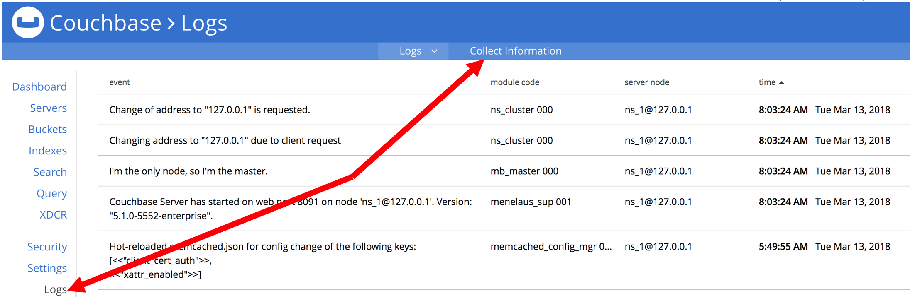

---
# frontmatter
path: "/tutorial-working-with-support"
title: Working with Support
short_title: Working with Support
description: 
  - View details about different support packages offered by Couchbase
  - Learn how to open a ticket, contact our support team, and extract appropriate logs to help diagnose issues
content_type: tutorial
filter: other
technology:
  - server
tags:
  - Support
  - Customer
sdk_language:
  - any
length: 15 Mins
---

To speed up the resolution of your issue, support will need some information to troubleshoot what is going on. The more information provided in the questions below the faster support will be able to identify the issue and propose a fix:

- Priority and impact of the issue (P1 and production impacting versus a P2 question)
- What versions of the software are you running,
- Operating system version and deployment (physical hardware, Amazon EC2, Kubernetes, etc.)
- What steps led to the failure or error?
- Information around whether this is something that has worked successfully in the past and if so what has changed in the environment since the last successful operation?
- Provide us with a current snapshot of logs taken from each node of the system and uploaded to our support system via the instructions below
- If your issue is a P1 and urgent, you must make a phone call as well as opening a support request. The phone call will ensure that your Initial Response Goal is met. Support phone number: +1-650-417-7500, option #1

We define our Support Request priorities in the following way:

**P1**: Software failures on a production system that cause complete loss or severe outage of service, resulting in a mission-critical business application being down or non-operational.

**P2**: Software failures on a production system that cause partial loss of service impacting business operations. Operations can continue in a restricted fashion and a workaround may be used to restore functionality. As to a non-production system, a software failure that causes a complete loss or severe outage of service where there is a time-sensitive impact to a planned production deployment. 

**P3**: All non-time sensitive requests including product functionality issues in Development or Test, feature requests and documentation clarifications.

## SLAs

|  | Silver | Gold | Platinum |
| :--- | :--- | :--- | :--- |
| Hours | 10 x 5 |	24 x 7 |	24 x 7 |
| Hours of Operation	| 7am - 5pm<sup>*</sup>	| 24 x 7 |	24 x 7 |
| Support Channel |	Email, Web, Phone |	Email, Web, Phone |	Email, Web, Phone |
| Number of Cases |	Unlimited |	Unlimited |	Unlimited |
| P1 SLA	| 5 hours<sup>**</sup>	| 2 hours	| 30 minutes |
| P2 SLA	| 1 Business Day |	5 hours |	3 hours |
| P3 SLA | 5 Business Days	| 3 Business Days	| 1 Business Day |

- <sup>*</sup>Within geo time zone, based on customer location: EST - Americas, East Coast; PST - Americas other than East Coast; GMT - EMEA; IST - APAC
- <sup>**</sup>Within business hours

## Opening a ticket

There are two ways to create a Couchbase Technical Support ticket: the web portal and a phone call.

### Web Portal

Visit the [Couchbase Support Web Portal](https://support.couchbase.com)

### Phone Call

Support phone number: +1-650-417-7500, option \#1

## Uploading logs

### Server logs

For nearly every ticket that gets generated, support will need to be able to review the logs for the Couchbase server cluster. Below is how to collect and upload those logs.

#### Collecting logs via the web console UI

The logs can be generated in the web console UI:

1. Click **Log**
2. Click **Collect Information**
   
3. To upload the collected logs to us, please tick the **Upload to Couchbase** checkbox and use the following values:
    - **Upload to host:** `uploads.couchbase.com`
    - **Customer name:** ``
    - **Ticket number:** ``

#### Collecting server logs via the command-line

Or you can use the `cbcollect_info` command (with `sudo` on Linux) to gather the logs and then upload them to us with the `curl` command:

Example usage:

- Linux (run as root or use sudo as below)

```bash
sudo /opt/couchbase/bin/cbcollect_info <node_name>.zip
```

- Windows (run as an administrator)

```powershell
C:\Program Files\Couchbase\Server\bin\cbcollect_info <node_name>.zip
```

Run cbcollect_info on all nodes in the cluster, and upload all of the resulting files to us.

```bash
curl --upload-file <FILE NAME> https://uploads.couchbase.com/<customer>/<ticket number>/
```

Please note that the trailing slash (`/`) is required in the upload URL for a successful upload of the logs.

### Sync Gateway logs

Introduced in Sync Gateway 1.3, the [sgcollect_info](https://developer.couchbase.com/documentation/mobile/current/guides/sync-gateway/sgcollect-info/index.html) tool provides a method to collect and upload logs to Couchbase Support.
`sgcollect_info` can be run from the command-line as per the example usage below.
You can find full details on using the built-in Upload functionality in the [documentation](https://developer.couchbase.com/documentation/mobile/current/guides/sync-gateway/sgcollect-info/index.html), or you can share the output manually using the `curl` command below.

- Linux (run as root or use sudo as below)

```bash
sudo /opt/couchbase-sync-gateway/tools/sgcollect_info <node_name>.zip
```

- Windows (run as administrator)

```powershell
Program Files (x86)\Couchbase\tools\sgcollect_info.exe <node_name>.zip
```

Sync Gateway 1.2 and earlier:

- If running a version of Sync Gateway earlier than 1.3, you can still collect and share the log files with us manually.
- Sync Gateway allows a great degree of flexibility on how [logging is configured](https://developer.couchbase.com/documentation/mobile/1.3/guides/sync-gateway/config-properties/index.html), so the location of these logs will depend on your specific deployment.
- As well as Sync Gateway's logs, the Configuration File used in your deployment will help us gain a better understanding of the situation and any potential issues.

To upload the `sgcollect_info` logs, please use the command below:

```bash
curl --upload-file <FILE NAME> https://uploads.couchbase.com/<customer>/<ticket>/
```

Please note that the trailing slash (`/`) is required in the upload URL for a successful upload of the logs.

Please see the _Couchbase Server Logs_ and _Sharing Files with Us_ sections of our [Working with Couchbase Technical Support](https://support.couchbase.com/hc/en-us/articles/218320083-Working-with-the-Couchbase-Technical-Support-Team) guide for more details.

### Application Logs

Depending on the type of ticket it may also be necessary to upload logs from the client application including the client SDK logs. The way you configure logging in each language is a little different. See the links below for your specific language. At a minimum you should have your applications configured to collect at the INFO level. They applications should be written in a way that the log level can be updated without having to restart the application.

- [Java](https://docs.couchbase.com/java-sdk/current/collecting-information-and-logging.html)
- [Python](https://docs.couchbase.com/python-sdk/current/collecting-information-and-logging.html)
- [.Net](https://docs.couchbase.com/dotnet-sdk/current/collecting-information-and-logging.html)
- [PHP](https://docs.couchbase.com/php-sdk/current/collecting-information-and-logging.html)
- [C](https://docs.couchbase.com/c-sdk/current/collecting-information-and-logging.html)
- [Go](https://docs.couchbase.com/go-sdk/current/collecting-information-and-logging.html)
- [NodeJS](https://docs.couchbase.com/nodejs-sdk/current/collecting-information-and-logging.html)

There may be times when engineering asks that the log level be updated to DEBUG or possibly TRACE. At that time the log level would need to be updated to the requested level, the logs collected and then if appropriate the log level returned to INFO. It is important that if it is possible to reproduce the error that prompted creation of the ticket that it is reproduced during log collection at the higher log level.

Once the logs are collected it is not necessary for them to be zipped together into a single file for upload but it may make uploading the files easier. To zip all the files together make sure the files are in the same directory.

```bash
tar -czf <hostname>_applicationLogs.tar.gz /path/to/directory-or-file
```

Then upload the files to the Ticket.

```bash
curl --upload-file <hostname_applicationLogs>.tar.gz \
    https://uploads.couchbase.com/<customer>/<ticket>/
```

### Networking Logs

- Wireshark/tshark

Use the following command on each Application node connecting to Couchbase. Let the collection run for a few minutes. The pcap filename needs to be named for the node it was run on and all of the Couchbase nodes need to be included in the list of hostnames. Then upload the pcap files to the ticket. It is imperative that the problem indicated in the ticket is reproduced during the collection of these pcaps.

```bash
tshark -w <hostname>.pcap -F pcap host <ip/hostname> or <ip/hostname> or ...
```

To read a pcap file use the following command:

```bash
tshark -r <hostname>.pcap
```

Then upload the files to the Ticket.

```bash
curl --upload-file <hostname>.pcap https://uploads.couchbase.com/<customer>/<ticket>/
```

### Couchbase Lite Logs

Couchbase Lite CBL2.5 and greater

This version of Couchbase Lite supports both console based logging and file based logging. By default console based logging is enabled and accessible through adb for Android or NSLog for iOS. File based logging is disabled by default. Connecting to console based logging and getting logs off of devices is outside the scope of this guide.

Configuring and enabling logging is language dependent. See the links below for specific languages.

- [java](https://docs.couchbase.com/couchbase-lite/current/java.html#logging)
- [swift](https://docs.couchbase.com/couchbase-lite/current/java.html#logging)
- [JavaScript](https://docs.couchbase.com/couchbase-lite/current/java.html#logging)
- [objective-c](https://docs.couchbase.com/couchbase-lite/current/java.html#logging)
- [C#](https://docs.couchbase.com/couchbase-lite/current/java.html#logging)

This is an example of how to configure file based logging in java.

```java
final File path = context.getCacheDir();
Database.log.getFile().setConfig(new LogFileConfiguration(path.toString()));
Database.log.getFile().setLevel(LogLevel.INFO);
```

Couchbase Lite earlier than CBL2.5

The log messages are split into different domains (LogDomains) which can be tuned to different log levels. The following example enables verbose logging for the replicator and query domains.

**java**

```java
Database.setLogLevel(LogDomain.REPLICATOR, LogLevel.VERBOSE);
Database.setLogLevel(LogDomain.QUERY, LogLevel.VERBOSE);
```

**swift**

```java
Database.setLogLevel(.verbose, domain: .replicator)
Database.setLogLevel(.verbose, domain: .query)
```
