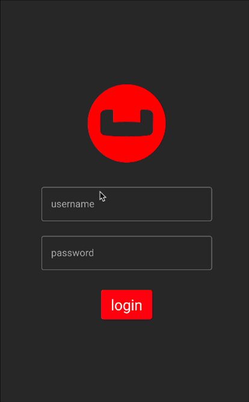

---
# frontmatter
path: "/android-kotlin-prebuilt-database"
title:  Include a Pre-built Database with Kotlin and Jetpack Compose
short_title: Include Pre-built Database 
description: 
  - Learn how to include a pre-built database in an Android mobile application with Kotlin
  - Create an Index and validate the database will work for future steps
content_type: tutorial
filter: mobile
technology: 
  - mobile
landing_page: mobile
landing_order: 3
exclude_tutorials: true 
tags:
  - Android
sdk_language:
  - kotlin
length: 30 Mins
---

## Introduction

In this part of the learning path, you will be working with the "Audit Inventory" demo app that allows users to log in and access the developer screens in order to validate the use of a pre-build database in the demo application that is used to store warehouse and stock item documents.  The warehouse and stock item documents will be used in future steps of the learning path when we need to add projects and audits to the database.  

In this step of the learning path you will learn the fundamentals of:

* Including a prebuilt database in an Android mobile application 
* Preparing the prebuilt database for use
* Creating an Index 
* Validating the database works for future steps 

## App Overview

While the demo app has a lot of functionality, this step will walk you through:

* Log in into the application
* Accessing the Developer Screen
* Accessing the Developer - Database Information screen
* Reviewing the Logcat logs
* Reviewing the files on the emulator using Device File Explorer



## Installation

### Fetching App Source Code

#### Clone Source Code

* If you haven't already cloned the repo from the previous step, clone the `Learn Couchbase Lite with Kotlin and Jetpack Compose` repository from GitHub.

```bash
git clone https://github.com/couchbase-examples/android-kotlin-cbl-learning-path.git
```

### Try it out

* Open src/build.gradle using Android Studio.
* Build and run the project.
* Verify that you see the `No Items found in the database` message on the Projects screen.


## Data Model

A reminder that Couchbase Lite is a JSON Document Store. A `Document` is a logical collection of named fields and values. The values are any valid JSON types. In addition to the standard JSON types, Couchbase Lite supports `Date` and `Blob` data types. While it is not required or enforced, it is a recommended practice to include a _"type"_ property that can serve as a namespace for related documents.

### The Warehouse Document

The sample app comes bundled with a collection of `Document` with a _"documentType"_ property of _"warehouse"_.  Each document represents an warehouse location that a team would visit in order to perform an audit of the inventory at that location. 

An example of a document would be:

```json
{
  "warehouseId":"e1839e0b-57a0-472c-b29d-8d57e256ef32",
  "name":"Santa Clara Warehouse",
  "address1":"3250 Dr Olcott Street",
  "address2":"",
  "city":"Santa Clara",
  "state":"CA",
  "postalCode":"95054",
  "salesTax":0.0913,
  "latitude":32.3803024,
  "longitude":-121.9674197,
  "documentType":"warehouse",
  "yearToDateBalance":0,
  	"shippingTo": [
			"AZ",
			"CA",
			"HI",
			"NV"
		],
}
```

### The Warehouse Data Class 
When a _"warehouse"_ is retreived from the database it is stored within an Data Class of type Warehouse.

```kotlin
data class Warehouse(
    val warehouseId: String,
    val name: String,
    val address1: String,
    val address2: String? = "",
    val city: String,
    val state: String,
    val postalCode: String,
    val salesTax: Double,
    val yearToDateBalance: Double,
    val latitude: Double,
    val longitude: Double,
    val documentType: String,
    val shippingTo: List<String>,
    )
```
### The Item Document

The sample app comes bundled with a collection of `Document` with a _"documentType"_ property of _"item"_.  Each document represents an item in stock that a team would count in order to perform an audit of the inventory in the warehouse. 

An example of a document would be:

```json
{
  "itemId":"00b66fdf-9bdb-451b-bd2a-75bdf0459958",
  "name":"Bachensteiner Beard Export",
  "price":24.22,
  "description":"Tranquil Export with Bachensteiner flavors",
  "style": "Imperial Stout",
  "documentType":"item"
}
```

### The StockItem Data Class 
When a _"item"_ is retreived from the database it is stored within an Data Class of type StockItem.

```kotlin
data class StockItem (
    var itemId: String = "",
    var name: String = "",
    var price: Float,
    var description: String = "",
    var style: String = "",
    var documentType: String = "item")
```

## Using a Prebuilt Database 
There are several reasons why you may want to bundle your app with a prebuilt database. This would be suited for data that does not change or change that often, so you can avoid the bandwidth and latency involved in fetching/syncing this data from a remote server. This also improves the overall user experience by reducing the start-up time.

In our app, the instance of Couchbase Lite that holds the pre-loaded "warehouse" and "stockItem" data is separate from the Couchbase Lite instance that holds "user", "project", and "audit" data. A separate Couchbase Lite instance is not required. However, in our case, since there can be many users potentially using the app on a given device, it makes more sense to keep it separate. This is to avoid duplication of pre-loaded data for every user and to help speed up the app vs pulling down the warehoue and items when the app is first installed.

### Location of the cblite file 

The pre-built database will be in the form of a cblite file. It should be in your app project bundle

* In the startinglocations.zip file within the Assets folder.


> **Note:** The cblite folder will be extracted from the zip file.

### Loading the Prebuilt Database

* Open the <a target="_blank" rel="noopener noreferrer" href="https://github.com/couchbase-examples/android-kotlin-cbl-learning-path/blob/main/src/app/src/main/java/com/couchbase/learningpath/data/DatabaseManager.kt#L72">**DatabaseManager.kt**</a> file and locate the `initializeDatabases()` function. The prebuilt database is common to all users of the app (on the device). So it will be loaded once and shared by all users on the device.  Note that the currentUser is required to setup the inventory database for use which holds the user profile documents, as covered in the Key Value step of the learning path.

```kotlin
fun initializeDatabases(currentUser: User) 
```

* First, we create an instance of the `DatabaseConfiguration` object and specify the path where the database would be located

```kotlin
val dbConfig = DatabaseConfigurationFactory.create(context.filesDir.toString())
```

* Then we determine if the "warehouse" database already exists at the specified location. It would not be present if this is the first time we are using the app, in which case, we locate the _"startingWarehouses.zip"_ resource in the App's main bundle, unzip it, and then we copy it over to the Database folder.

If the database is already present at the specified Database location, we simply open the database.

```kotlin
private fun setupWarehouseDatabase(dbConfig: DatabaseConfiguration) {
 // create the warehouse database if it doesn't already exist
 if (!Database.exists(warehouseDatabaseName, context.filesDir)) {
  unzip(startingWarehouseFileName, File(context.filesDir.toString()))

  // copy the warehouse database to the project database
  // never open the database directly as this will cause issues
  // with sync
  val warehouseDbFile =
   File(
    String.format(
    "%s/%s",
    context.filesDir,
    ("${startingWarehouseDatabaseName}.cblite2")
   )
  )
  Database.copy(warehouseDbFile, warehouseDatabaseName, dbConfig)
 }
 warehouseDatabase = Database(warehouseDatabaseName, dbConfig)
}
```
> Note:  You MUST copy the pre-built database using the Database.copy function instead of opening it directly or you will run into issues with data syncronization.

### Indexing the Database

* Creating indexes for non-FTS based queries is optional. However, to speed up queries, you can create indexes on the properties that you would query against.  Indexes can slow down writes, so it's recommended adding indexes as you need them.  Indexing is handled eagerly.

* In the <a target="_blank" rel="noopener noreferrer" href="https://github.com/couchbase-examples/android-kotlin-cbl-learning-path/blob/main/src/app/src/main/java/com/couchbase/learningpath/data/DatabaseManager.kt#L209">**DatabaseManager.kt**</a>  file, locate the `createTypeIndex(database: Database?)` function. 
* We create an index on the `documentType` property of the documents in the database that is referenced to the function using the databases createIndex function.  The createIndex function requires the name of the index along with the expression of what to index.

```kotlin
private fun createTypeIndex(
  database: Database?
) {
  // create index for document type if it doesn't exist
  database?.let {
    if (!it.indexes.contains(typeIndexName)) {
      it.createIndex(
        typeIndexName, IndexBuilder.valueIndex(
          ValueIndexItem.expression(
            Expression.property(typeAttributeName))
        )
      )
    }
  }
}
```

> Note:  Since both databases have documents that use a `documentType` property, it was easier to create a function that could be used to create the index for either database.  The `typeIndexName` and `typeAttributeName` variables are defined at the top of the <a target="_blank" rel="noopener noreferrer" href="https://github.com/couchbase-examples/android-kotlin-cbl-learning-path/blob/main/src/app/src/main/java/com/couchbase/learningpath/data/DatabaseManager.kt#L22">**DatabaseManager**</a> class. 


### Closing the Database

When a user logs out, we close the pre-built database along with other user-specific databases

* In the <a target="_blank" rel="noopener noreferrer" href="https://github.com/couchbase-examples/android-kotlin-cbl-learning-path/blob/main/src/app/src/main/java/com/couchbase/learningpath/data/DatabaseManager.kt#L63">**DatabaseManager.kt**</a>  file, locate the `closeDatabases()` function.

* Closing the databases is pretty straightforward

```java
fun closeDatabases() {
        try {
            inventoryDatabase?.close()
            warehouseDatabase?.close()
        } catch (e: java.lang.Exception) {
            android.util.Log.e(e.message, e.stackTraceToString())
        }
    }
```

### Try It Out

* The app should be running in the emulator. 
* Log in to the app with any email Id and password. Let's use the values **_"demo@example.com"_** and **_"P@ssw0rd12"_** for user Id and password fields respectively. If this is the first time that **_any_** user is signing in to the app, the pre-built database will be loaded from the App Bundle. In addition, a new team-specific Database will be created / opened.
* Confirm that the console log output has a message similar to the one below. This output also indicates the location of the pre-built database as well as the inventory database. In this example, we are logging in with a user email Id of **_"demo@example.com"_**.
```bash
I/CouchbaseLite/DATABASE: Copying prebuilt database from 
/data/data/com.couchbase.kotlin.learningpath/files/startingWarehouses.cblite2/ 
to /data/user/0/com.couchbase.kotlin.learningpath/files/warehouse.cblite2
```
* The above log message indicates the location of the pre-built database as well as the Database for the inventory data. This would be within the _files_ folder.
* <a target="_blank" rel="noopener noreferrer" href="https://developer.android.com/studio/debug/device-file-explorer">**Open the folder on your computer**</a> and verify that a Database with name _"warehouse"_ exists along with a team specific Database with name _"teamname_inventory"_ where teamname is the name of the team the user is assigned to


* Click the Drawer menu icon (sometimes referred to the Hamburger icon) and tap on Developer
* Tap on the Database Information button
* Validate the Location Database Path, Warehouse Database Name, and Warehouse Count which should be 50 
* Validate that the Stock Item Count is 3000 


## Learn More

Congratulations on completing this step of our learning path!

This step of the learning path walked you through an example of how to use a pre-built Couchbase Lite database. Check out the following links for further documenation and continue on to the next step that covers how to insert documents into the database using Batch operations.

References 

* <a target="_blank" rel="noopener noreferrer" href="https://docs.couchbase.com/couchbase-lite/current/android/prebuilt-database.html">Documentation: Pre-built Database</a>
* <a target="_blank" rel="noopener noreferrer" href="https://docs.couchbase.com/couchbase-lite/current/android/indexing.html">Documentation: Indexing your Data</a>
* <a target="_blank" rel="noopener noreferrer" href="https://docs.couchbase.com/couchbase-lite/current/android/querybuilder.html#indexing">Documentation: Querybuilder - Indexing</a>
