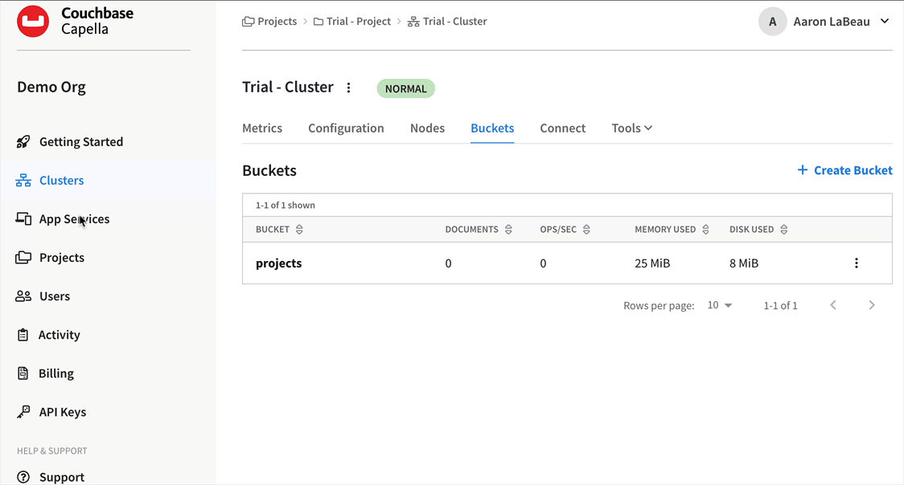
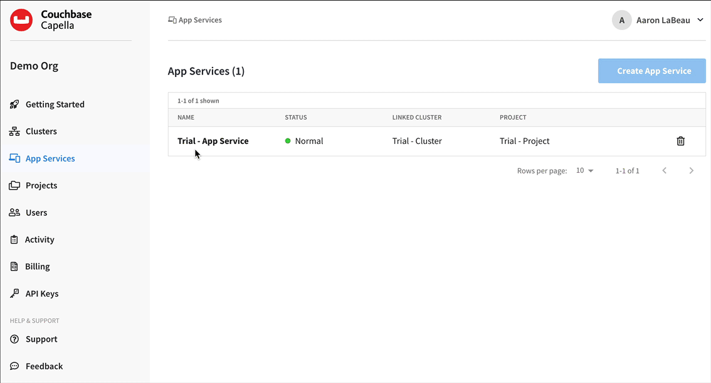

---
# frontmatter
path: "/app-services-lp-audit-inventory"
title:  Set up Couchbase Capella and App Services for Audit Inventory Demo App 
short_title: Couchbase Capella App Services Setup 
description: 
  - Learn how to set up Couchbase Capella and App Services to work with a mobile app
  - Explore Capella App Services configuration including security, authentication, and data synchronization
content_type: tutorial
filter: mobile
technology: 
  - mobile
  - capella
landing_page: mobile
landing_order: 3
exclude_tutorials: true 
tags:
  - App Services
sdk_language:
  - kotlin
  - objective-c
  - android-java
length: 45 Mins
---

## Introduction

Couchbase Capella is a fully managed database-as-a-service that makes it easy to deploy a clustered database.  Capella allows you to securely deploy, manage, and monitor database clusters through a single user interface.   Capella App Services is a fully managed and hosted service for synchronizing data between mobile, web and IoT apps. App Services effectively brings mobile support to Capella, combining Couchbase’s traditional strengths in mobile and edge with the scale, performance and convenience of Capella DBaaS. 

App Services also manages secure data access with role-based access control, providing authentication for mobile users. These key capabilities in Capella are offered as a ready-to-use service for mobile and IoT developers, making it faster and easier than ever to build highly performant and reliable applications.


The core functions of Capella App Services include 

* Data Synchronization across devices and the cloud
* Authorization & Access Control

In this part of our learning path, you will walk you through setting up Couchbase Capella and Capella App Services so that in future steps we can replicate documents from the mobile app to Couchbase Capella and vice versa.  You will learn the fundamentals of:

* Setting up Couchbase Capella projects, cluster, and buckets 
* Setting up App Services including security, authentication, and data synchronization 

## Prerequisites

In this step of the learning path, we will be using Couchbase Capella and App Services.  If you don't have an account with either of these services, you can sign up for one <a target="_blank" rel="noopener noreferrer" href="https://cloud.couchbase.com/sign-up">here</a>.  The Developer Portal already has a tutorial for how to setup a Couchbase Capella trial if you run into any issues <a target="_blank" rel="noopener noreferrer" href="https://developer.couchbase.com/tutorial-capella-sign-up-ui-overview">here</a>.


> **NOTE**: This part of the learning path is longer than normal as there are several screens review.  

### Fetching App Source Code

#### Clone Source Code

* If you haven't already cloned the repo from the previous steps, clone the `Learn Couchbase Lite with Kotlin and Jetpack Compose` repository from GitHub.  We will need to use several files in the capella folder found in the root directory of the repo.

```bash
git clone https://github.com/couchbase-examples/android-kotlin-cbl-learning-path.git
```

## Review Setup Couchbase Capella Projects, Clusters, and Buckets 

### Couchbase Capella Projects and Clusters

When signing up with a Capella Trial you should already have a project setup called Trial - Project and a cluster created for you called Trial - Cluster.  If you log in and the `DEPLOY TRIAL CLUSTER` window appears, you need the click the Deploy Cluster button to deploy a trial clister.


Once your cluster is deployed, click on the `Clusters` link on the left navigation panel and then select the `Trial - Cluster` by clicking on it.  

## Create Bucket Workflow

Couchbase uses Buckets to store JSON documents.  We need a bucket to store not only our JSON documents we want to sync, but also the App Services configuration files.  Follow the steps below to create a bucket. 

* Click on the `Buckets` link on the top navigation bar.  By default the Capella comes with a default bucket called travel sample, but we won't be using that bucket.  Click the `+ Create Bucket` link in the right hand corner to start the `Create Bucket` wizard.

* In the `Bucket Name` field enter the name `projects` and click the Next button.

* In the `Memory Per Server Node (MiB)` field enter the value `1024` and click the Next button.

* On the `Settings` tab just leave the default settings and click the `Create Bucket` button.

* This step is completed when you are returned to the Bucket listing screen and you see your new projects bucket listed.


## Create App Services 

* Click on the `App Services` link on the left navigation panel.  This will open the App Services page.

* Click the `Create App Service` button. 

* Scroll down to the the `Try App Services Now` button and click on it

* Click the `App Services` link again on the left navigation panel.

* Wait for the App Service to deploy



## Create App Services Endpoint

Next we will create an App Services endpoint.  This is the endpoint that will be used to sync data between the mobile app and the Couchbase Capella database.

* Click the `App Services` link on the left navigation panel.  This will open the App Services page.

* Click on the `Trial - App Services` you created in the previous step.

* Click the `+ Create App Endpoint` button.

* In the `App Endpoint Name` field enter `projects`

*  Select the `projects` bucket you created from the `Select a Bucket` list.

* Under `Import Filter` click the Enabled option from the selection menu.

* A new option will appear for importing clode.  Click the `Import Code` button.

* Navigate to the directory you stored the code and find the Capella folder.  Select the import.js file.

* Click the Create App Endpoint button



## Configure App Services Projects Endpoint and Security

#### Mobile App Users 

App Services offers authentication via OpenID Connect (OIDC) along with Anonymous and Basic Authentication.  For sake of simplicity we wil use Basic Authentication in this demo.  Our mobile app already defines the usernames and passwords and assigns them to a team in the <a target="_blank" rel="noopener noreferrer"  href="https://github.com/couchbase-examples/android-kotlin-cbl-learning-path/blob/main/src/app/src/main/java/com/couchbase/learningpath/services/MockAuthenticationService.kt#L36">MockAuthenticationService</a> class.

```kotlin
init {
  //create mock users for testing the application
  //in a real app this would be provided by some kind of OAuth2 Service, etc
  _mockUsers["demo@example.com"] = User("demo@example.com", "P@ssw0rd12", "team1")
  _mockUsers["demo1@example.com"] = User("demo1@example.com", "P@ssw0rd12", "team1")
  _mockUsers["demo2@example.com"] = User("demo2@example.com", "P@ssw0rd12", "team2")
  _mockUsers["demo3@example.com"] = User("demo3@example.com", "P@ssw0rd12", "team2")
  _mockUsers["demo4@example.com"] = User("demo4@example.com", "P@ssw0rd12", "team3")
  _mockUsers["demo5@example.com"] = User("demo5@example.com", "P@ssw0rd12", "team3")
  _mockUsers["demo6@example.com"] = User("demo6@example.com", "P@ssw0rd12", "team4")
  _mockUsers["demo7@example.com"] = User("demo7@example.com", "P@ssw0rd12", "team4")
  _mockUsers["demo8@example.com"] = User("demo8@example.com", "P@ssw0rd12", "team5")
  _mockUsers["demo9@example.com"] = User("demo9@example.com", "P@ssw0rd12", "team5")
  _mockUsers["demo10@example.com"] = User("demo10@example.com", "P@ssw0rd12", "team6")
  _mockUsers["demo11@example.com"] = User("demo11@example.com", "P@ssw0rd12", "team6")
  _mockUsers["demo12@example.com"] = User("demo12@example.com", "P@ssw0rd12", "team7")
  _mockUsers["demo13@example.com"] = User("demo13@example.com", "P@ssw0rd12", "team8")
  _mockUsers["demo14@example.com"] = User("demo14@example.com", "P@ssw0rd12", "team9")
  _mockUsers["demo15@example.com"] = User("demo15@example.com", "P@ssw0rd12", "team10")
}
```

> **NOTE**: For the mobile app to function properly with app services, we must also create these same users in App Services using the same username and password and assigning them to the proper team as shown above.  We also must setup these teams and map them to channels using App Roles.

### Configure App Services Projects Endpoint 

The newly created projects endpoint needs to be configured before we can setup security.  To configure it, follow the directions below.

* Click on the `projects` endpoint from the App Endpoints list.

* Click on the `Access Control` tab.  This will open the `Access Control and Data Validation` page.

* Click on the `Import From File` button. 

* Navigate to the directory you stored the code and find the Capella folder.  Select the `sync.js` file.

* Scroll to the buttom and click the `Save` button.

* Click the `Resume App Endpoint` button located in the upper right hand corner.


#### Review How App Roles are Setup using sync.js

App Roles allow us to map a role to a channel in App Services.  In our mobile app we would like to have users assigned to teams which are app roles and then have those roles associated with channels.  Our <a target="_blank" rel="noopener noreferrer"  href="https://github.com/couchbase-examples/android-kotlin-cbl-learning-path/blob/main/capella/sync.js#L1">sync.js</a> script will check the file for the team name attribute in any document and then assign it to the proper channel.

To see this in action you can open the <a target="_blank" rel="noopener noreferrer"  href="https://github.com/couchbase-examples/android-kotlin-cbl-learning-path/blob/main/capella/sync.js#L1">sync.js</a> file in a text editor of your choice.

```javascript 
function sync(doc, oldDoc) {
 /* Data Validation */
 validateNotEmpty("documentType", doc.documentType);  // <1>

 if (doc.documentType == 'warehouse') {
  console.log("********Processing Warehouse Docs - setting it to global/public");
  channel('!');
 } else {
  console.log("********Processing Team Docs");
	validateNotEmpty("team", doc.team); // <2>
	if (!isDelete()) {  // <3>
	/* Routing  -- add channel routing rules here for document */
	var team = getTeam();  // <4>
  var channelId = "channel." + team;
	console.log("********Setting Channel to " + channelId);  
	channel(channelId); // <5>

	/* Authorization  - Access Control */
	requireRole(team);  // <6>
	access("role:team1", "channel.team1"); // <7>
	access("role:team2", "channel.team2"); // <7>
	access("role:team3", "channel.team3"); // <7>
	access("role:team4", "channel.team4"); // <7>
	access("role:team5", "channel.team5"); // <7>
	access("role:team6", "channel.team6"); // <7>
	access("role:team7", "channel.team7"); // <7>	
	access("role:team8", "channel.team8"); // <7>
	access("role:team9", "channel.team9"); //	<7>
	access("role:team10", "channel.team10"); // <7>
	}
 }
  ...
}
```

1. The `documentType` field is required.  If it is not present, the document will not be processed. 
2. The `team` field is required as we use this for access control.  If it is not present, the document will not be processed. 
3. If the document is not a delete, we need to set the channel.  
4. Get the team associated with the document.
5. Assign the channel to the calculated channelId which is channel dot team number. 
6. The `requireRole` function is used to assign a role to the team.  
7. The `access` function is used to map access for roles to channel.

### Configure App Roles

Now that we understand that App Roles are used to map a team to a channel, we need to create the roles.  

* Once the endpoint starts, click the `App Roles` tab.

* Click on the `+ Create App Role` button in the right hand corner.

* In the `App Role Name` field enter `team1`

* In the `Add your channel...` field enter `channel.team1`

* Click the `+` button to add the channel to the role.

* Click the Create App Role button.

* Repeat these steps for team2 - team10 adding them to the appropriate channels.  

> **NOTE**: Note the data sync demo only uses team1 - team3, but the rest of the mobile app has users assigned up to team10.

> **NOTE**: Currently the Create App Role team overlay window remembers the previously used channel name, so you need to make sure you remove the previously used channel before adding a new one.
<br>


### App Services - Configure App Users 

To configure App Users that we will be used by our mobile app to talk to App Services, follow the directions below.

* Click on the `App Users` tab.

* Click the `+ Create App User` button in the right hand corner.

* In the `Username` field enter `demo@example.com`

* In the `Password` field enter the password `P@ssw0rd12`.  

* Scroll to the App Role section and select `team1` from the `Admin App Roles(optional)` dropdown.

* Click the Create App User button.

* Repeat these steps for demo1@example.com - demo5@example.com adding them to the appropriate teams.  You can reference <a target="_blank" rel="noopener noreferrer"  href="https://github.com/couchbase-examples/android-kotlin-cbl-learning-path/blob/main/src/app/src/main/java/com/couchbase/learningpath/services/MockAuthenticationService.kt#L36">MockAuthenticationService</a> for a listing of username, passwords, and team assignments. 

> **NOTE**: Note the data sync demo only uses users assigned from team1 - team3, but the rest of the mobile app has users assigned up to team10.  Optionally you want you can add all the users listed in the MockAuthenticationService.kt file. 


### Test App Services

We can use our web browser to test App Services.  To test our App Services setup, make sure you are in one of the App Services -  App Endpoint section of Capella and do the following steps:

* Click the Connect tab


* Copy the URL in the Public Connections field.  This URL should look like something similar to 
  * wss://hostname.apps.cloud.couchbase.com:4984/projects

* Paste this into a new web browser tab.

* Replace the wss: with https:

* Hit enter.  You should be prompted for a username and password.

* In the username field enter `demo@example.com`

* In the password field enter `P@ssw0rd12`

* You should see something similar to this:

```json
{"db_name":"projects","update_seq":38,"committed_update_seq":38,
"instance_start_time":1656975035787443,"compact_running":false,
"purge_seq":0,"disk_format_version":0,
"state":"Online","server_uuid":"xxxxxxxxxxxxxxxxxxxxxxxxxxxx"}
```
> **NOTE**: Keep this URL handy because we will update the mobile app in the next step of the learning path to use this URL in replication. 

## Import Test Sync Data into Capella Projects Bucket

We need to import some data into Capella into the projects bucket that we can then use in the next step of the learning path with replication.  The follow steps will help you import the sample data provided in our repo into Capella.  

* Click on the `Clusters` link located in the navigation menu on the left side.

* Click on the `Trial-Cluster` link under the list of Clusters.

* Now click the `Tools` pull down menu and select `Import`.

* Click the `Import` button.

* The `Import` Document wizard should appear.  

* `Bucket` step
  * Click the `Choose a bucket` drop down list and select `projects` from the pop-up menu
  * Click the `Next` button

* `File` step
  * Select `JSON` from the provided list of file formats 
  * Under the `Format Type` list, select `List`  
  * Under `Upload File` select `Using your browser`
  * Click the `Choose a File` link
  * Browse to the location of the repo on your computer and go into the `capella` folder and select `sample-data.json`.
  * Click the `Next` button  

* `Collections` step
  * In the scope drop down list select `_default` 
  * The collection should auto fill to `_default`
  * Click the `Next` button 

* `Key` step
  * Select `Custom Generated` from the `Choose How to Generate Key Name` list
  * Copy the `JSON` formatted text below and paste it into the `Test your key name expression` field.

```json
{
	"name": "Santa Clare Warehouse 100",
	"documentType": "project",
	"modifiedOn": "1651533549000",
	"createdBy": "demo@example.com",
	"dueDate": "1704064749000",
	"description": "Lorem ipsum dolor sit amet, consectetur adipiscing elit, 
  sed do eiusmod tempor incididunt ut labore et dolore magna aliqua. 
  Ut enim ad minim veniam, quis nostrud exercitation ullamco laboris 
  nisi ut aliquip ex ea commodo consequat. Duis aute irure dolor in 
  reprehenderit in voluptate velit esse cillum dolore eu fugiat nulla 
  pariatur. Excepteur sint occaecat cupidatat non proident, 
  sunt in culpa qui officia deserunt mollit anim id est laborum",
	"warehouse":{
		"warehouseId":"e1839e0b-57a0-472c-b29d-8d57e256ef32",
		"name":"Santa Clara Warehouse",
		"address1":"3250 Dr Olcott Street",
		"address2":"",
		"city":"Santa Clara",
		"state":"CA",
		"postalCode":"95054",
		"salesTax":0.0913,
		"latitude":32.3803024,
		"longitude":-121.9674197,
		"documentType":"warehouse",
		"yearToDateBalance":0
	},
	"modifiedBy": "demo@example.com",
	"team": "team1",
	"createdOn": "1651533549000",
	"projectId": "8b37f8e2-f8f7-4fe0-bb6d-58bbfde62841",
	"isComplete": false
}
```
  * Enter `"%projectId%"` into the `Key Name Generator Expression` field.  Don't for the the parathesis or this step will fail.
  * Scroll down and validate you see the following text in the `Generated Key Name Expression per tested record` field
    * `"8b37f8e2-f8f7-4fe0-bb6d-58bbfde62841"`
  * Click the `Next` button.
  
* `Import Documents` step
  * You can take the default settings
  * Click the `Next` button

* `Import` step  
  * Confirm all the information on the screen
  * Click the `Import` button
  * **Note**: this process could take a few minutes


### Validate Import Test Data in Bucket 

We can now validate that the documents were imported and picked up by App Services.  

* While in the Trial - Cluster page, click the `Tools` pull down menu and select `Documents`

* When the documents window appears, you should see a listing of documents.  

* If you change the `limit` box to 100 you should be able to see the first 100 documents.

* In the Content Sample section look for a document that has a name field and click on the `ID` link.

* The document viewer moudel window should appear.  

* Click on the `Meta` tab.

* Scroll down to view the various metadata.  About half way through you should see an array called `channels` and a string should be set in this to the channel the document is assigned.  This means App Services has picked up the document and properly assigned it to a team!  


## Learn More

Congratulations on completing this step of the learning path!  In this section, we walked creating a `Bucket` in Capella, then setup `App Services` including an `End Point` and `Security`.  Finally we imported sample data into the Capella `Bucket` to use in future parts of the learning path. 

### References 

* <a target="_blank" rel="noopener noreferrer" href="https://docs.couchbase.com/cloud/app-services/index.html">Documentation: App Services 
* <a target="_blank" rel="noopener noreferrer" href="https://docs.couchbase.com/cloud/app-services/deployment/creating-an-app-service.html">Documentation: Creating an App Services</a>
* <a target="_blank" rel="noopener noreferrer" href="https://docs.couchbase.com/cloud/app-services/deployment/app-endpoint.html">Documentation:  Creating App Endpoints</a>
* <a target="_blank" rel="noopener noreferrer" href="https://docs.couchbase.com/cloud/app-services/user-management/create-user.html">Documentation:  App User Administration</a>
* <a target="_blank" rel="noopener noreferrer" href="https://docs.couchbase.com/cloud/app-services/channels/channels.html">Documentation:  App Services Channels</a>
* <a target="_blank" rel="noopener noreferrer" href="https://docs.couchbase.com/cloud/clusters/data-service/manage-buckets.html">Documentation:  Capella Managing Buckets</a>
* <a target="_blank" rel="noopener noreferrer" href="https://docs.couchbase.com/cloud/clusters/data-service/import-data-documents.html">Documentation:  Capella Import Data</a>
