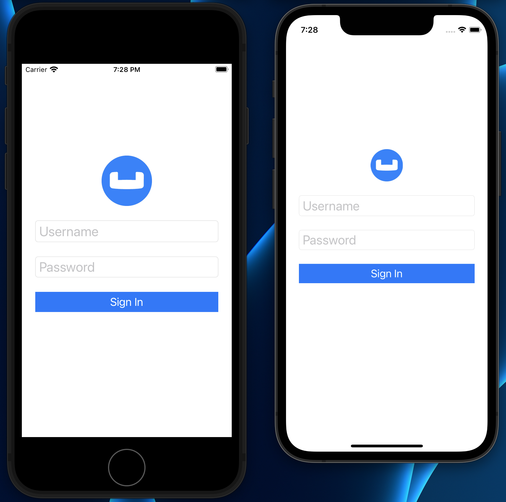

---
# frontmatter
path: "/tutorial-quickstart-ios-uikit-sync"
title: Quickstart in Couchbase Lite Data Sync with iOS, Swift, and UIKit
short_title: Data Sync Fundamentals
description:
  - Build an iOS App that uses Data Sync in Swift with Couchbase Lite
  - Learn how you can sync your data across devices and to the cloud with Sync Gateway
  - Gain experience working with channels in Sync Gateway
content_type: quickstart
filter: mobile
technology:
  - mobile
  - sync gateway
  - kv
  - query
landing_page: none 
landing_order: 7
tags:
  - iOS
sdk_language:
  - swift
length: 30 Mins
---

## Introduction

Couchbase Sync Gateway is a key component of the Couchbase Mobile stack. It is an Internet-facing synchronization mechanism that securely syncs data across devices as well as between devices and the cloud. Couchbase Mobile 3.0 introduces centralized persistent module configuration of synchronization, which simplifies the administration of Sync Gateway clusters — see <a target="_blank" rel="noopener noreferrer" href="https://docs.couchbase.com/sync-gateway/3.0/configuration-overview.html">Sync Gateway Configuration</a>.

The core functions of the Sync Gateway include

* Data Synchronization across devices and the cloud
* Authorization & Access Control
* Data Validation

This tutorial will demonstrate how to -

* Setup a basic Couchbase Sync Gateway configuration to sync content between multiple Couchbase Lite enabled clients.
*  We will will cover the basics of the Sync Gateway Configuration.
* Configure your Sync Gateway to enforce data routing, access control and authorization. We will cover the basics of <a target="_blank" rel="noopener noreferrer" href="https://docs.couchbase.com/sync-gateway/3.0/sync-function.html">Sync Function API</a>.
* Configure your Couchbase Lite clients for replication with the Sync Gateway
* Use "Live Queries" or Query events within your Couchbase Lite clients to be asyncronously notified of changes

We will be using a Swift App as an example of a Couchbase Lite enabled client.

> You can learn more about the Sync Gateway here in the <a target="_blank" rel="noopener noreferrer" href="https://docs.couchbase.com/sync-gateway/3.0/index.html">Sync Gateway Documentation</a>.

## Prerequisites

This tutorial assumes familiarity with building swift apps with Xcode and with Couchbase Lite.

* If you are unfamiliar with the basics of Couchbase Lite, it is recommended that you walk through the following tutorials
  * Fundamentals of using Couchbase Lite as a standalone database - see <a target="_blank" rel="noopener noreferrer" href="https://developer.couchbase.com/tutorial-quickstart-ios-uikit-basic">Quickstart in Couchbase Lite with iOS, Swift, and UIKit</a>
  * Query Basics with a prebuilt version of Couchbase Lite database - see <a target="_blank" rel="noopener noreferrer" href="https://developer.couchbase.com/tutorial-quickstart-ios-uikit-query">Quickstart in Couchbase Lite Query with iOS, Swift, and UIKit</a>

* iOS (Xcode 12/13) - Download latest version from the <a target="_blank" rel="noopener noreferrer" href="https://itunes.apple.com/us/app/xcode/id497799835?mt=12">Mac App Store</a> or via <a target="_blank" rel="noopener noreferrer" href="https://github.com/RobotsAndPencils/XcodesApp">Xcodes</a>
> **Note**: If you are using an older version of Xcode, which you need to retain for other development needs, make a copy of your existing version of Xcode and install the latest Xcode version.  That way you can have multiple versions of Xcode on your Mac.  More information can be found in <a target="_blank" rel="noopener noreferrer" href="https://developer.apple.com/library/archive/technotes/tn2339/_index.html#//apple_ref/doc/uid/DTS40014588-CH1-I_HAVE_MULTIPLE_VERSIONS_OF_XCODE_INSTALLED_ON_MY_MACHINE__WHAT_VERSION_OF_XCODE_DO_THE_COMMAND_LINE_TOOLS_CURRENTLY_USE_">Apple's Developer Documentation</a>. The open source <a target="_blank" rel="noopener noreferrer" href="https://github.com/RobotsAndPencils/XcodesApp ">Xcodes</a> project makes managing multiple installations of Xcode easier.

* curl HTTP client 
  * You could use any HTTP client of your choice. But we will use *curl* in our tutorial. Package manager users can use <a target="_blank" rel="noopener noreferrer" href="https://brew.sh/">homebrew</a>. 

* Docker
  * We will be using Docker to run images of both Couchbase Server and the Sync Gateway — to download Docker, or for more information, see: <a target="_blank" rel="noopener noreferrer" href="https://docs.docker.com/get-docker/">Get Docker</a>.

## System Overview

We will be working with a simple "User Profile" app which we introduced in the <a target="_blank" rel="noopener noreferrer" href="https://developer.couchbase.com/tutorial-quickstart-ios-uikit-basic">Quickstart in Couchbase Lite with iOS, Swift, and UIKit</a> tutorial and extended in the <a target="_blank" rel="noopener noreferrer" href="https://developer.couchbase.com/tutorial-quickstart-ios-uikit-query">Quickstart in Couchbase Lite Query with iOS, Swift, and UIKit</a> tutorial.

In this tutorial, we will be extending that app to support data sync.

The app does the following

* Allows users to log in and create or update his/her user profile information. The user profile view is **_automatically updated_** everytime the profile information changes in the underlying database.

* The user profile information is synced with a remote Sync Gateway which then syncs it to other devices (subject to access control and routing configurations specified in the `sync function`).


## App Installation

### Fetching App Source Code

To clone the project from GitHub, type the following command in your terminal:

```bash
git clone https://github.com/couchbase-examples/ios-swift-cblite-userprofile-sync
```

### Installing Couchbase Lite XCFramework

Next, we will download the Couchbase Lite 3.0 XCFramework. 

The Couchbase Lite iOS XCFramework is distributed via SPM, CocoaPods, Carthage, or you can download the pre-built framework.  See the <a target="_blank" rel="noopener noreferrer" href="https://docs.couchbase.com/couchbase-lite/3.0/swift/gs-install.html"> Getting Started - Install</a> documentation for more information. 

In our example, we will be downloading the pre-built version of the XCFramework, using a script. To do this, type the following in a command terminal replacing the path with the path on your computer:

```bash
  cd /path/to/cloned/repo/ios-swift-cblite-userprofile-sync/src

  sh install_tutorial.sh
```

Now, let's verify the installation.

### Try it Out

* Open the `UserProfileSyncDemo.xcodeproj`. The project would be located at `/path/to/cloned/repo/ios-swift-cblite-userprofile-sync/src`

```bash
open UserProfileSyncDemo.xcodeproj
```

* Build and run the project using **two different simulators** using Xcode

* Verify that you see the login screen on both the simulators



## Data Model

If have followed along the tutorial <a target="_blank" rel="noopener noreferrer" href="https://developer.couchbase.com/tutorial-quickstart-ios-uikit-query">Quickstart in Couchbase Lite Query with iOS, Swift, and UIKit</a>, you can skip this section and proceed to the [Backend Installation](#backend-installation) section as we have not made any changes to the Data model for this tutorial.

Couchbase Lite is a JSON Document Store. A Document is a logical collection of named fields and values.The values are any valid JSON types. In addition to the standard JSON types, Couchbase Lite supports some special types like `Date` and `Blob`.

While it is not required or enforced, it is a recommended practice to include a **_"type"_** property that can serve as a namespace for related.

### The "User Profile" Document

The app deals with a single Document with a **_"type"_** property of **_"user"_**.  The document ID is of the form **_"user::&lt;email&gt;"_**.
An example of a document would be:

```json
{
    "type":"user",
    "name":"Jane Doe",
    "email":"jame.doe@earth.org",
    "address":"101 Main Street",
    "image":CBLBlob (image/jpg),
    "university":"Rensselaer Polytechnic"
}
```

### UserRecord

The **_"user"_** Document is encoded to a native struct named **_UserRecord_**.

```swift
let kUserRecordDocumentType = "user"
typealias ExtendedData = [[String:Any]]
struct UserRecord : CustomStringConvertible{
  let type = kUserRecordDocumentType
  var name:String?
  var email:String?
  var address:String?
  var imageData:Data?
  var university:String?
  var extended:ExtendedData? // future

  var description: String {
      return "name = \(String(describing: name)), email = \(String(describing: email)), address = \(String(describing: address)), imageData = \(imageData)"
  }
}
```

## The "University" Document

The app comes bundled with a collection of Documents of type **_"university"_**. Each Document represents a university.

```json
{
    "type":"university","web_pages": [
      "http://www.rpi.edu/"
    ],
    "name": "Rensselaer Polytechnic Institute",
    "alpha_two_code": "US",
    "state-province": null,
    "domains": [
      "rpi.edu"
    ],
    "country": "United States"
}
```

### UniversityRecord

The **_"university"_** Document is encoded to a native struct named **_UniversityRecord_**.

```swift
typealias Universities = [UniversityRecord]
// Native object
struct UniversityRecord : CustomStringConvertible{
  var alphaTwoCode:String?
  var country:String?
  var domains:[String]?
  var name:String?
  var webPages:[String]?
  
  var description: String {
      return "name = \(String(describing: name)), country = \(String(describing: country)), domains = \(String(describing: domains)), webPages = \(webPages), alphaTwoCode = \(String(describing: alphaTwoCode)) "
  }
}
```
## Backend Installation

We will install [Couchbase Server](#couchbase-server) and [Sync Gateway](#sync-gateway) using Docker.

### Prerequisites

- You must have Docker installed on your laptop. For more on Docker — see: <a target="_blank" rel="noopener noreferrer" href="https://docs.docker.com/get-docker/">Get Docker</a>.
- Ensure that you have sufficient memory and cores allocated to docker. At Least 3GB of RAM is recommended.

### Docker Network

Couchbase Server and Sync Gateway Server need to communicate with each other over the network.  A network bridge in docker allows network traffic between servers.  Create a docker network bridge named **workshop**.

```bash
docker network ls

docker network create -d bridge workshop
```

### Couchbase Server

#### Install

We have a custom docker image priyacouch/couchbase-server-userprofile:7.0.0-dev of Couchbase Server, which creates an empty bucket named **userprofile** and an RBAC user **admin** with **sync gateway** role.

Alternatively, you can follow the instructions in our documentation — see: <a target="_blank" rel="noopener noreferrer" href="https://developer.couchbase.com/tutorial-quickstart-ios-uikit-query">Get Started - Prepare</a>, to install Couchbase Server and configure it with the relevant bucket.

* Optionally, remove any existing Docker container.

```bash
docker stop cb-server && docker rm cb-server
```

* Start Couchbase Server in a Docker container

```bash
docker run -d --name cb-server \
--network workshop \
-p 8091-8094:8091-8094 -p 11210:11210 \
priyacouch/couchbase-server-userprofile:7.0.0-dev
```

### Test Server Installation

The server could take a few minutes to deploy and fully initialize; so be patient.

1. Check the Docker logs using the command:

```bash
docker logs -f cb-server
```

When the setup is completed, you should see output similar to that shown in below.


2. Now check the required data is in place: 
  a. Open up http://localhost:8091 in a browser.
  b. Sign in as **Administrator** and **password** in login page.
  c. Go to **buckets** menu and confirm **userprofile** bucket is created


  - Go to **security** menu and confirm **admin** user is created.


### Sync Gateway 

Now we will install, configure, and run Sync Gateway.

#### Configuration

When using Sync Gateway, we can opt to provide a bootstrap configuration -- see: <a target="_blank" rel="noopener noreferrer" href="https://docs.couchbase.com/sync-gateway/3.0/configuration-overview.html">Sync Gateway Configuration</a>.  We would then provision database, sync and other configuration using the Admin REST endpoints Alternatively, we can continue to run in legacy-mode, using the Pre-3.0 configuration.

In this tutorial - for the purposes of backward compatibility - we will run 3.x using its
<a target="_blank" rel="noopener noreferrer" href="https://docs.couchbase.com/sync-gateway/3.0/configuration-properties-legacy.html">legacy configuration option</a>.  That is, we will be running with the *`disable_persistent_config`* option in the configuration file set to *`true`*.  You can, if you wish, run a 2.8 version of Sync Gateway instead.

The configuration files corresponding to this sample application are shown in Table 1.
They are available in the github repo hosting the app, which you cloned - look in: 
`/path/to/cloned/repo/ios-swift-cblite-userprofile-sync/src/` 

**Table 1. Available configuration files**
| Release | Filename |
| ------- | -------- |
| 3.x | <a target="_blank" rel="noopener noreferrer" href="https://github.com/couchbase-examples/ios-swift-cblite-userprofile-sync/blob/main/src/sync-gateway-config-userprofile-demo-3-x-legacy.json">sync-gateway-config-userprofile-demo-3-x-legacy.json</a>|
| 2.x | <a target="_blank" rel="noopener noreferrer" href="https://github.com/couchbase-examples/ios-swift-cblite-userprofile-sync/blob/main/src/sync-gateway-config-userprofile-demo-2-x.json">sync-gateway-config-userprofile-demo-2-x.json</a>|

### Deploy

Let us configure and launch Sync Gateway in a Docker container.

1. Switch to the the folder containing the cloned configuration files, using:

```bash
cd /path/to/cloned/repo/ios-swift-cblite-userprofile-sync/src
```

2. Make sure no Sync Gateway container exists, using:

```bash
docker stop sync-gateway && docker rm sync-gateway
```
3.  Listing the json files in the directory you should see configuration files for the latest major version and the previous major version in this folder.  Choose an appropriate version.

```bash
ls -l *.json
```
4.  Launch Sync Gateway in a Docker container using directions below based on the version you are using.

#### Sync Gateway 3.x 

Configuring and running Sync Gateway 3.x in Docker using the configuration in `sync-gateway-config-userprofile-demo-3-x-legacy.json`.

Note the use of `disable_persistent_config` in the configuration file to force legacy configuration mode. 

```bash
docker run -p 4984-4986:4984-4986 \
--network workshop \
--name sync-gateway \
-d \
-v `pwd`/sync-gateway-config-userprofile-demo-3-x-legacy.json \
/etc/sync_gateway/sync_gateway.json \
couchbase/sync-gateway:3.0.0-enterprise \
/etc/sync_gateway/sync_gateway.json
```

#### Sync Gateway 2.x 

Configuring and running Sync Gateway 2.8.

```bash
docker run -p 4984-4986:4984-4986 \
--network workshop \
--name sync-gateway \
-d \
-v `pwd`/sync-gateway-config-userprofile-demo-2-x.json:\
/etc/sync_gateway/sync_gateway.json \
couchbase/sync-gateway:2.8.4-enterprise \
/etc/sync_gateway/sync_gateway.json
```
#### Test the Installation

Now we can confirm that the Sync Gateway is up and running.

1. Check the log messages.

```bash
docker logs -f sync-gateway
```
  You will see a series of log messages.  Make sure there are no errors.

2. Open up <a target="_blank" rel="noopener noreferrer" href="http://localhost:4984">http://localhost:4984</a> in your browser.  You should see equivalent of the following message:

```bash
{"couchdb":"Welcome","vendor": { "name":"Couchbase Sync Gateway", "version":"3.0" },
"version":"Couchbase Sync Gateway/3.0.0(460;26daced) EE"}
```
Now that we have the server and the sync gateway installed, we can verify data sync between Couchbase Lite enabled apps.

## Sync Function

A key component of the sync process is the Sync Function and we will first look at how that can be set-up to control how data sync works.

The Sync Function is a Javascript function that is specified as part of the [Sync Gateway Configuration](#configuration). It handles [Authorization](#authorization), [Data Validation](#data-validation), [Data Routing](#data-routing), and [Access Countrol](#access-control).

1. Open the your configuration file using a text editor of your choice.  It will be located in the repo at `/path/to/cloned/repo/ios-swift-cblite-userprofile-sync/src`.

2. Locate the `sync` setting in the file. 

Now you can follow along with the rest of the sections below.

### Authorization

We use *Basic Authentication* in our application.  The Id of the user making the request is specified in the `Authorization` header.

Locate the *`// Authorization`* section of the Sync Function.  You will see we are using the Sync functions <a target="_blank" rel="noopener noreferrer" href="https://developer.couchbase.com/documentation/mobile/2.0/guides/sync-gateway/sync-function-api-guide/index.html#requireuserusername">`requireUser()`</a> API to verify that the `email` property specified in the Document matches the Id of the user making the request. 

```js
function sync(doc, oldDoc) {
   ....
   /* Authorization */

  // Verify the user making the request is the same as the one in doc's email
  requireUser(doc.email);
  .....
}
```

### Data Validation

In this case, we are doing some basic validation of the contents of the Document:

```js
/* Data Validation */

// Validate the presence of email field.
// This is the "username" 
validateNotEmpty("email", doc.email);

// Validate that the document Id _id is prefixed by owner 
var expectedDocId = "user" + "::" + doc.email;


if (expectedDocId != doc._id) {
  // reject document
  throw({forbidden: "user doc Id must be of form user::email"});
}
```

1. Verify that the `email` property is not null. If it's null, we throw a JS exception (see `validateNotEmpty()` function)
2. If this a new document, then verify that the `Id` of the Document is of the required format (i.e. **_"user::&lt;email&gt;"_**). We throw an exception if that's not the case.
3. If this is a document update, then verify that the `email` property value has not changed. Again, we throw an exception if that's not the case.

> **NOTE**:  You can learn more about the Sync Function in the documentation here: <a target="_blank" rel="noopener noreferrer" href="https://docs.couchbase.com/sync-gateway/3.0/sync-function.html">Sync Function API</a>.

### Data Routing

<a target="_blank" rel="noopener noreferrer" href="https://docs.couchbase.com/sync-gateway/3.0/channels.html">`channels`</a> are a mechanism to "tag" documents.  They are typically used to route/seggregate documents based on the contents of those document. 

Combined with <a target="_blank" rel="noopener noreferrer" href="https://docs.couchbase.com/sync-gateway/3.0/sync-function-api-access-cmd.html">access()</a> and <a target="_blank" rel="noopener noreferrer" href="https://docs.couchbase.com/sync-gateway/3.0/sync-function-api-require-access-cmd.html">`requireAccess() `</a> API, the <a target="_blank" rel="noopener noreferrer" href="https://docs.couchbase.com/sync-gateway/3.0/channels.html">channel()</a> API can be used to enforce [Access Control](#access-control). 

As we shall see in a later section, clients can use channels to pull only a subset of documents.

```js
  /* Routing */
  // Add doc to the user's channel.
  var email = getEmail();

  var channelId = "channel."+ username; 
  channel(channelId); 
```

1. Retrieve the the email property specified in the document. We will uses this as our user and channel name.
2. Next, we generate the channel name from the email property.
3. Finally we route the document to the channel. The channel comes into existence the first time a document is added to it.


### Access Control

We can enforce access control to channels using the <a target="_blank" rel="noopener noreferrer" href="https://docs.couchbase.com/sync-gateway/3.0/sync-function-api-access-cmd.html">access () API</a>. This approach ensures that only users with access to a specific channel will be able to retrieve documents in the channel.

```js
 // Give user read access to channel
 access(username, channelId);
```

## Starting Replication

Two-way Replication between the app and the Sync Gateway is enabled when user logs into the app.

To see the code behind this, open the project's **DatabaseManager.swift** file and locate the `startPushAndPullReplicationForCurrentUser()` function.

```swift
func startPushAndPullReplicationForCurrentUser() {
```
In the function you will see we create an instance of the `ReplicatorConfig`, which specifies the source and target database.  You could also use this to, optionally, override the default configuration settings.

```swift
let dbUrl = remoteUrl.appendingPathComponent(kDBName)
let config = ReplicatorConfiguration.init(database: db, target: URLEndpoint.init(url:dbUrl)) 

config.replicatorType = .pushAndPull
config.continuous =  true 
config.authenticator =  BasicAuthenticator(username: user, password: password) 

// This should match what is specified in the sync gateway config
// Only pull documents from this user's channel
let userChannel = "channel.\(user)"
config.channels = [userChannel]
```

* Initialize with `source` as the local Couchbase Lite database and the `remote` target as the Sync Gateway

* Replication `type` of `pushAndPull` indicates that we require two-way sync. A value of `.pull` specifies that we only pull data from the Sync Gateway. A value of `.push` specifies that we only push data.

* The `continuous` mode is specified to be _true_ which means that changes are synced in real-time. A value of _false_  which implies that data is only pulled from the Sync Gateway.

* This is where you specify the authentication credentials of the user. In the [Authorization](#authorization) section, we discussed that the Sync Gateway can enforce authorization check using the `requireUser` API.

* The `channels` are used to specify the channels to pull from. Only documents belonging to the specified channels are synced. This is subject to Access Control rights enforced at the Sync Gateway. This means that if a client does not have access to documents in a channel, the documents will not be synched even if the client specifies it in the replicator configuration.

Now we initialize the `Replicator` with the `ReplicatorConfiguration`.

```swift
_pushPullRepl = Replicator.init(config: config)
```
In order to follow the replicator's progress, we can attach a callback listener to it.

Attaching a callback listener to the `Replicator` means we will be asynchronously notified of state changes.
This could be useful for instance, to inform the user of the progress of the replication.  It is an optional step shown below.

```swift
_pushPullReplListener = _pushPullRepl?.addChangeListener({ (change) in
  let s = change.status
  switch s.activity {
    case .busy:
      print("Busy transferring data")
    case .connecting:
      print("Connecting to Sync Gateway")
    case .idle:
      print("Replicator in Idle state")
    case .offline:
      print("Replicator in offline state")
    case .stopped:
      print("Completed syncing documents")
  }
})
```
Now, with all that done, we can start the replicator. 

```swift
_pushPullRepl?.start()
```

## Stopping Replication

When user logs out of the app, the replication is stopped before the database is closed.

1. Open the *DatabaseManager.swift* file and locate the `stopAllReplicationForCurrentUser()` function.

```swift
func stopAllReplicationForCurrentUser() {
```

2. Stop the replicator and remove any associated change listeners

```swift
if let pushPullReplListener = _pushPullReplListener{
  print(#function)
  _pushPullRepl?.removeChangeListener(withToken:  pushPullReplListener)
  _pushPullRepl = nil
  _pushPullReplListener = nil
}
_pushPullRepl?.stop()
```

> **TIP**: When you close a database, any active replicators, listeners and-or live queries are also be closed.

## Query Events / Live Queries

Couchbase Lite applications can set up **live queries** in order to be asynchronously notified of changes to the database that affect the results of the query.  This can be very useful, for instance, in keeping a UI View up-to-date with the results of a query.

In our app, the user profile view is kept up-to-date using a live query that fetches the user profile data used to populate the view.  This means that, if the replicator pulls down changes to the user profile, they are automatically reflected in the view.

To see this:

1. Open the *UserPresenter.swift* file and locate the `fetchRecordForCurrentUserWithLiveModeEnabled()` function. Calling this function with a value of `true` implies that the caller wishes to be notified of any changes to query results.

```swift
func fetchRecordForCurrentUserWithLiveModeEnabled(__ enabled:Bool = false) {
```

2. Build the Query using `QueryBuilder` API. If you are unfamiliar with this API, please check out the <a target="_blank" rel="noopener noreferrer" href="https://developer.couchbase.com/tutorial-quickstart-ios-uikit-query">Quickstart in Couchbase Lite Query with iOS, Swift, and UIKit</a> tutorial.

```swift
guard let db = dbMgr.db else {
  fatalError("db is not initialized at this point!")
}
userQuery = QueryBuilder
  .select(SelectResult.all())
  .from(DataSource.database(db))
  .where(Meta.id.equalTo(Expression.string(self.userProfileDocId)))
```

 > **Note**: We query for documents based on document Id. In our app, there should be exactly one user profile document corresponding to this Id.

3. Attach listener callback to the query to make it **live**.

```swift
userQueryToken = userQuery?.addChangeListener { [weak self] (change) in 
  guard let `self`` = self else {return}
  switch change.error {
    case nil:
      var userRecord = UserRecord.init()
      userRecord.email = self.dbMgr.currentUserCredentials?.user
      
      for (_, row) in (change.results?.enumerated())! {
        if let userVal = row.dictionary(forKey: "userprofile") { 
          userRecord.email  =  userVal.string(forKey: UserRecordDocumentKeys.email.rawValue)
          userRecord.address = userVal.string(forKey:UserRecordDocumentKeys.address.rawValue)
          userRecord.name =  userVal.string(forKey: UserRecordDocumentKeys.name.rawValue)
          userRecord.university = userVal.string(forKey: UserRecordDocumentKeys.university.rawValue)
          userRecord.imageData = userVal.blob(forKey:UserRecordDocumentKeys.image.rawValue)?.content 
        }
      }
```

* Attach a listener callback to the query. Attaching a listerner automatically makes it **live** so any time there is a change in the user profile data in the underlying database, the callback would be invoked

* Create an instance of UserRecord. This will be populated with the query results.

* The `SelectResult.all()` method is used to query all the properties of a document. In this case, the document in the result is embedded in a dictionary where the key is the database name, which is **"userprofile"**. So we retrieve the <a target="_blank" rel="noopener noreferrer" ref="https://docs.couchbase.com/mobile/3.0.0-beta02/couchbase-lite-swift/Classes/DictionaryObject.html">DictionaryObject</a> at key **_"userprofile"_**.

* We use appropriate _type getters_ to retrieve values and populate the _UserRecord_ instance

## Exercises

### Exercise 1

In this exercise, we will observe how changes made on one app are synced across to the other app

1. The app should be running in two simulators side by side.
2. Log into both the simulators with same userId and password. Use the values **demo@example.com** and **password** for user Id and password fields respectively.
3. On one simulator, enter values in the user and address fields.
4. Confirm that changes show up in the app on the other simulator.
5. Similarly, make changes to the app in the other simulator and confirm that the changes are synced over to the first simulator.

### Exercise 2

In this exercise, we will observe changes made via Sync Gateway are synced over to the apps

1. Make sure you have completed Exercise 1. This is to ensure that you have the appropriate user profile document (with document Id of "user::demo@example.com") created through the app and synced over to the Sync Gateway.

2. Open the command terminal and issue the following command to get the user profile document via link:[GET Document REST API] . We will be using `curl` to issue the request. If you haven't done so, please install curl as indicated in the Prerequisites section.

```bash
curl -X GET http://localhost:4984/userprofile/user::demo@example.com --user demo@example.com
```
* This GET retrieves the userprofile document with the id **user::demo@example.com**

3. Your response should look something like the response below. The exact contents depends on the user profile information that you provided via your mobile app.

```bash
{
    "_attachments": { 
        "blob_1": {
            "content_type": "image/jpeg",
            "digest": "sha1-S8asPSgzA+F+fp8/2DdIy4K+0U8=",
            "length": 14989,
            "revpos": 2,
            "stub": true
        }
    },
    "_id": "user::demo@example.com",
    "_rev": "2-3a76cfa911e2c54d1e82b29dbffc7f4e5a9bc265", 
    "address": "",
    "email": "demo@example.com",
    "image": { 
        "@type": "blob",
        "content_type": "image/jpeg",
        "digest": "sha1-S8asPSgzA+F+fp8/2DdIy4K+0U8=",
        "length": 14989
    },
    "name": "",
    "type": "user",
    "university": "British Institute in Paris, University of London"
}
```

* If you had updated an image via the mobile app, you should see an **"_attachments"** property. This entry holds an array of attachments corresponding to each image blob entry added by the mobile app. This property is added by the Sync Gateway when it processes the document. You can learn more about how image Blob types are mapped to attachments <a target="_blank" rel="noopener noreferrer"  href="https://docs.couchbase.com/couchbase-lite/3.0/swift/blob.html">here</a>.

* Record the revision Id of the document.  You will need this when you update the document

4. In the command terminal, issue the following command to update the user profile document via <a target="_blank" rel="noopener noreferrer"  href="https://docs.couchbase.com/sync-gateway/3.0/rest-api.html#/document/AddOrUpdateDocument">PUT Document REST API</a>.  
> **NOTE**: We chose to show how to update the address field via the REST API.  You can choose to update any other profile information if you like.  You will be prompted to enter the users password when you submit the curl command.

```bash
curl -X PUT \
  'http://localhost:4985/userprofile/user::demo@example.com?rev=3-12d203d6024c8b844c5ed736c726ac63379e05dc' \
  -H 'Accept: application/json' \
  -H 'Cache-Control: no-cache' \
  -H 'Content-Type: application/json' \
  -d '{
    "address": "101 Main Street", 
    "email": "demo@example.com",
    "image": {
        "@type": "blob",
        "content_type": "image/jpeg",
        "digest": "sha1-S8asPSgzA+F+fp8/2DdIy4K+0U8=",
        "length": 14989
    },
    "name": "",
    "type": "user",
    "university": "British Institute in Paris, University of London"
}'
```
Here, in the `PUT`, we specify the:
* user id (`user::demo@example.com`)
* revision Id (from the previous step `3-033fcbaf269d65a9247067be76d664f1111d033b`) to select the item we want to update

5. Confirm that you get a HTTP *"201 Created"* status code

6. As soon as you update the document via the Sync Gateway REST API, confirm that the changes show up in the mobile app on the simulator.


## Handling Conflicts during Data Syncronization

Data conflicts are inevtiable in an environment where you can potentially have multiple writes updating the same data concurrently. Couchbase Mobile supports **_Automated Conflict Resolution_**.

You can learn more about automated conflict resolution in this blog <a target="_blank" rel="noopener noreferrer"  href="https://blog.couchbase.com/document-conflicts-couchbase-mobile/">Document Conflicts & Resolution</a>.

## Learn More

Congratulations on completing this tutorial!

This tutorial walked you through an example of how to use a Sync Gateway to synchronize data between Couchbase Lite enabled clients. We discussed how to configure your Sync Gateway to enforce relevant access control, authorization and data routing between Couchbase Lite enabled clients.

Check out the following links for further details.

### Further Reading

* <a target="_blank" rel="noopener noreferrer"  href="https://docs.couchbase.com/sync-gateway/3.0/configuration-overview.html">Sync Gateway Configuration</a>

* <a target="_blank" rel="noopener noreferrer"  href="https://blog.couchbase.com/category/couchbase-mobile/?ref=blog-menu">Couchbase Mobile Blog</a>

* <a target="_blank" rel="noopener noreferrer"  href="https://blog.couchbase.com/?s=sync+function">Sync function blogs</a>

* <a target="_blank" rel="noopener noreferrer"  href="https://blog.couchbase.com/data-replication-couchbase-mobile/">Overview of Replication Protocol</a>

* <a target="_blank" rel="noopener noreferrer"  href="https://blog.couchbase.com/document-conflicts-couchbase-mobile/">Document Conflicts & Resolution</a>
